# 您的首个 Kotlin 程序

## 1. 准备工作


在此课程中，您将使用 Kotlin 编程语言编写代码，从而构建各种应用。Kotlin 是 Google 推荐在创建新 Android 应用时使用的语言。

Kotlin 是一种现代编程语言，可帮助开发者提高工作效率。例如，与其他编程语言相比，使用 Kotlin，您能够用更简洁的代码实现同样的功能，减少代码的行数。此外，使用 Kotlin 构建的应用不容易发生崩溃，能够为用户带来更稳定、更可靠的应用体验。从本质上讲，使用 Kotlin，您可以花更短的时间编写出更好的 Android 应用。因此 Kotlin 在业界方兴未艾，是大多数专业 Android 开发者使用的语言。

若要开始用 Kotlin 构建 Android 应用，首先必须在 Kotlin 编程概念方面打下坚实基础。通过此开发者在线课程中的 Codelab，您将在深入学习应用创建之前先了解 Kotlin 编程的基础知识。

### 构建内容

- 用 Kotlin 编写的简短程序，在运行时可显示消息。

### 学习内容

- 如何编写和运行简单的 Kotlin 程序。
- 如何修改简单的程序来更改输出。

### 所需条件

- 可连接到互联网的计算机和网络浏览器。

## 2. 开始使用

在此 Codelab 中，您将探索和修改用 Kotlin 编写的简单程序。您可以将程序视为一系列指示计算机或移动设备执行某项操作的指令，例如指示设备向用户显示消息或计算购物车中商品的费用。针对计算机应执行的操作所提供的分步说明称为代码。如果您修改程序中的代码，输出可能会发生变化。

您可以使用名为代码编辑器的工具编写和修改代码。它与文本编辑器类似，您可以在其中编写和修改文本，但代码编辑器还提供了可帮助您更准确地编写代码的功能。例如，代码编辑器会在您输入内容时显示自动补全建议，还会在代码不正确时显示错误消息。

若要练习 Kotlin 语言的基本编程方法，您可以使用名为"Kotlin 园地"的交互式代码编辑器。您可以通过网络浏览器访问此工具，因此无需在计算机上安装任何软件。您可以直接在 Kotlin 园地中修改和运行 Kotlin 代码，然后查看输出。

请注意，您无法在 Kotlin 园地中构建 Android 应用。在后续的衔接课程中，您将安装名为 Android Studio 的工具，并使用该工具编写和修改 Android 应用代码。

现在，您已经了解了 Kotlin 的一些相关知识，接下来我们看看您的第一个程序！

## 3. 打开 Kotlin 园地

在计算机上通过网络浏览器打开 [Kotlin 园地](https://play.kotlinlang.org/)。

您应该会看到类似下图的网页：

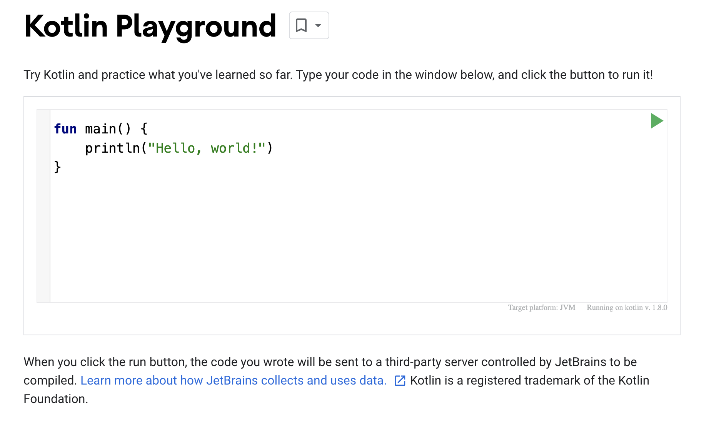

代码编辑器中已填充了一些默认代码。这三行代码构成了一个简单的程序：

```kotlin
fun main() {
    println("Hello, world!")
}
```

虽然您从未编写过程序，但能否猜出这个程序会做什么？

请继续阅读下一部分，看看您的猜测是否正确！

## 4. 运行您的第一个程序

点击  运行程序。

点击"运行"按钮后，后台会执行很多操作。用 Kotlin 编程语言编写的代码具有人类可读懂的特点，因此人们可以更轻松地读、写 Kotlin 程序及就这类程序展开协作。但是，计算机无法直接理解该语言。

您需要使用名为 Kotlin 编译器的工具，该工具可接受您编写的 Kotlin 代码，逐行查看，并将其转换成计算机可理解的代码。此过程称为代码编译。

如果您的代码能够成功编译，程序就会运行（即执行）。当计算机执行您的程序时，它会执行您的每条指令。我们可以把这比作照着食谱做美食，按照食谱完成每个步骤的操作就是在执行每条指令。

以下屏幕截图显示了运行程序时您应该会看到的内容。

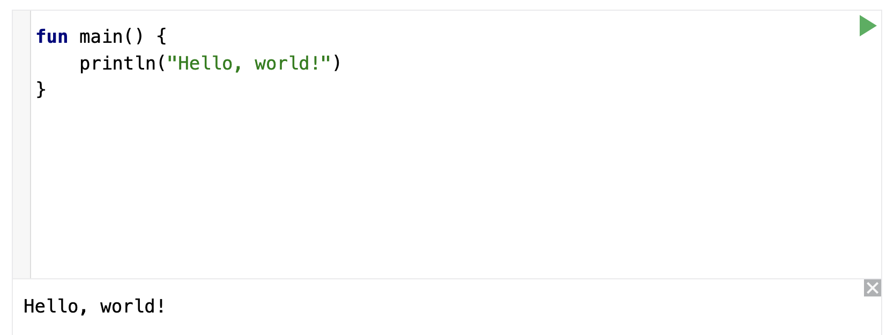

在代码编辑器的底部，您应该会看到一个显示程序输出（即结果）的窗格：

```
Hello, world!
```

棒极了！此程序的目的是输出或显示内容为 Hello, world! 的消息。

> **警告**：如果您没有看到此结果，请复制上一部分中的三行代码并将其粘贴到 Kotlin 园地中，然后重试。

运作方式是怎样的？Kotlin 程序必须具有主函数，这是代码中程序开始运行的特定位置。主函数是程序的入口点，或者说是起点。


现在您可能想知道，函数是什么？

## 5. 函数的组成部分

函数是程序中用于执行特定任务的部分。您的程序可以包含一个或多个函数。

### 定义函数与调用函数

在代码中，您首先要定义函数。也就是说，您需要指定执行该任务所需的所有指令。

定义函数后，您就可以调用该函数，以便可以执行该函数中的指令。

我们打个比方。假如您编写了巧克力蛋糕烘焙方法的分步说明。您可以为这组指令命名：bakeChocolateCake。每次您想要烤蛋糕时，都可以执行 bakeChocolateCake 指令。如果您想烤 3 个蛋糕，则需要执行 3 次 bakeChocolateCake 指令。第一步是定义步骤并指定名称，这就相当于定义函数。然后，您可以随时参考想要执行的步骤，这就相当于调用函数。

> **注意**：您可能还会听到"声明函数"的说法。"声明"和"定义"这两个词可以互换使用，含义相同。您还可能会听到"函数定义"或"函数声明"的说法，它们是指定义某个函数的确切代码。在一些其他编程语言中，"声明"和"定义"有不同的含义。

### 定义函数

以下是定义函数所需的关键部分：

- 函数需要有名称，这样您以后才能调用它。
- 函数还可能需要一些输入或需要在调用函数时提供的信息。函数要利用这些输入来实现其目的。输入并非硬性要求，有些函数不需要输入。
- 函数还要有主体，其中包含执行任务的指令。

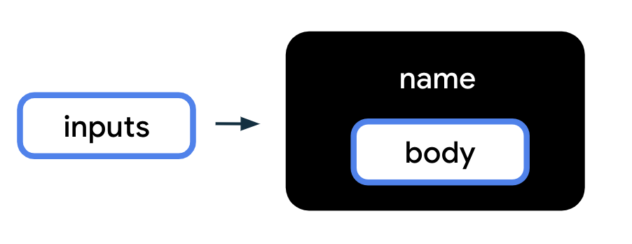

若要将上图转换为 Kotlin 代码，请使用以下语法或格式来定义函数。这些元素的顺序很重要。单词"fun"必须放在最前面，接着是函数名称，之后是用圆括号括起的输入，再之后是用花括号括起的主体。

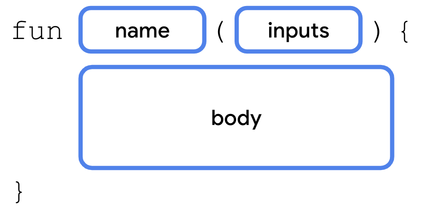

请注意您在 Kotlin 园地中看到的 main 函数示例中函数的关键部分：

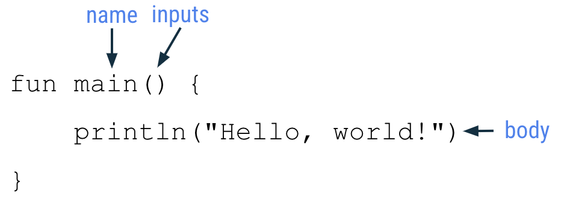

该函数定义以单词 fun 开头。
然后，该函数的名称为 main。
该函数没有输入，因此圆括号内是空的。
函数主体 println("Hello, world!") 中有一行代码，位于函数的左花括号和右花括号之间。

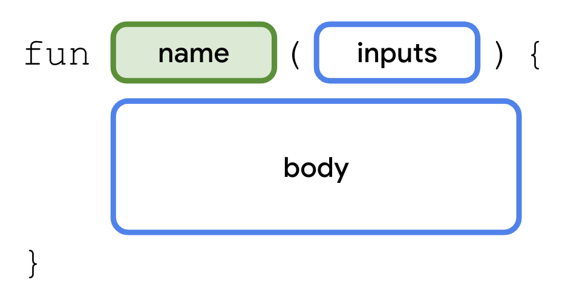

下文更详细地介绍了该函数的各个部分。

### 函数关键字

为了指明您即将使用 Kotlin 定义函数，请在新行中输入特殊单词 **fun**（函数的缩写）。您输入的 fun 必须与此处所示的单词完成相同，所有字母均为小写形式。您不能使用"func"、"function"或其他拼写，因为 Kotlin 编译器会无法识别其含义。

这些特殊单词在 Kotlin 中称为关键字，专用于特定用途，例如在 Kotlin 中创建新函数。

### 函数名称

函数需要用名称来区分彼此，正如人们要有名字作为称呼一样。函数的名称位于 fun 关键字后面。

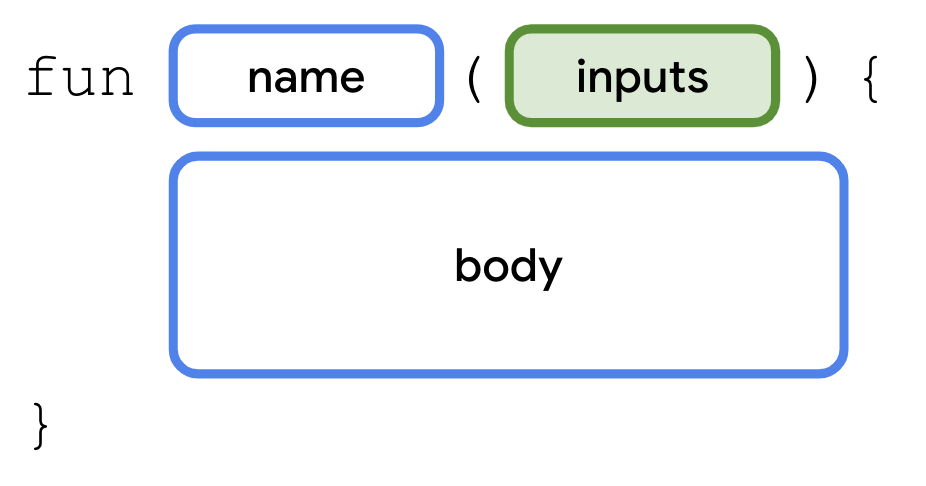

您应根据函数的用途为函数选择合适的名称。名称通常是动词或动词短语。建议不要使用 Kotlin 关键字作为函数名称。

函数名称应遵循驼峰式大小写的规范，函数名称中的第一个单词应采用全小写形式。如果名称中包含多个单词，则各个单词之间不应有空格，所有其他单词的首字母都应大写。

函数名称示例：

- calculateTip
- displayErrorMessage
- takePhoto

### 函数输入

请注意，函数名称后面始终应跟着括号。函数的输入应列在这对圆括号内。

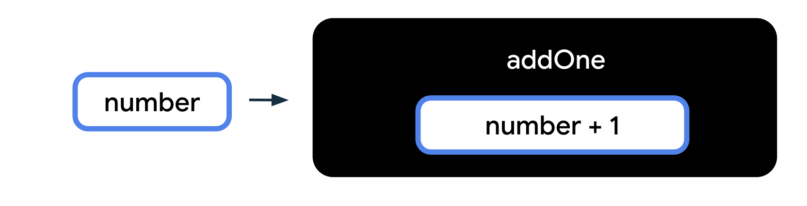

输入是函数实现自身用途所需的数据。在定义函数时，您可以要求在调用该函数时传入某些输入。如果函数不需要输入，圆括号就是空的 ()。

以下示例展示了具有不同数量的输入的函数：

下图显示了一个名为 addOne 的函数。该函数的作用是为给定数值加上 1。该函数中有一个输入，即给定的数字。在函数主体内部，有代码为传入到函数中的数字加上 1。

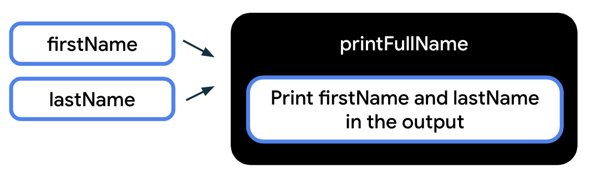

在下一个示例中，有一个名为 printFullName 的函数。该函数需要两个输入：一个是名字，另一个是姓氏。该函数主体会输出在输出部分指定的名字和姓氏，从而显示这个人的全名。

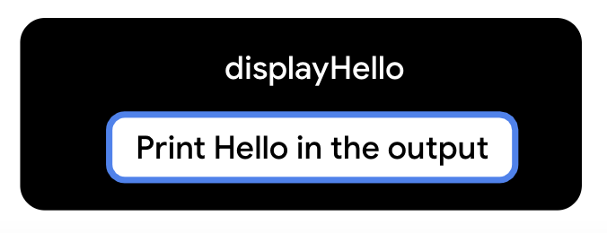

最后一个示例展示了在调用函数时无需传入任何输入的函数。当您调用 displayHello() 函数时，会输出一条"Hello"消息。

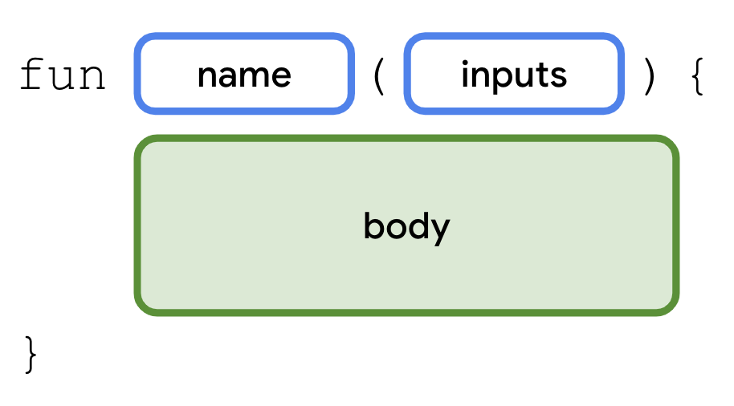

### 函数主体

函数主体包含实现函数用途所需的指令。您可以通过查找由左花括号和右花括号括起来的代码行，找到函数主体。


### 简单程序说明

我们来回顾您在本 Codelab 的前面部分看到的简单程序。


该程序包含一个函数：main 函数。main 是 Kotlin 中的一个特殊函数名称。当您在 Kotlin 园地中编写代码时，您的代码应在 main() 函数内编写或从 main() 函数调用。

此 main() 函数的主体中只有一行代码：

```kotlin
println("Hello, world!")
```

这行代码是一个语句，因为它执行特定操作，即在输出窗格中输出 Hello, world! 文本。更具体地说，我们在这行代码中调用了 println() 函数。println() 是已在 Kotlin 语言中定义的函数。也就是说，创建 Kotlin 语言的工程师团队已经编写了 println() 函数的函数声明。该函数需要一个输入，即应该输出的消息。

如果您调用 println() 函数，请将消息文本放置在函数名称后的圆括号内。请务必在显示的文本两边添加引号，例如 "Hello, world!"。

当您执行该程序后，它就会输出传递到 println() 函数的消息：

```
Hello, world!
```

### 试试看

现在，再来看看该程序中的原始代码。您能否在 Kotlin 园地中修改代码，让输出改为显示此消息？

```
Hello, Android!
```

## 6. 修改您的程序

若要更改输出显示的消息，请修改程序第二行中的 println() 函数调用。将 println() 函数中的 world 替换为 Android。确保 "Hello, Android!" 仍在引号内和圆括号内。

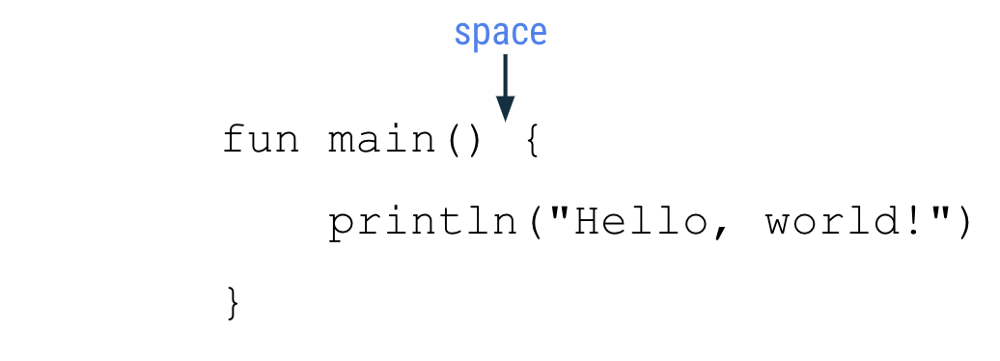

```kotlin
fun main() {
    println("Hello, Android!")
}
```

运行该程序。

输出应显示以下消息：

```
Hello, Android!
```

太棒了，您已修改自己的第一个程序！

现在，您能通过更改代码让该消息输出两次吗？查看所需的输出：

```
Hello, Android!
Hello, Android!
```

### 输出多条消息

您可以根据任务需求，在函数内添加任意行指令。但请注意，在 Kotlin 中，每行应该只有一个语句。如果您要新增语句，则应在函数中另起一行进行编写。

若要更改程序以输出多行文本，请按以下方法操作：

复制初始的 println() 语句，并将复制的语句粘贴到函数主体中该语句的下方。这两个 println() 语句都必须位于主函数的花括号内。现在，函数主体中有两个语句。

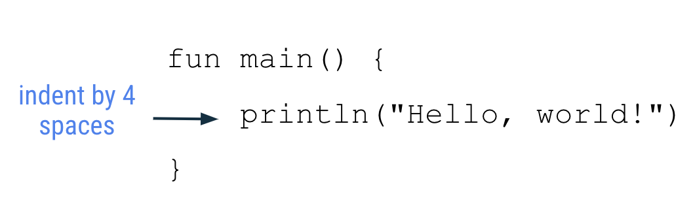

```kotlin
fun main() {
    println("Hello, Android!")
    println("Hello, Android!")
}
```

运行该程序。

当您运行该程序时，输出应如下所示：

```
Hello, Android!
Hello, Android!
```

您可以看到代码更改对输出有何影响。

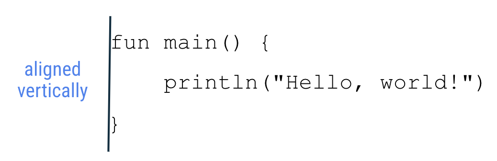

更改代码，使其显示 Hello, YOUR_NAME!。

## 7. Kotlin 样式指南

在本课程中，您将了解 Android 开发者在编码方面应遵循的良好做法。一种做法是遵循 Google 针对使用 Kotlin 进行编码制定的 Android 编码标准。完整的指南称为[样式指南](https://developer.android.com/kotlin/style-guide?hl=zh-cn)，它从视觉外观和编码规范角度说明了代码应采用的格式。例如，样式指南包括关于使用空格、缩进及命名等方面的建议。

遵循风格指南的目的是使您的代码更易读，并且与其他 Android 开发者的编码方式更加一致。在大型项目的协作中，这种一致性非常重要，它可以确保项目的所有文件都采用相同的代码样式。

针对您目前为止学到的 Kotlin 知识，下面给出了一些相关样式指南：

- 函数名称应采用驼峰命名法，并且应该是动词或动词短语。
- 每个语句都应单独占一行。
- 左花括号应出现在函数开始行的末尾。
- 左花括号前应有一个空格。
- 函数主体应缩进 4 个空格。请勿使用制表符缩进代码，而应输入 4 个空格。
- 右花括号位于函数主体中的末行代码之后，单独占一行。右花括号应与函数开头的 fun 关键字对齐。

在进一步学习 Kotlin 知识的过程中，您将了解到更多 Android 编码规范。您可在[此处](https://developer.android.com/kotlin/style-guide?hl=zh-cn)查看完整的样式指南，不过如果您看到其中涵盖尚未学到的其他主题，也无需着急。

## 8. 修正代码中的错误

在学习人类语言时，我们知道针对单词的正确使用和句子的正确构成都有句法和语法规则。同样，在编程语言中，也有特定的规则来规范有效代码（即能成功编译的代码）。

在编码过程中，出错及无意中编写出无效代码是正常情况。新手在出现这类错误时往往会感到迷茫或沮丧。不过您不必担心，这是正常现象。代码很少编写一次就能完美无瑕。正如撰写文档需要打多版草稿一样，编写代码也可能需要多次迭代，直到代码达到预期的运行效果。

如果代码无法成功编译，则表示存在错误。例如，如果有缺少引号或圆括号之类的输入错误，编译器将无法识别您的代码，也无法将其转换为由计算机执行的步骤。如果您的代码未按预期运行，或者您在代码编辑器中看到错误消息，则必须检查代码，修正错误。修正这些错误的过程称为问题排查。

复制以下代码段并将其粘贴到 Kotlin 园地中，然后运行该程序。您看到了什么？

```kotlin
fun main() {
    println("Today is sunny!)
}
```

理想情况下，您会希望看到显示 Today is sunny! 消息。然而，实际上您在输出窗格中看到的是带有错误消息的感叹号图标。

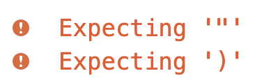

Kotlin 园地中的错误消息：

错误消息以"Expecting"（预期）一词开头，因为 Kotlin 编译器"预期"识别到某个内容，但在代码中却找不到该内容。在这个示例中，编译器预期在程序的第二行代码中识别到右引号和右圆括号。

请注意，在 println() 语句中，显示的消息有左引号，但没有右引号。即使代码中有右圆括号，编译器也会认为要输出的文本包括圆括号，因为圆括号前面没有右引号。

在感叹号与右圆括号之间添加右引号。

```kotlin
fun main() {
    println("Today is sunny!")
}
```

主函数包含一行代码（println() 语句），其中的文本用引号引起来，再用圆括号括起："Today is sunny!"。

再次运行该程序。

现在应该没有任何错误了，输出窗格应显示以下文本：

```
Today is sunny!
```

错误已修正，做的不错！当您在代码编写和错误排查方面拥有更多经验后，就会认识到在输入代码时注意大小写、拼写、空格、符号和名称极其重要。

在下一部分中，您将通过一系列练习来操练所学内容。本 Codelab 的结尾会提供解决方法，但请先尽力独立探索答案。

## 9. 练习

您能否读懂这个程序的代码并猜出其输出内容（不要在 Kotlin 园地中运行）？

```kotlin
fun main() {
    println("1")
    println("2")
    println("3")
}
```

在您做出猜测后，请复制此代码并将其粘贴到 Kotlin 园地中，看看您的猜测是否正确。

---

通过 Kotlin 园地创建一个输出以下消息的程序：

```
I'm
learning
Kotlin!
```

---

复制此程序并将其粘贴到 Kotlin 园地中。

```kotlin
fun main() {
    println("Tuesday")
    println("Thursday")
    println("Wednesday")
    println("Friday")
    println("Monday")
}
```

修正程序，使其输出以下信息：

```
Monday
Tuesday
Wednesday
Thursday
Friday
```

---

现在来做些初级的问题排查练习，请修正以下练习中的错误。对于每个练习，请在浏览器中将代码复制到 Kotlin 园地。尝试运行该程序，然后您会看到一条错误消息。

**练习 1：** 修正此程序中的错误，使其能生成所需的输出。

```kotlin
fun main() {
    println("Tomorrow is rainy")
```

所需的输出：

```
Tomorrow is rainy
```

**练习 2：** 修正此程序中的错误，使其能生成所需的输出。

```kotlin
fun main() {
    printLine("There is a chance of snow")
}
```

所需的输出：

```
There is a chance of snow
```

**练习 3：** 修正此程序中的错误，使其能生成所需的输出。

```kotlin
fun main() {
    println("Cloudy") println("Partly Cloudy") println("Windy")
}
```

所需的输出：

```
Cloudy
Partly Cloudy
Windy
```

**练习 4：** 修正此程序中的错误，使其能生成所需的输出。

```kotlin
fun main() (
    println("How's the weather today?"))
```

所需的输出：

```
How's the weather today?
```

完成这些练习后，请根据下一部分中给出的解决方法检查您的答案。

## 10. 解决方案

**练习 1：** 该程序的输出是：

```
1
2
3
```

**练习 2：** 该程序中的代码应如下所示：

```kotlin
fun main() {
    println("I'm")
    println("learning")
    println("Kotlin!")
}
```

**练习 3：** 该程序的正确代码如下：

```kotlin
fun main() {
    println("Monday")
    println("Tuesday")
    println("Wednesday")
    println("Thursday")
    println("Friday")
}
```

**练习 4-1：** 该程序的第三行缺少指示 main 函数的函数主体结束的右花括号。

正确代码：

```kotlin
fun main() {
    println("Tomorrow is rainy")
}
```

输出：

```
Tomorrow is rainy
```

**练习 4-2：** 在运行该程序时，您会看到 Unresolved reference: printLine 错误。这是因为在 Kotlin 中 printLine() 不是可识别的函数。您还可以在 Kotlin 园地中查看代码中导致该错误的部分，这部分代码会以红色突出显示。将函数名称更改为 println，使程序在输出中显示一行文本，即可修正错误。

正确代码：

```kotlin
fun main() {
    println("There is a chance of snow")
}
```

输出：

```
There is a chance of snow
```

**练习 4-3：** 在运行该程序时，您会看到 Unresolved reference: println 错误。此消息并未直接说明如何解决问题。在排查错误时，有时确实可能会出现这种情况，您需要深入检查代码以解决意外行为问题。

仔细看一下，代码中的第二个 println() 函数调用为红色，表示这里存在问题。在 Kotlin 中，每行应该只有一个语句。在这种情况下，您可以将第二个和第三个 println() 函数调用移到新行，各自单独占一行，从而解决该问题。

正确代码：

```kotlin
fun main() {
    println("Cloudy")
    println("Partly Cloudy")
    println("Windy")
}
```

输出：

```
Cloudy
Partly Cloudy
Windy
```

**练习 4-4：** 如果您运行该程序，会看到错误消息：Function 'main' must have a body。函数主体应该用一对花括号 { } 括起，而不是圆括号 ( )。

正确代码：

```kotlin
fun main() {
    println("How's the weather today?")
}
```

输出：

```
How's the weather today?
```

## 11. 总结

太棒了，您完成了本次 Kotlin 入门课程！

您创建了简单的 Kotlin 程序，然后运行程序来查看输出的文本。您以不同方式修改了程序，并观察这些更改对输出有何影响。编程时出错是很正常的，因此您还开始学习了如何排查和修正代码中的错误；这是非常重要的技巧，会对您以后的编程工作很有帮助。

欢迎继续学习下一个 Codelab，了解如何使用 Kotlin 中的变量，从而创建更有趣的程序！

### 摘要

- Kotlin 程序需要有一个 main 函数作为程序的入口点。
- 若要在 Kotlin 中定义函数，请使用 fun 关键字，后跟函数名称，用圆括号括起全部输入，后跟用花括号括起来的函数主体。
- 函数名称应遵循驼峰命名法，并以小写字母开头。
- 使用 println() 函数调用输出一些文本。
- 参阅 Kotlin 样式指南，了解使用 Kotlin 进行编码时应遵循的格式和代码规范。
- 问题排查是解决代码错误的过程。

### 了解更多内容

- [Hello World](https://www.jetbrains.com/help/education/learner-start-guide.html?section=Kotlin%20Koans)
- [程序入口点](https://kotlinlang.org/docs/basic-syntax.html#program-entry-point)
- [显示标准输出](https://kotlinlang.org/docs/basic-syntax.html#standard-output)
- [函数的基本语法](https://kotlinlang.org/docs/functions.html)
- [关键字和运算符](https://kotlinlang.org/docs/keyword-reference.html)
- [函数概念](https://kotlinlang.org/docs/functions.html)
- [println()](https://kotlinlang.org/api/latest/jvm/stdlib/kotlin.io/println.html)
- [Kotlin 样式指南](https://developer.android.com/kotlin/style-guide?hl=zh-cn)
