# 在 Kotlin 中创建和使用变量

## 1. 使用前须知

在手机应用中，有些部分会保持不变，而其他部分则会发生变化（或者是可变的）。

例如，在"设置"应用中，"网络和互联网""已连接的设备""应用"等类别名称会保持不变。

<div align="center">
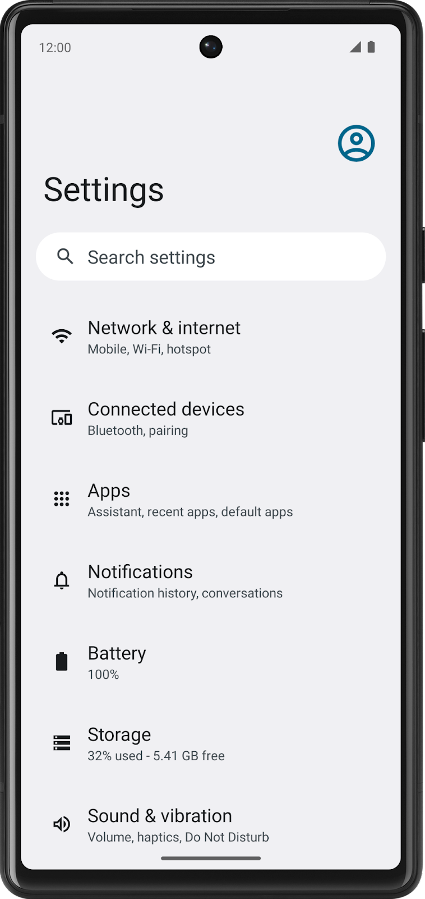
</div>

另一方面，如果您浏览新闻应用就会发现，其中显示的报道会经常变动。比方说，报道的名称、来源、发布时间和图片就会发生变化。

怎样编写代码，才能让内容随着时间而变化呢？每天、每小时甚至每分钟都会有新报道需要发布，您总不能在每次发布新的报道时都重写应用中的代码吧！

在本 Codelab 中，您将学习如何编写使用变量的代码，以便让程序的某些部分可以更改，而不必编写一套全新的指令。与上一个 Codelab 一样，您将会使用 Kotlin 园地。

### 构建内容

- 使用变量的简短 Kotlin 程序。

### 学习内容

- 如何定义变量并更新其值。
- 如何从 Kotlin 的基本数据类型中为变量选择合适的数据类型。
- 如何在代码中添加注释。

### 所需条件

- 可连接到互联网的计算机和网络浏览器。

## 2. 变量和数据类型

在计算机编程中，"变量"这个概念表示单项数据的容器。您可以将"变量"想象成一个包含值的盒子，并且盒子上带有标签（也就是变量的名称）。您可以通过盒子名称来引用这个盒子，从而访问存储在其中的值。

<div align="center">
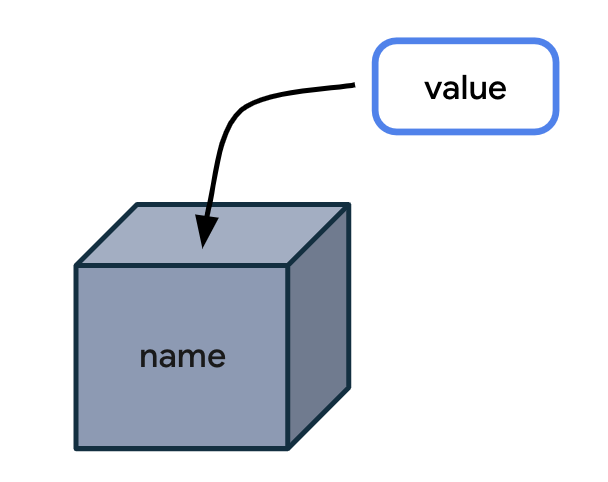
</div>

如果能直接使用值，为什么还要将值存储在盒子里，然后通过盒子名称来引用这个盒子呢？这是因为，如果代码在所有指令中直接使用值，程序就只会在特定情况下运行。

让我们来打个比方，这样您就可以更轻松地了解变量为什么有用了。下面是给您最近会晤的人的一封信。

> 尊敬的 Lauren：
> 您好！很高兴今天能在办公室与您会晤。希望周五还能见到您。
> 祝您天天好心情！

这封信写得很好，但只适用于您遇到 Lauren 的这种特定情况。如果您发现自己需要多次撰写同样的信，只是因为对象不同，内容而略有变化，该怎么办？在这种情况下，建议您创建一个信函模板，并将可能变化的部分留空。

> 尊敬的____：
> 您好！很高兴今天能在_____与您会晤。希望____还能见到您。
> 祝您天天好心情！

您还可以指定每个空白区域所包含信息的类型，从而确保信函模板达到您的预期用途。

> 尊敬的 { name }：
> 您好！很高兴今天能在 {location} 与您会晤。希望 { date } 还能见到您。
> 祝您天天好心情！

从概念上讲，您可以采用类似的方式来构建应用；也就是，用占位符代替某些数据，同时让应用的其他部分保持不变。

<div align="center">
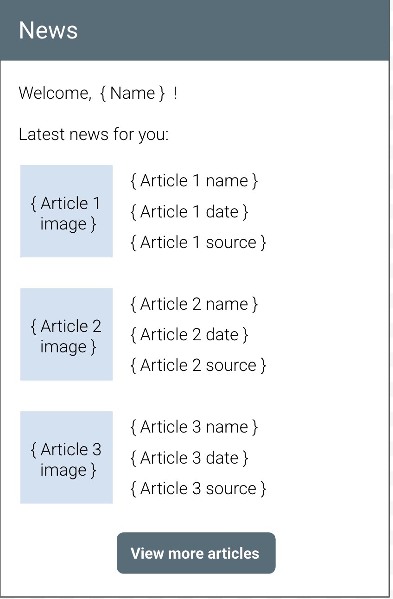
</div>

在上面的新闻应用图示中，"Welcome"（欢迎）文本、"Latest news for you"（为您推荐的最新消息）标题以及"View more articles"（查看更多报道）按钮文本始终保持不变。与之相反，用户的名称和每篇报道的内容将会发生变化，因此可以使用变量存储每一条信息。

<div align="center">
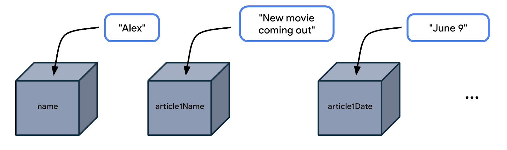
</div>

您没有必要在新闻应用中专门针对名叫 Alex 的用户或始终具有相同标题和发布日期的新闻报道编写适用的代码（或指令）。相反，您可以在编写代码时通过引用 name、article1Name、article1Date 等变量名称，增加应用的灵活性。如此一来，您的代码在通常情况下便足以适用许多不同的用例，例如不同的用户名称、不同的报道详情。

### 使用变量的示例应用

下面我们来看一个应用示例，了解其中可能使用变量的位置。

<div align="center">

</div>

地图应用可能会显示各个营业地点（如餐馆或商家）的详情屏幕。上面的 Google 地图应用屏幕截图显示的就是 Google 公司总部（名为 Googleplex）的详细信息。您不妨想一想，哪几项数据会在该应用中存储为变量？

- 营业地点的名称
- 营业地点的星级
- 营业地点的评价数量
- 用户是否已保存此营业地点（即已为其添加书签）
- 营业地点的地址

通过更改存储在这些变量中的数据，您可以让地图应用保持足够的灵活性，使其也能显示其他营业地点的详细信息。

### 数据类型

在决定应用的哪些部分可变时，请务必指定可在这些变量中存储的数据类型。在 Kotlin 中，有一些常见的基本数据类型。下表逐行列明了各种不同的数据类型，并针对每种数据类型提供了可存储数据类型的说明和示例值。

| Kotlin 数据类型 | 可包含的数据类型 | 字面量值示例 |
|---|---|---|
| String | 文本 | `"Add contact"` `"Search"` `"Sign in"` |
| Int | 整数 | `32` `1293490` `-59281` |
| Double | 小数 | `2.0` `501.0292` `-31723.99999` |
| Float | 小数（不如 Double 精确），数字末尾带有 f 或 F。 | `5.0f` `-1630.209f` `1.2940278F` |
| Boolean | `true` 或 `false`。当只有两个可能的值时，可使用此数据类型。 | `true` `false` |

> **注意**：如需了解数值数据类型（Int、Double 和 Float）的有效范围，请参阅[数字部分](https://kotlinlang.org/docs/numbers.html)中的说明。如需详细了解 Double 和 Float 之间的区别，请查看[这个表格](https://kotlinlang.org/docs/numbers.html#floating-point-types)中对这两种数据类型进行的对比。

现在，您已经了解了一些常见的 Kotlin 数据类型，那么对于在您之前所见营业地点详情页面中确定的各个变量，哪种数据类型会比较合适？

<div align="center">

</div>

- 地点的名称属于文本，可存储在数据类型为 String 的变量中。
- 营业地点的星级属于小数（例如 4.2 颗星），可存储为 Double。
- 营业地点的评价数量属于整数，应存储为 Int。
- 涉及用户是否已保存此营业地点的数据只会有两个可能的值（即"已保存"或"未保存"），因此该数据存储为 Boolean，可用 true 和 false 来代表各个状态。
- 营业地点的地址属于文本，应为 String。

让我们再从下面的两个场景中练习一下。请确定在以下应用中使用的变量及其数据类型。

**场景 1**：在用来观看视频的应用（如 YouTube 应用）中，有一个视频详情屏幕。变量可能会在何处使用？这些变量的数据类型是什么？

<div align="center">

</div>

正确答案不止一个，而在视频观看应用中，变量可用于以下几项数据：
- 视频的名称 (String)
- 频道的名称 (String)
- 视频的观看次数 (Int)
- 视频的顶的次数 (Int)
- 视频的评论数 (Int)

**场景 2**：在类似"信息"的应用中，界面上会列出最近收到的短信。变量可能会在何处使用？这些变量的数据类型是什么？

<div align="center">
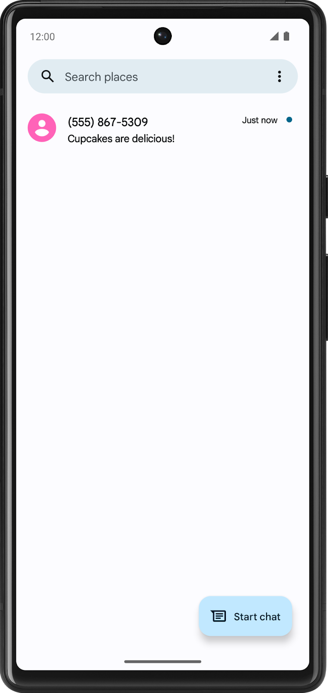
</div>

同样，正确答案不止一个。在短信应用中，可以为以下几项数据使用变量：
- 发送者的电话号码 (String)
- 短信的时间戳 (String)
- 短信内容的预览 (String)
- 短信是否未读 (Boolean)

### 试试看

- 在手机上打开您喜爱的应用。
- 在应用的特定屏幕上找到您认为会使用变量的位置。
- 猜猜这些变量的数据类型。
- 在社交媒体上，提供应用的屏幕截图、说明您认为变量会用在何处，并使用 #AndroidBasics 标签来分享您的回答。

## 3. 定义和使用变量

### 定义与使用变量

您必须先在代码中定义变量，然后才能使用该变量。这与您在上一个 Codelab 中学到的关于在调用函数之前对其进行定义的做法类似。

定义变量时，您需要指定名称来对变量进行唯一标识，还需要指定数据类型来决定变量可以存储哪类数据。此外，您可以视需要提供将存储在变量中的初始值。

> **注意**：您可能会听到"声明变量"的说法。"声明"和"定义"这两个词可以互换使用，含义相同。您还可能会听到"变量定义"或"变量声明"的说法，它们是指定义某个变量的确切代码。在其他编程语言中，"声明"和"定义"有不同的含义。

定义变量后，您便可以在程序中使用该变量。若要使用变量，请在代码中输入变量名称，指示 Kotlin 编译器在代码中的那个位置使用变量的值。

例如，为用户收件箱中的未读邮件数量定义一个变量。该变量的名称可以是 count。将一个值（例如 2）存储在变量中。

<div align="center">
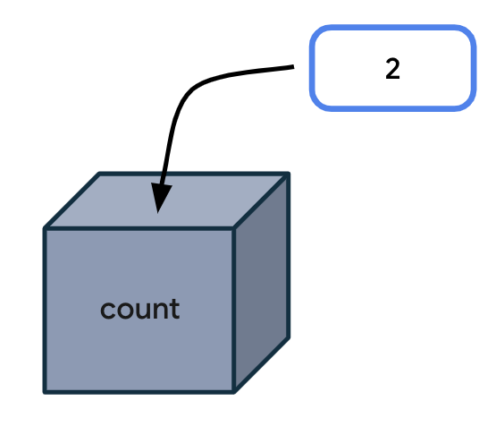
</div>

每当代码需要访问未读邮件的数量时，请在代码中输入 count。执行指令时，Kotlin 编译器就会在代码中找到对应的变量名称，并使用变量值来代替它。

从技术角度而言，我们可以用更具体的术语来描述这个过程：

"表达式"是用于求值的一小段代码。可以由变量、函数调用等元素组成。在下例中，表达式由一个变量（即 count 变量）组成。该表达式的求值结果为 2。

<div align="center">
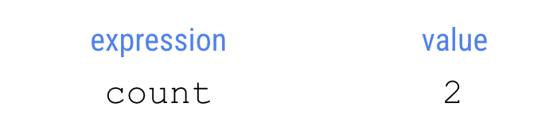
</div>

"求值"的意思是确定表达式的值。在本例中，表达式的求值结果为 2。编译器会对代码中的表达式求值，并在执行程序中的指令时使用这些值。

<div align="center">
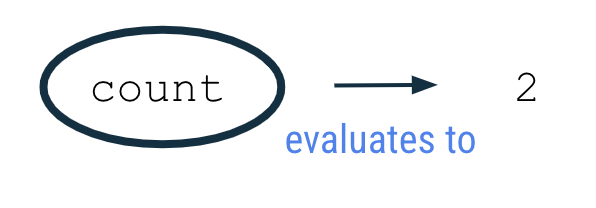
</div>

### 示例

在网络浏览器中打开 [Kotlin 园地](https://play.kotlinlang.org/)。将 Kotlin 园地中的现有代码替换为以下程序。

此程序会创建一个名为 count 且初始值为 2 的变量，并通过输出 count 变量的值来使用该值。

```kotlin
fun main() {
    val count: Int = 2
    println(count)
}
```

运行程序，输出内容应如下所示：

```
2
```

### 变量声明

在运行的程序中，第二行代码如下：

```kotlin
val count: Int = 2
```

此语句会创建一个名为 count 且存储数字 2 的整数变量。

<div align="center">

</div>

若要通晓在 Kotlin 中声明变量的语法（或格式），您可能需要花费一些时间。下图显示了变量应处位置的各个细节，以及空格和符号的位置。

<div align="center">
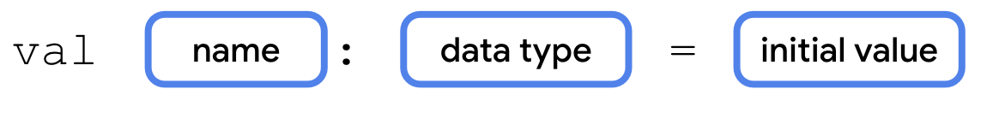
</div>

在下面的 count 变量示例中，您可以看到以单词 val 开头的变量声明。该变量的名称为 count，数据类型为 Int，初始值为 2。

<div align="center">
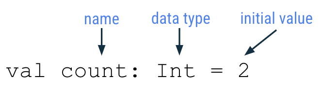
</div>

接下来，让我们进一步了解变量声明的各个部分。

#### 用于定义新变量的关键字

若要定义新变量，请以 Kotlin 关键字 **val**（表示值的意思）开头。然后，Kotlin 编译器就会知道这个语句中包含变量声明。

#### 变量名称

和函数一样，您也要为变量命名。在变量声明中，变量名称跟在 val 关键字后面。

<div align="center">
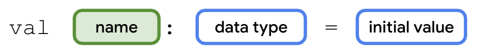
</div>

您可以选择任意变量名称，但最佳做法是避免使用 Kotlin 关键字作为变量名称。

建议选择能够描述变量所存储数据的名称，以便让代码更易于理解。

与您在函数名称中学到的一样，变量名称应遵循驼峰命名法惯例。变量名称中的第一个单词全部小写。如果名称中包含多个单词，则各个单词之间不应有空格，所有其他单词的首字母都应大写。

变量名称示例：

- numberOfEmails
- cityName
- bookPublicationDate

在前面显示的代码示例中，count 就是变量名称。

```kotlin
val count: Int = 2
```

#### 变量数据类型

在变量名称后，需依次添加冒号、空格和变量的数据类型。如前所述，String、Int、Double、Float 和 Boolean 是一些基本的 Kotlin 数据类型。请务必准确拼写数据类型（如下所示），并以大写字母开头。

<div align="center">
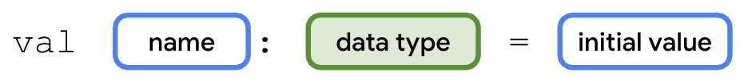
</div>

在 count 变量示例中，Int 就是该变量的数据类型。

```kotlin
val count: Int = 2
```

#### 赋值运算符

在变量声明中，等号 (=) 跟在数据类型之后。等号被称为赋值运算符。赋值运算符用于为变量赋值。换句话说，等号右侧的值会存储在等号左侧的变量中。

#### 变量初始值

变量值是存储在变量中的实际数据。

<div align="center">
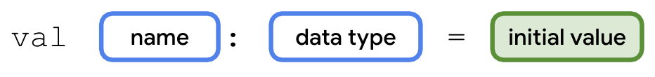
</div>

在 count 变量示例中，2 就是该变量的初始值。

<div align="center">
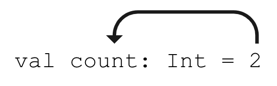
</div>

```kotlin
val count: Int = 2
```

您还可能会听到"count 变量初始化为 2"的说法。这表示，在声明变量时，其中存储的第一个值是 2。

初始值会因为变量声明的数据类型而异。这些值称为"字面量"，因为它们是固定值或常量值（也就是保持不变的值）。请务必根据变量的数据类型提供适当的有效值。举例来说，您不能在 Int 类型的变量中存储字符串字面量（如 "Hello"），因为这会导致 Kotlin 编译器抛出错误。

### 使用变量

```kotlin
fun main() {
    val count: Int = 2
    println(count)
}
```

现在，让我们看看第三行代码：

```kotlin
println(count)
```

请注意，count 一词前后没有引号；它是变量名称，不是字符串字面量。运行程序时，Kotlin 编译器会依据 println() 指令，对括号内的表达式（即 count）进行求值。由于表达式的求值结果为 2，因此输出：

```
2
```

输出数字本身并不是很有用。如果在输出内容中输出更详细的消息来解释 2 所代表的含义，会更为实用。

### 字符串模板

以下是在输出内容中显示的更实用消息：

```
You have 2 unread messages.
```

在 Kotlin 园地中，使用以下代码更新您的程序：

```kotlin
fun main() {
    val count: Int = 2
    println("You have count unread messages.")
}
```

运行程序，输出内容应如下所示：

```
You have count unread messages.
```

这句话不知所云！您应该在消息中显示 count 变量的值，而不是变量名称。

如要修复输出，您需要使用**字符串模板**。这是一个字符串模板，其中包含一个模板表达式，该模板表达式由美元符号 ($) 后跟一个变量名组成。系统会对模板表达式求值，并将值换入到字符串中。

<div align="center">
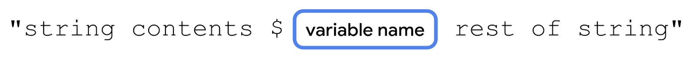
</div>

在 count 变量前添加一个美元符号 $。在此例中，模板表达式 $count 的求值结果为 2，并且 2 会换入到表达式所在的字符串中。

```kotlin
fun main() {
    val count: Int = 2
    println("You have $count unread messages.")
}
```

运行程序后，您将会获得所需的输出内容：

```
You have 2 unread messages.
```

现在，将 count 变量的初始值更改为其他整数字面量（例如，您可以选择数字 10）：

```kotlin
fun main() {
    val count: Int = 10
    println("You have $count unread messages.")
}
```

输出内容会相应地改变，您甚至不需要更改 println() 语句：

```
You have 10 unread messages.
```

为了进一步强调这一点，接下来比较两个程序。第一个程序使用了一个字符串字面量，字符串中直接包含未读邮件的确切数量。在这种情况下，只有当用户收到 10 封未读邮件时，此程序才能正常运行。

```kotlin
fun main() {
    println("You have 10 unread messages.")
}
```

第二个程序使用了一个变量和一个字符串模板，因此代码可以适应更多场景：

```kotlin
fun main() {
    val count: Int = 10
    println("You have $count unread messages.")
}
```

### 类型推断

利用**类型推断**，当 Kotlin 编译器可以推断（或确定）变量应属的数据类型时，您不必在代码中写入确切类型。这意味着，如果您为变量提供了初始值，就可以在变量声明中省略数据类型。

<div align="center">
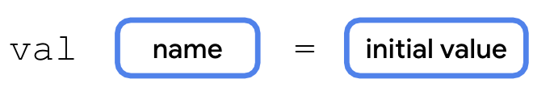
</div>

在 count 示例中，可以省略冒号和 Int 数据类型：

```kotlin
val count = 2
```

> **注意**：如果您在声明变量时未提供初始值，就必须指定类型：`val count: Int`。如果已提供赋值，则可以省略：`val count = 2`。

类型推断的概念适用于 Kotlin 中所有的数据类型。

### 整数的基本数学运算

值为 2 的 Int 变量与值为 "2" 的 String 变量有何区别？将整数存储为 Int（而不是 String）的优势在于，您可以使用 Int 变量执行数学运算，例如加法、减法、除法和乘法（请参阅[其他运算符](https://kotlinlang.org/docs/keyword-reference.html#operators-and-special-symbols)）。

返回 Kotlin 园地，创建一个新程序：

```kotlin
fun main() {
    val unreadCount = 5
    val readCount = 100
    println("You have ${unreadCount + readCount} total messages in your inbox.")
}
```

运行程序，它应该会显示收件箱中的邮件总数：

```
You have 105 total messages in your inbox.
```

<div align="center">
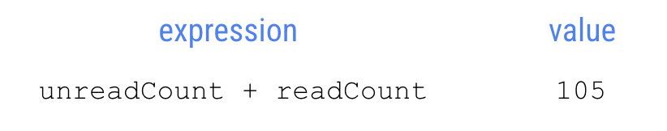
</div>

如果您使用更复杂的表达式，就必须用大括号将该表达式括起来，并在大括号前添加 $ 符号：`${unreadCount + readCount}`。用大括号括起来的表达式（即 unreadCount + readCount）的求值结果为 105。然后，105 这个值会替换到字符串字面量中。

> **警告**：如果忘记用大括号将模板表达式括起来，您将无法获得预期结果。可以在 Kotlin 园地中对此进行测试，将 println() 语句更改为 `println("You have $unreadCount + readCount total messages in your inbox.")` 并观察输出内容即可。

例如，修改您的程序以输出以下内容：

```
100 photos
10 photos deleted
90 photos left
```

可以参考以下代码：

```kotlin
fun main() {
    val numberOfPhotos = 100
    val photosDeleted = 10
    println("$numberOfPhotos photos")
    println("$photosDeleted photos deleted")
    println("${numberOfPhotos - photosDeleted} photos left")
}
```

## 4. 更新变量

应用在运行时，可能需要更新变量的值。例如，在购物应用中，如果用户向购物车添加商品，购物车总金额就会增加。

让我们将购物用例简化成一个简单的程序。下面的逻辑是用人类语言（而非 Kotlin）编写的，属于**伪代码**，因为它只描述了代码编写方式的要点，并未包含代码的所有细节。

> **注意**：之所以称为"伪代码"，是因为它不是可以编译的有效代码。

在程序的 main 函数中：

1. 创建一个从 0 值开始的整数 cartTotal 变量。
2. 用户在购物车中添加了一件 20 元的毛衣。
3. 将 cartTotal 变量更新为 20（即购物车中商品的当前费用）。
4. 输出购物车中商品的总费用（即 cartTotal 变量）。

将 Kotlin 园地中的现有代码替换为以下程序：

```kotlin
fun main() {
    val cartTotal = 0
    cartTotal = 20
    println("Total: $cartTotal")
}
```

运行程序，系统会抛出编译错误：

```
Val cannot be reassigned
```

如果您需要更新变量的值，请使用 Kotlin 关键字 **var**（而不是 val）声明该变量。

- **val** 关键字 — 预计变量值不会变化时使用。
- **var** 关键字 — 预计变量值会发生变化时使用。

如果使用 val，变量只读，值一经设置，便无法再编辑或修改。如果使用 var，变量可变。在 Kotlin 中，建议尽量使用 val 关键字，而不是 var 关键字。

更新 cartTotal 的变量声明，以使用 var：

```kotlin
fun main() {
    var cartTotal = 0
    cartTotal = 20
    println("Total: $cartTotal")
}
```

注意程序中第 3 行代码的语法（用于更新变量）：

```kotlin
cartTotal = 20
```

使用赋值运算符 (=) 为现有变量赋予新值。由于该变量已定义，因此您无需再次使用 var 关键字。

<div align="center">
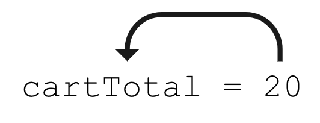
</div>

以盒子为喻，想象 20 这个值是存储在标着 cartTotal（购物车总金额）的盒子里。

<div align="center">
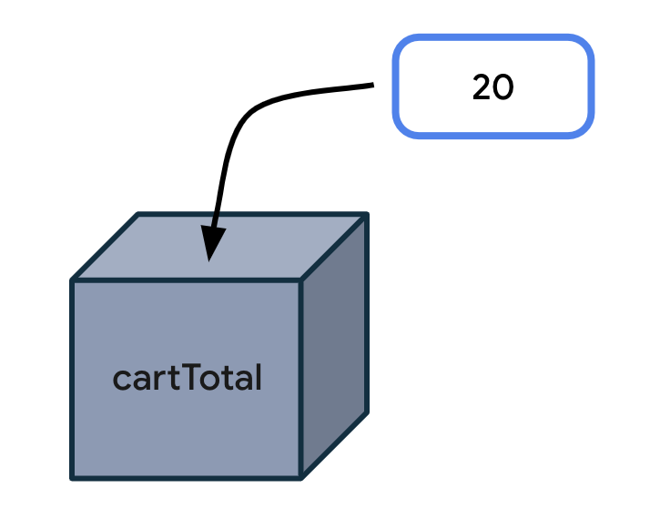
</div>

下图显示了更新变量的一般语法：

<div align="center">
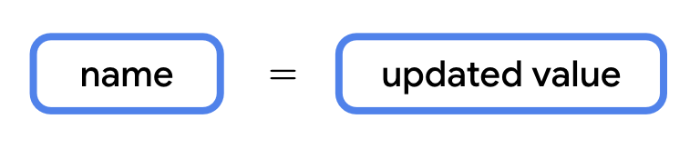
</div>

运行程序，输出内容应如下所示：

```
Total: 20
```

若要了解变量值在程序运行期间的变化情况，请在最初声明 cartTotal 变量后输出该变量：

```kotlin
fun main() {
    var cartTotal = 0
    println("Total: $cartTotal")

    cartTotal = 20
    println("Total: $cartTotal")
}
```

输出内容应如下所示：

```
Total: 0
Total: 20
```

您可以看到，购物车总金额最初为 0，之后更新为 20。

请注意，只有在预计值会发生变化时，才应使用 var 声明变量；否则，应默认使用 val 声明变量。这样做是为了提高代码的安全性。

> **注意**：因为 val 是只读变量，所以熟悉其他编程语言的人可以把声明 val 当作声明常量值来对待。在 Kotlin 中声明常量时，还需遵循一些其他规范，但这超出了本 Codelab 的范围，不过您可以在[样式指南的常量部分](https://kotlinlang.org/docs/coding-conventions.html#property-names)找到它们。

### 增量运算符和减量运算符

现在您已经知道，必须将变量声明为 var，才能更新其值。让我们将这个知识应用到我们之前使用的电子邮件示例中。

```kotlin
fun main() {
    val count: Int = 10
    println("You have $count unread messages.")
}
```

将 val 关键字替换为 var 关键字，使 count 变量成为可变变量：

```kotlin
fun main() {
    var count: Int = 10
    println("You have $count unread messages.")
}
```

现在您可以将 count 更新为其他值。例如，当用户在收件箱中收到一封新的电子邮件时，您可以将 count 加 1：

```kotlin
count = count + 1
```

等号右侧的表达式 count + 1 的求值结果为 11（count 当前值为 10，10 + 1 = 11）。

<div align="center">
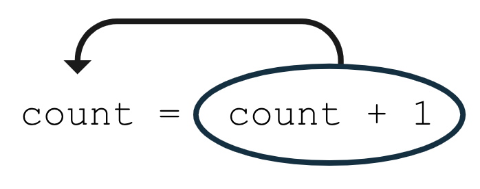
</div>

```kotlin
fun main() {
    var count = 10
    println("You have $count unread messages.")
    count = count + 1
    println("You have $count unread messages.")
}
```

输出：

```
You have 10 unread messages.
You have 11 unread messages.
```

如果您想让变量加 1，可以使用由两个加号组成的**增量运算符 (++)** 来简化代码：

```kotlin
count = count + 1
count++  // 等效
```

类似地，可以使用**减量运算符 (--)** 将变量减 1：

```kotlin
fun main() {
    var count = 10
    println("You have $count unread messages.")
    count--
    println("You have $count unread messages.")
}
```

输出：

```
You have 10 unread messages.
You have 9 unread messages.
```

更具体地说，count++ 等同于 count = count + 1，count-- 等同于 count = count - 1。

## 5. 探索其他数据类型

### Double

如果您需要一个可以存储小数值的变量，请使用 Double 变量。Double 数据类型的精度是 Float 类型的两倍，可存储更精确的值。

假设您要导航到某个目的地，由于沿途需要停靠，因此您的行程被拆分成三个单独的部分：

```kotlin
fun main() {
    val trip1: Double = 3.20
    val trip2: Double = 4.10
    val trip3: Double = 1.72
    val totalTripLength: Double = 0.0
    println("$totalTripLength miles left to destination")
}
```

修正代码，使 totalTripLength 变量是所有三段行程长度的总和：

```kotlin
val totalTripLength: Double = trip1 + trip2 + trip3
```

等号右侧表达式求值结果为 9.02（3.20 + 4.10 + 1.72 = 9.02）。

<div align="center">
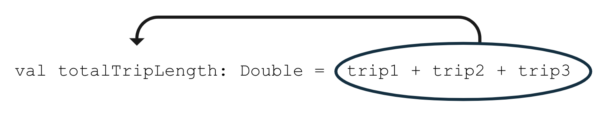
</div>

完整程序：

```kotlin
fun main() {
    val trip1: Double = 3.20
    val trip2: Double = 4.10
    val trip3: Double = 1.72
    val totalTripLength: Double = trip1 + trip2 + trip3
    println("$totalTripLength miles left to destination")
}
```

输出：

```
9.02 miles left to destination
```

使用类型推断简化代码：

```kotlin
fun main() {
    val trip1 = 3.20
    val trip2 = 4.10
    val trip3 = 1.72
    val totalTripLength = trip1 + trip2 + trip3
    println("$totalTripLength miles left to destination")
}
```

### 字符串

如果您需要一个可以存储文本的变量，请使用 String 变量。请务必用引号引住 String 字面量值（如 "Hello Kotlin"），但不要用引号引住 Int 和 Double 字面量值。

```kotlin
fun main() {
    val nextMeeting = "Next meeting:"
    val date = "January 1"
    val reminder = nextMeeting + date
    println(reminder)
}
```

您可以使用 + 号将两个字符串加在一起（这种做法称为"串联"）。当两个字符串前后组合起来后，表达式 nextMeeting + date 的结果即为 "Next meeting:January 1"。

<div align="center">
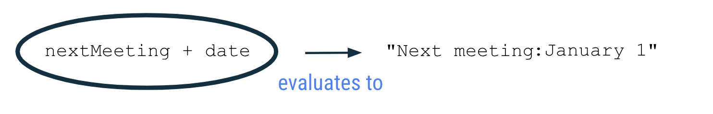
</div>

运行程序：

```
Next meeting:January 1
```

如果您想让冒号后面有空格，需要在其中一个字符串中添加空格：

```kotlin
fun main() {
    val nextMeeting = "Next meeting: "
    val date = "January 1"
    val reminder = nextMeeting + date
    println(reminder)
}
```

输出：

```
Next meeting: January 1
```

继续将更多文本串联到 reminder 表达式中：

```kotlin
fun main() {
    val nextMeeting = "Next meeting: "
    val date = "January 1"
    val reminder = nextMeeting + date + " at work"
    println(reminder)
}
```

输出：

```
Next meeting: January 1 at work
```

请注意，不要用引号将 nextMeeting 和 date 变量名称引起来，因为它们是变量，不是字符串字面量。但必须用引号将 " at work" 引起来，因为这是一段固定文本。

从技术层面来讲，您可以声明包含完整文本的单个 String 变量（而不是使用单独的变量）来实现相同输出。不过，本练习的目的是为了说明如何声明和操纵 String 变量，特别是如何串联单独的字符串。

读取包含字符串的代码时，您可能会遇到**转义序列**。转义序列是指前面带有反斜杠符号（\）的字符。

在下面的例子中，字符串字面量中出现了 \"。请复制此代码并将其粘贴到 Kotlin 园地中。

```kotlin
fun main() {
    println("Say \"hello\"")
}
```

运行该程序来查看输出：

```
Say "hello"
```

在输出中，hello 会使用英文双引号引起来，因为我们在 println() 语句中 hello 的前后都添加了 \"。

如需了解 Kotlin 支持的其他转义序列，请参阅有关[转义序列](https://kotlinlang.org/docs/basic-types.html#string-literals)的文档页面。例如，如果要在字符串中另起一行，请在字符 n 前面使用 \ 符号，表示为 \n。

### 布尔值

当变量只有两个可能的值（用 true 或 false 表示）时，Boolean 数据类型会非常有用。

例如，指示设备的飞行模式是处于开启还是关闭状态的变量，或者指示应用的通知功能是处于启用还是停用状态的变量。

在 Kotlin 园地中输入以下代码：

```kotlin
fun main() {
    val notificationsEnabled: Boolean = true
    println(notificationsEnabled)
}
```

运行程序：

```
true
```

在程序的第 2 行代码中，将 Boolean 的初始值更改为 false：

```kotlin
fun main() {
    val notificationsEnabled: Boolean = false
    println(notificationsEnabled)
}
```

输出：

```
false
```

其他数据类型可以串联到 Strings 上。例如，您可以将 Booleans 串联到 Strings 上：

```kotlin
fun main() {
    val notificationsEnabled: Boolean = false
    println("Are notifications enabled? " + notificationsEnabled)
}
```

输出：

```
Are notifications enabled? false
```

有了 Boolean 变量，您就可以用代码表示更加复杂的场景。在 Boolean 变量的值为 true 时，执行一组指令；在 Boolean 变量的值为 false 时，跳过这些指令。在后续的 Codelab 中，我们会对 Booleans 进行详细说明。

## 6. 编码规范

在上一个 Codelab 中，我们为您介绍了 Kotlin 样式指南，这是 Google 推荐使用并且其他专业开发者也在遵循的一种 Android 代码统一编写方式。

对于所学的新主题，您还需遵循其他一些格式设置和编码规范：

- 变量名称应采用驼峰命名法，并以小写字母开头。
- 在变量声明中指定数据类型时，应在冒号后面添加一个空格。

```kotlin
// Good
val count: Int = 2
```

- 赋值运算符 (=) 前后各应有一个空格。

<div align="center">
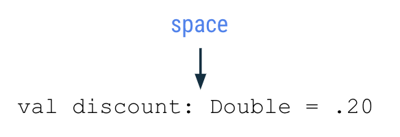
</div>

- 加号 (+)、减号 (-)、乘号 (*)、除号 (/) 等运算符的前后应有空格。

<div align="center">
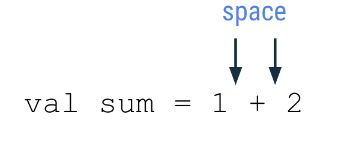
</div>

- 如果是编写更为复杂的程序，建议每行不要超过 100 个字符。这样一来，您无需水平滚动计算机屏幕，便可轻松阅读程序中的所有代码。

## 7. 在代码中添加注释

编写代码时，另一个建议遵循的较好做法是添加注释来说明代码的用途。这样做可帮助读者更轻松地理解代码。您可以使用两个正斜杠符号 (//) 来指明将相应行中该符号后面的剩余文本视为注释，而不要解释为代码。通常的做法是在两个正斜杠符号后添加一个空格。

```kotlin
// This is a comment.
```

您也可以在一行代码的中间位置插入注释。在下面的示例中，height = 1 是正常的编码语句。// Assume the height is 1 to start with 会被解释为注释。

```kotlin
height = 1 // Assume the height is 1 to start with
```

如果您想用一行超过 100 个字符的长注释来详细说明代码，不妨使用多行注释。具体方法为：使用由正斜杠 (/) 和星号 (*) 组成的 /* 作为多行注释的开头，在注释的每个新行开头添加一个星号，最后使用由星号和正斜杠符号组成的 */ 作为结尾。

```kotlin
/*
 * This is a very long comment that can
 * take up multiple lines.
 */
```

以下程序包含描述代码行为的单行注释和多行注释：

```kotlin
/*
 * This program displays the number of messages
 * in the user's inbox.
 */
fun main() {
    // Create a variable for the number of unread messages.
    var count = 10
    println("You have $count unread messages.")

    // Decrease the number of messages by 1.
    count--
    println("You have $count unread messages.")
}
```

<div align="center">
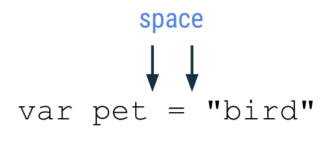
</div>

如前所述，您可以在代码中添加空行来对相关语句进行分组，让代码更易于阅读。

在之前使用的代码段中添加一些注释。运行程序，确认行为未发生变化（注释不应该影响输出）。

## 8. 总结

做得很好！您已经了解了 Kotlin 中的变量、变量为什么在编程中大有用处，以及如何创建、更新和使用变量。您尝试了 Kotlin 中不同的基本数据类型（包括 Int、Double、String 和 Boolean 数据类型），同时还了解了 val 和 var 关键字之间的区别。

在成为开发者的旅程中，所有这些概念都是您前进道路上的重要基石。

期待与您相会于下一个 Codelab！

### 摘要

- 变量是存储单项数据的容器。
- 必须先声明变量，然后才能使用它。
- val 关键字用于定义只读变量；其中的变量一旦赋值，就不能再更改。
- var 关键字用于定义可变变量。
- 在 Kotlin 中，建议您尽可能使用 val，而不是 var。
- 如需声明变量，请以 val 或 var 关键字开头，然后指定变量名称、数据类型和初始值。例如：`val count: Int = 2`。
- 使用类型推断时，如果提供了初始值，则可以在变量声明中省略数据类型。
- 一些常见的基本 Kotlin 数据类型包括：Int、String、Boolean、Float 和 Double。
- 在声明或更新变量时，请使用赋值运算符 (=) 为变量赋值。
- 只能更新通过 var 声明为可变变量的变量。
- 增量运算符 (++) 用于为整数变量的值加 1，减量运算符 (--) 用于为整数变量的值减 1。
- + 符号用于串联各个字符串，也可用于将其他数据类型的变量（如 Int 和 Boolean）串联到 Strings。

### 了解详情

- [变量](https://kotlinlang.org/docs/basic-syntax.html#variables)
- [基本类型](https://kotlinlang.org/docs/basic-types.html)
- [字符串模板](https://kotlinlang.org/docs/basic-types.html#string-templates)
- [关键字和运算符](https://kotlinlang.org/docs/keyword-reference.html)
- [基本语法](https://kotlinlang.org/docs/basic-syntax.html)
