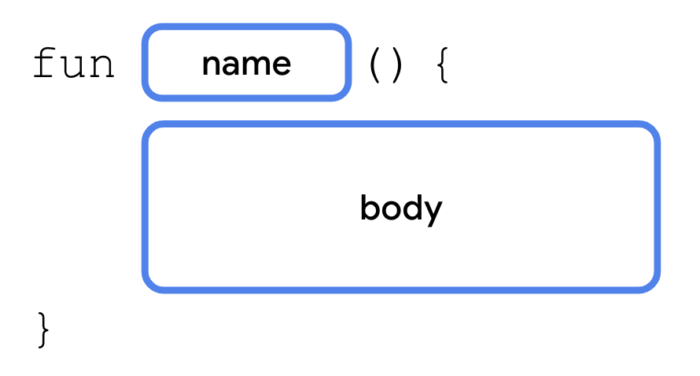
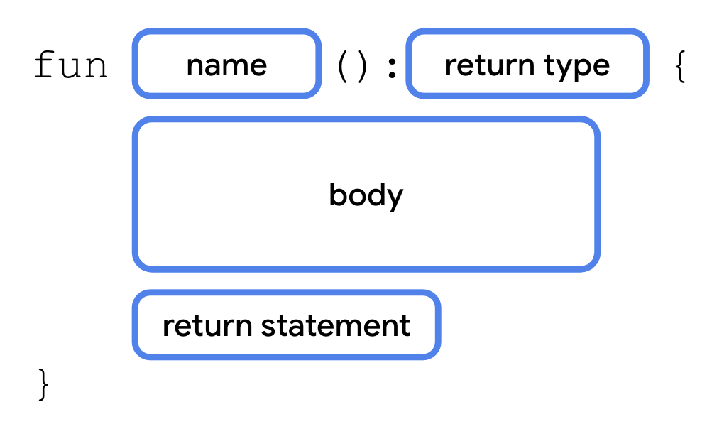
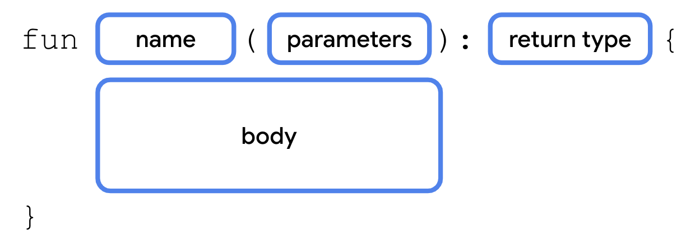
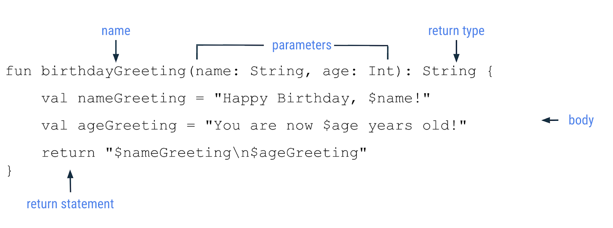

# 创建和使用 Kotlin 函数

## 1. 使用前须知

在先前的 Codelab 中，您看到了一个会输出"Hello, world!"的简单程序。在您到目前为止编写过的程序中，您看到了两个函数：

- `main()` 函数，这在每个 Kotlin 程序中都需要。它是程序的入口点，或者说是起点。
- `println()` 函数，您会从 `main()` 中调用此函数以输出文本。

在此 Codelab 中，您将详细了解函数。

借助函数，您可将代码拆分为可重复使用的部分，而不是将所有代码都放在 `main()` 中。函数是 Android 应用的基本构建块，了解如何定义和使用函数是成为一名 Android 开发者的重要一步。

**前提条件**

- 了解 Kotlin 编程基础知识，包括变量以及 `println()` 和 `main()` 函数

**学习内容**

- 如何定义和调用您自己的函数。
- 如何从函数返回可存储在变量中的值。
- 如何定义和调用带有多个形参的函数。
- 如何调用带有具名实参的函数。
- 如何为函数形参设置默认值。

**所需条件**

- 一个能够访问 Kotlin 园地的网络浏览器

## 2. 定义并调用函数

在深入了解函数之前，我们先来了解一些基本术语。

- **声明**（或定义）函数时，需要使用 `fun` 关键字，并在大括号内添加代码，其中包含执行某个任务所需的指令。
- **调用**函数时，系统会执行该函数中包含的所有代码。

到目前为止，您都是在 `main()` 函数中编写所有代码。实际上，系统并不会在代码中的任何位置调用 `main()` 函数；Kotlin 编译器会将该函数用作起点。`main()` 函数仅用于包含您要执行的其他代码，例如对 `println()` 函数的调用。

`println()` 函数是 Kotlin 语言的一部分。不过，您可以定义自己的函数。这样一来，如果您需要多次调用代码，就可以重复使用它。以下面的程序为例。

```kotlin
fun main() {
    println("Happy Birthday, Rover!")
    println("You are now 5 years old!")
}
```

`main()` 函数包含两个 `println()` 语句：一个语句是祝 Rover 生日快乐，另一个语句指明了 Rover 的年龄。

虽然 Kotlin 允许您将所有代码都放入 `main()` 函数中，但有时您可能并不想这样做。例如，如果您还希望程序包含新年问候语，那么 main 函数还必须包含对 `println()` 的调用。或许您想向 Rover 致以多次问候。只需复制并粘贴代码，或者为生日祝福创建一个单独的函数。您会选择后者。针对特定任务创建单独的函数有诸多好处。

- **可重复使用的代码**：您只需在需要时调用一个函数，而不必多次复制并粘贴所需代码。
- **可读性**：确保函数只执行一个特定任务不仅可帮助其他开发者和团队成员准确了解某段代码的用途，而且未来也可帮助您自己准确了解某段代码的用途。

定义函数的语法如下图所示。

<div align="center">

</div>

函数定义以 `fun` 关键字开头，后跟函数名称、一组圆括号和一组大括号。调用该函数时，将运行大括号中所含的代码。

您需要创建一个新函数，将两个 `println()` 语句移出 `main()` 函数。

1. 在浏览器中，打开 [Kotlin 园地](https://developer.android.com/training/kotlinplayground)，并将相关内容替换为以下代码。

```kotlin
fun main() {
    println("Happy Birthday, Rover!")
    println("You are now 5 years old!")
}
```

2. 在 `main()` 函数后面，定义一个名为 `birthdayGreeting()` 的新函数。该函数使用与 `main()` 函数相同的语法进行声明。

```kotlin
fun main() {
    println("Happy Birthday, Rover!")
    println("You are now 5 years old!")
}

fun birthdayGreeting() {

}
```

3. 将两个 `println()` 语句从 `main()` 移到 `birthdayGreeting()` 函数的大括号中。

```kotlin
fun main() {

}

fun birthdayGreeting() {
    println("Happy Birthday, Rover!")
    println("You are now 5 years old!")
}
```

4. 在 `main()` 函数中，调用 `birthdayGreeting()` 函数。完成后的代码应如下所示：

```kotlin
fun main() {
    birthdayGreeting()
}

fun birthdayGreeting() {
    println("Happy Birthday, Rover!")
    println("You are now 5 years old!")
}
```

运行您的代码。您应该会看到以下输出内容：

```
Happy Birthday, Rover!
You are now 5 years old!
```

## 3. 从函数返回值

在更复杂的应用中，函数的作用不仅仅是输出文本。

Kotlin 函数也可以生成称为"返回值"的数据，该值存储在变量中，供您在代码中的其他位置使用。

定义函数时，您可以指定希望其返回的值的数据类型。如需指定返回值类型，只需在圆括号后面添加冒号 (`:`)，然后在冒号后面添加一个空格和类型名称（`Int`、`String` 等）。然后，在返回值类型与左大括号之间添加一个空格。在函数主体中，您可以在所有语句之后使用 return 语句指定您希望函数返回的值。return 语句包含 `return` 关键字，后跟您希望函数作为输出返回的值（例如变量）。

声明具有返回值类型的函数的语法如下所示。

<div align="center">

</div>

### Unit 类型

默认情况下，如果您不指定返回值类型，默认返回值类型是 `Unit`。`Unit` 表示函数并不会返回值。`Unit` 相当于其他语言中的 void 返回值类型（在 Java 和 C 中为 `void`；在 Swift 中为 `Void`/空元组 `()`；在 Python 中为 `None` 等）。任何不返回值的函数都会隐式返回 `Unit`。您可以通过修改代码以返回 `Unit` 来观察此情况。

在 `birthdayGreeting()` 的函数声明中，在右圆括号后面添加冒号，并将返回值类型指定为 `Unit`。

```kotlin
fun main() {
    birthdayGreeting()
}

fun birthdayGreeting(): Unit {
    println("Happy Birthday, Rover!")
    println("You are now 5 years old!")
}
```

运行代码，观察一切是否仍然正常运行。

```
Happy Birthday, Rover!
You are now 5 years old!
```

您可以选择在 Kotlin 中指定 `Unit` 返回值类型。对于不返回任何内容或返回 `Unit` 的函数，不需要使用 return 语句。

> 注意：在后面的 Codelab 中了解名为 lambda 的 Kotlin 功能时，您将再次看到 `Unit` 类型。

### 从 birthdayGreeting() 返回 String

为了演示函数如何返回值，您需要修改 `birthdayGreeting()` 函数以返回一个字符串，而不是直接输出结果。

1. 将 `Unit` 返回值类型替换为 `String`。

```kotlin
fun birthdayGreeting(): String {
    println("Happy Birthday, Rover!")
    println("You are now 5 years old!")
}
```

运行您的代码。您会收到错误消息。如果您声明函数的返回值类型（例如 `String`），该函数必须包含 `return` 语句。

```
A 'return' expression required in a function with a block body ('{...}')
```

2. 您只能从函数返回一个（而非两个）字符串。使用 `val` 关键字将 `println()` 语句替换为两个变量（`nameGreeting` 和 `ageGreeting`）。由于您从 `birthdayGreeting()` 移除了对 `println()` 的调用，因此调用 `birthdayGreeting()` 不会输出任何内容。

```kotlin
fun birthdayGreeting(): String {
    val nameGreeting = "Happy Birthday, Rover!"
    val ageGreeting = "You are now 5 years old!"
}
```

3. 使用您在先前的 Codelab 中学到的字符串格式设置语法，添加 `return` 语句以从函数返回一个包含这两个问候语的字符串。

为了将每个问候语单独放一行，您还需要使用 `\n` 转义字符。这与您在上一个 Codelab 中了解的 `\"` 转义字符类似。`\n` 字符将替换为换行符，因此两条问候语都分别位于单独的一行上。

```kotlin
fun birthdayGreeting(): String {
    val nameGreeting = "Happy Birthday, Rover!"
    val ageGreeting = "You are now 5 years old!"
    return "$nameGreeting\n$ageGreeting"
}
```

4. 在 `main()` 中，由于 `birthdayGreeting()` 会返回一个值，因此您可以将结果存储在字符串变量中。使用 `val` 声明 `greeting` 变量，以存储调用 `birthdayGreeting()` 的结果。

```kotlin
fun main() {
    val greeting = birthdayGreeting()
}
```

5. 在 `main()` 中，调用 `println()` 来输出 `greeting` 字符串。`main()` 函数现在应如下所示。

```kotlin
fun main() {
    val greeting = birthdayGreeting()
    println(greeting)
}
```

运行代码，然后观察结果是否和之前一样。返回值可让您将结果存储在变量中，但如果您在 `println()` 函数内调用 `birthdayGreeting()` 函数，您认为会发生什么情况？

```
Happy Birthday, Rover!
You are now 5 years old!
```

6. 移除该变量，然后将调用 `birthdayGreeting()` 函数的结果传递到 `println()` 函数：

```kotlin
fun main() {
    println(birthdayGreeting())
}
```

运行代码并观察输出结果。调用 `birthdayGreeting()` 的返回值会直接传入 `println()`。

```
Happy Birthday, Rover!
You are now 5 years old!
```

## 4. 向 birthdayGreeting() 函数添加形参

如您所见，调用 `println()` 时，可在圆括号内添加一个字符串，或者向该函数传递值。您可以使用 `birthdayGreeting()` 函数执行相同的操作。不过，您首先需要向 `birthdayGreeting()` 函数添加形参。

形参会指定变量的名称和数据类型，您可以将其作为要在函数内访问的数据传递到函数中。形参在函数名称后面的圆括号内进行声明。

<div align="center">

</div>

每个形参均由变量名称和数据类型组成，以冒号和空格分隔。多个形参以英文逗号分隔。

目前，`birthdayGreeting()` 函数只能用于向 Rover 致以问候。您将向 `birthdayGreeting()` 函数添加一个形参，以便向传入该函数的任何名字致以问候。

1. 在 `birthdayGreeting()` 函数的圆括号内使用语法 `name: String` 添加类型为 `String` 的 `name` 形参。

```kotlin
fun birthdayGreeting(name: String): String {
    val nameGreeting = "Happy Birthday, Rover!"
    val ageGreeting = "You are now 5 years old!"
    return "$nameGreeting\n$ageGreeting"
}
```

上一步中定义的形参的工作原理类似于使用 `val` 关键字声明的变量。其值可以在 `birthdayGreeting()` 函数中的任何位置使用。在先前的 Codelab 中，您学习了如何将变量的值插入字符串中。

2. 将 `nameGreeting` 字符串中的 `Rover` 替换为 `$` 符号，后跟 `name` 形参。

```kotlin
fun birthdayGreeting(name: String): String {
    val nameGreeting = "Happy Birthday, $name!"
    val ageGreeting = "You are now 5 years old!"
    return "$nameGreeting\n$ageGreeting"
}
```

运行代码并观察错误。现在您已声明 `name` 形参，接下来需要在调用 `birthdayGreeting()` 时传入 `String` 值。当您调用接受形参的函数时，需要向该函数传递实参。实参是您传递的值，例如 `"Rover"`。

```
No value passed for parameter 'name'
```

3. 将 `"Rover"` 传入 `main()` 中的 `birthdayGreeting()` 调用。

```kotlin
fun main() {
    println(birthdayGreeting("Rover"))
}
```

运行代码并观察输出结果。名称 Rover 来自 `name` 形参。

```
Happy Birthday, Rover!
You are now 5 years old!
```

4. 由于 `birthdayGreeting()` 接受形参，因此您可以使用 Rover 以外的名称调用它。在对 `println()` 的调用内添加对 `birthdayGreeting()` 的另一个调用，并传入实参 `"Rex"`。

```kotlin
println(birthdayGreeting("Rover"))
println(birthdayGreeting("Rex"))
```

再次运行代码，然后观察输出结果是否会因传递给 `birthdayGreeting()` 的实参而异。

```
Happy Birthday, Rover!
You are now 5 years old!
Happy Birthday, Rex!
You are now 5 years old!
```

> 注意：尽管您经常会发现形参和实参可互换使用，但这两者并不是一回事。定义函数时，您需定义要在调用该函数时向它传递的形参。调用函数时，您需要为形参传递实参。形参是可供函数访问的变量（例如 `name` 变量），而实参是您传递的实际值（例如 `"Rover"` 字符串）。

> 警告：与某些语言（例如在 Java 中，函数可以更改传递到形参中的值）不同，Kotlin 中的形参是不可变的。您不能在函数主体中重新分配形参的值。

## 5. 具有多个形参的函数

之前，您添加了一个根据名称更改问候语的形参。但是，您也可以为函数定义多个形参，甚至可定义不同数据类型的形参。在这部分中，您将修改问候语，使其还会根据狗狗的年龄而变化。

<div align="center">

</div>

形参定义以英文逗号分隔。同样，当您调用具有多个形参的函数时，也需使用英文逗号分隔传入的实参。我们来看看实际用例。

1. 在 `name` 形参后面，向 `birthdayGreeting()` 函数添加类型为 `Int` 的 `age` 形参。新的函数声明应具有两个形参，即 `name` 和 `age`，它们之间以英文逗号分隔：

```kotlin
fun birthdayGreeting(name: String, age: Int): String {
    val nameGreeting = "Happy Birthday, $name!"
    val ageGreeting = "You are now 5 years old!"
    return "$nameGreeting\n$ageGreeting"
}
```

2. 新的问候语字符串应使用 `age` 形参。将 `birthdayGreeting()` 函数更新为使用 `ageGreeting` 字符串中的 `age` 形参的值。

```kotlin
fun birthdayGreeting(name: String, age: Int): String {
    val nameGreeting = "Happy Birthday, $name!"
    val ageGreeting = "You are now $age years old!"
    return "$nameGreeting\n$ageGreeting"
}
```

运行该函数，然后注意输出中的错误：

```
No value passed for parameter 'age'
No value passed for parameter 'age'
```

3. 修改 `main()` 中对 `birthdayGreeting()` 函数的两次调用，为每只狗狗传入不同的年龄。传入 `5` 来表示 Rover 的年龄，传入 `2` 来表示 Rex 的年龄。

```kotlin
fun main() {
    println(birthdayGreeting("Rover", 5))
    println(birthdayGreeting("Rex", 2))
}
```

运行您的代码。现在，您已经为这两个形参传入了值，因此在调用函数时，输出结果应反映每只狗狗的名字和年龄。

```
Happy Birthday, Rover!
You are now 5 years old!
Happy Birthday, Rex!
You are now 2 years old!
```

### 函数签名

到目前为止，您已经学习了如何定义函数名称、输入（形参）和输出。函数名称及其输入（形参）统称为"函数签名"。函数签名包含返回值类型前面的所有内容，如以下代码段所示。

```kotlin
fun birthdayGreeting(name: String, age: Int)
```

形参（以英文逗号分隔）有时称为形参列表。

对于其他开发者编写的代码，您经常会在其文档中看到这些术语。通过函数签名，您可以了解函数的名称以及可以传入的数据类型。

关于定义函数的新语法，您已经了解了很多。请查看下图，简要回顾一下函数语法。

<div align="center">

</div>

## 6. 具名实参

在前面的示例中，调用函数时不需要指定形参名称 `name` 或 `age`。不过，您可以选择这么做。例如，您可以调用具有很多形参的函数，也可能希望以不同的顺序传递实参，例如将 `age` 形参放在 `name` 形参前面。如果您在调用函数时添加了形参名称，该名称就称为**具名实参**。尝试结合使用具名实参和 `birthdayGreeting()` 函数。

1. 修改对 Rex 的调用以使用具名实参，如以下代码段所示。为此，您可以添加形参名称，后跟一个等号，再后跟值（例如 `name = "Rex"`）。

```kotlin
println(birthdayGreeting(name = "Rex", age = 2))
```

运行代码，然后观察输出结果是否保持不变：

```
Happy Birthday, Rover!
You are now 5 years old!
Happy Birthday, Rex!
You are now 2 years old!
```

2. 对具名实参重新排序。例如，将 `age` 具名实参放在 `name` 具名实参前面。

```kotlin
println(birthdayGreeting(age = 2, name = "Rex"))
```

运行代码，观察输出结果是否保持不变。即使您更改了实参的顺序，系统也会为相同的形参传入相同的值。

```
Happy Birthday, Rover!
You are now 5 years old!
Happy Birthday, Rex!
You are now 2 years old!
```

## 7. 默认实参

函数形参还可以指定默认实参。可能 Rover 是您最喜欢的狗狗，或者在大多数情况下您希望在调用函数时使用特定实参。调用函数时，您可以选择忽略具有默认值的实参，在这种情况下，系统将使用默认值。

如需添加默认实参，您可以在形参的数据类型后面添加赋值运算符 (`=`)，并将其设为等于某个值。将代码修改为使用默认实参。

1. 在 `birthdayGreeting()` 函数中，将 `name` 形参设为默认值 `"Rover"`。

```kotlin
fun birthdayGreeting(name: String = "Rover", age: Int): String {
    return "Happy Birthday, $name! You are now $age years old!"
}
```

2. 在 `main()` 中第一次针对 Rover 调用 `birthdayGreeting()` 时，将 `age` 具名实参设为 `5`。由于 `age` 形参是在 `name` 后面定义的，因此您需要使用具名实参 `age`。如果没有具名实参，Kotlin 会假定实参的顺序与形参的定义顺序相同。具名实参可确保 Kotlin 要求使用 `Int` 类型的 `age` 形参。

```kotlin
println(birthdayGreeting(age = 5))
println(birthdayGreeting("Rex", 2))
```

运行您的代码。首次调用 `birthdayGreeting()` 函数会将"Rover"输出为名称，因为您从未指定该名称。第二次调用 `birthdayGreeting()` 时仍会使用 `Rex` 值，该值会针对 `name` 传入。

```
Happy Birthday, Rover! You are now 5 years old!
Happy Birthday, Rex! You are now 2 years old!
```

3. 从对 `birthdayGreeting()` 函数的第二次调用中移除该名称。同样，由于省略了 `name`，因此您需要为年龄使用具名实参。

```kotlin
println(birthdayGreeting(age = 5))
println(birthdayGreeting(age = 2))
```

运行代码，然后观察对 `birthdayGreeting()` 的两次调用现在是否都会输出"Rover"作为名称（因为没有传入具名实参）。

```
Happy Birthday, Rover! You are now 5 years old!
Happy Birthday, Rover! You are now 2 years old!
```

## 8. 总结

恭喜！您已了解如何在 Kotlin 中定义和调用函数。

**摘要**

- 函数是用 `fun` 关键字定义的，包含可重复使用的代码段。
- 函数有助于使大型程序更易于维护，并避免无谓地重复编写代码。
- 函数可以返回值，您可以将其存储在变量中以备后用。
- 函数可以接受形参，即函数主体内可用的变量。
- 实参是您在调用函数时传入的值。
- 您可以在调用函数时为实参命名。使用具名实参时，您可以对实参重新排序，而不会影响输出。
- 您可以指定默认实参，以便在调用函数时省略该实参。
