# 下载并安装 Android Studio

## 1. 准备工作

在本 Codelab 中，您将安装 Android Studio。

Android Studio 是由 Google 打造和发布的用于开发 Android 应用的官方集成开发环境 (IDE)。软件开发者可利用 IDE 中的工具为 Android 平台设计、构建、运行和测试软件（在本用例中指的是应用）。Android Studio 以 IntelliJ IDEA 为基础，预装了 Android 插件，并且专门针对 Android 平台进行了一些修改。

**前提条件**

- 具备中等计算机技能，熟悉文件与文件夹操作，会使用电子表格、文字处理器、修图工具之类的应用。
- 能够下载、安装和更新软件。

**学习内容**

- 如何检查您的计算机配置是否满足运行 Android Studio 的最低要求。
- 如何下载并安装 Android Studio。

**所需条件**

- 一台运行 64 位版本的 Windows（8、10 或 11）、Linux、macOS（10.14 Mojave 或更高版本）或 ChromeOS 的计算机。
- 计算机可以访问互联网。

## 2. Windows：验证系统要求

### Android Studio 系统要求

若要在 Windows 上安装 Android Studio，您的计算机需满足以下系统要求：

- 64 位 Microsoft Windows 8/10/11
- x86_64 CPU 架构；第 2 代 Intel Core 或更高版本，或者支持 [Windows Hypervisor](https://developer.android.com/studio/run/emulator-acceleration?hl=zh-cn#vm-windows) 的 AMD CPU
- 至少有 8 GB 的 RAM
- 至少 8 GB 可用磁盘空间（IDE + Android SDK + Android 模拟器）
- 最低屏幕分辨率：1280 x 800

### 检查系统要求 (Windows 10)

在 Windows 计算机上，您可以在"设置"应用中找到验证系统要求所需的所有信息。

1. 打开**设置**。

   提示：您可以使用屏幕底部"开始"按钮旁边的搜索工具进行查找。

2. 点击**系统**。
3. 在左侧导航窗格的底部，点击**关于**。
4. 确保 **Windows 规格**符合或超过相关要求。

<div align="center">
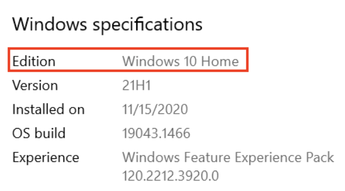
</div>

5. 选择**设备规格**。确保机带 RAM 不低于要求的容量，并且系统类型是 64 位版本的操作系统。

<div align="center">
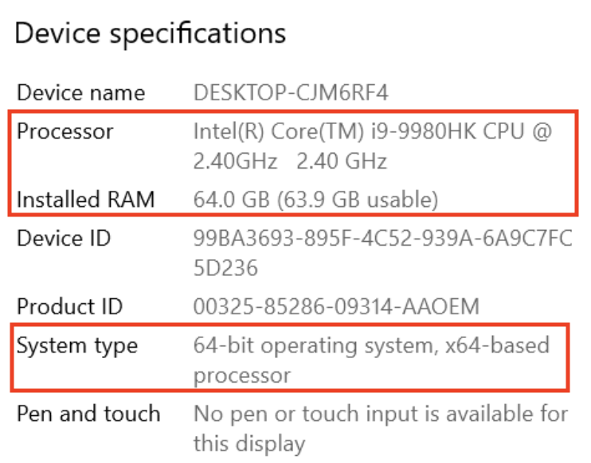
</div>

6. 在导航窗格中，点击**显示**。确保**分辨率**不低于要求的值。

<div align="center">
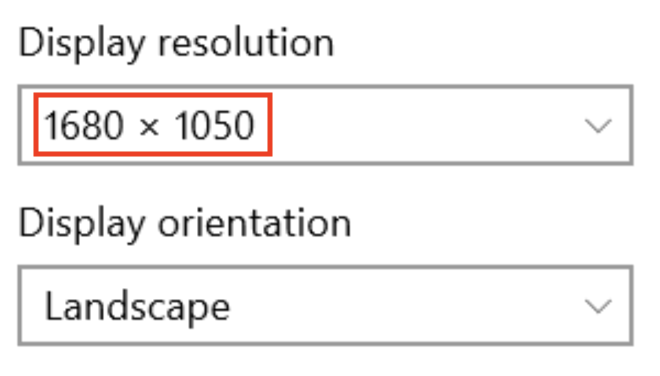
</div>

### 验证存储空间

1. 打开文件资源管理器。
2. 在左侧导航窗格中，点击**此电脑**。
3. 确保本地存储空间有足够的可用空间来安装 Android Studio。

<div align="center">
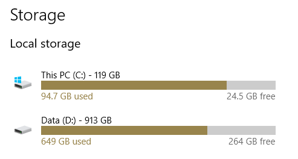
</div>

### 检查系统要求 (Windows 8.1)

如果您使用的是 Windows 8.1，请按照以下步骤查找设备规格：

1. 打开"设置"应用。
2. 在导航窗格中，点击 **PC 和设备**。
3. 在导航窗格中，点击 **PC 信息**。检查您的 CPU 和 RAM 是否满足最低要求，并确保您使用的是 64 位操作系统。

<div align="center">
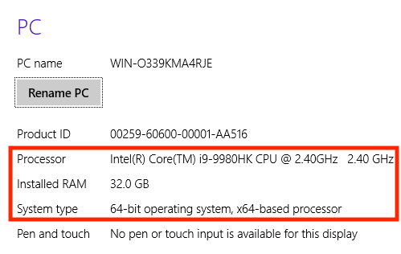
</div>

4. 在导航窗格中，点击**显示**。检查您的显示屏是否符合要求。

<div align="center">
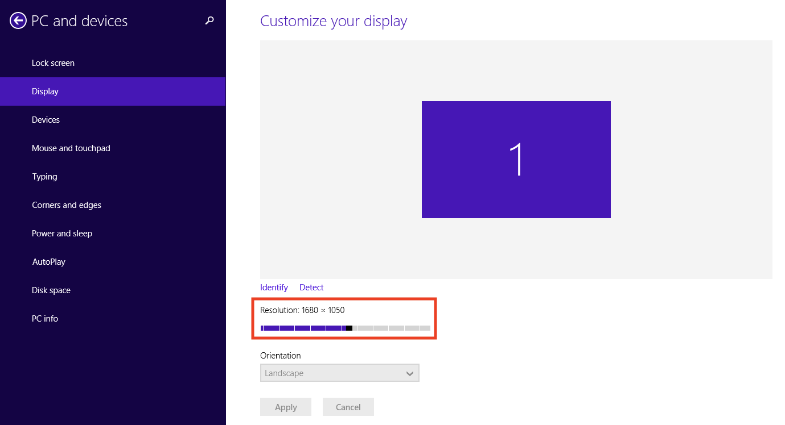
</div>

5. 打开文件资源管理器，点击**这台电脑**，然后检查您是否有足够的磁盘可用空间。

<div align="center">
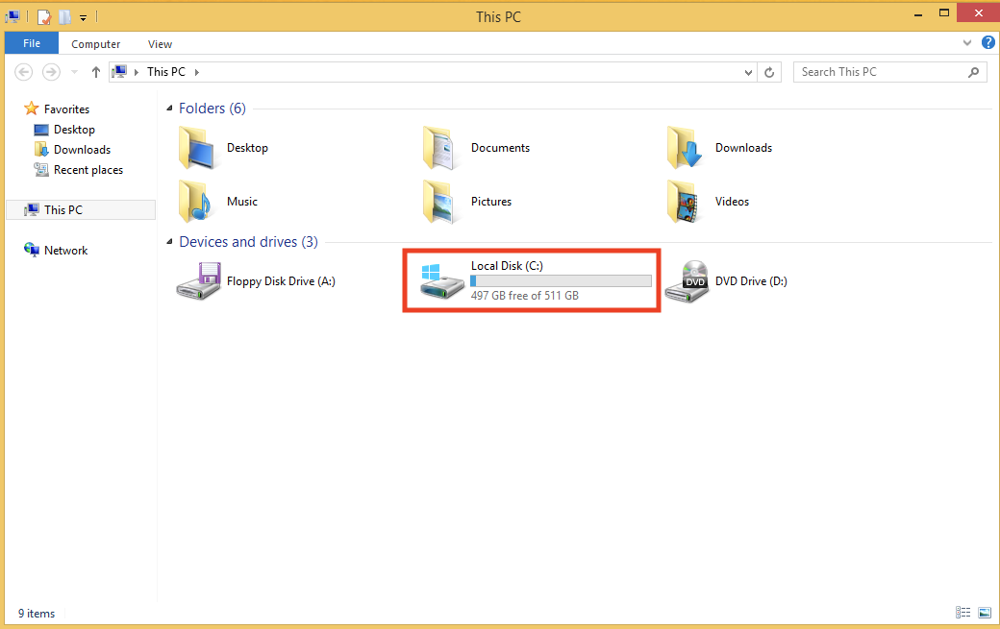
</div>

## 3. Windows：下载并安装 Android Studio

### 下载 Android Studio

1. 打开任意网络浏览器并进入 [Android Studio 下载页面](https://developer.android.com/studio?hl=zh-cn)。
2. 您可以在这个 Android 开发者网站上下载 Android Studio。此页面会自动检测您的操作系统。
3. 点击 **Download Android Studio**。系统会打开 Android Studio **许可协议**的 **Terms and Conditions** 页面。
4. 阅读**许可协议**。
5. 如果您同意条款及条件，请在页面底部选中 **I have read and agree with the above terms and conditions** 复选框。
6. 点击 **Download Android Studio** 以开始下载。
7. 当系统提示时，将相应文件保存到您可以轻松找到的位置（例如 **Downloads** 文件夹）。
8. 等待下载完成。下载可能需要一些时间，不妨喝杯茶吧！

### 在 Windows 上安装 Android Studio

1. 打开您下载并保存了 Android Studio 安装文件的文件夹。
2. 双击下载的文件。
3. 如果您看到有关允许安装程序更改计算机的**用户账户控制**对话框，请点击**是**确认该安装。

<div align="center">
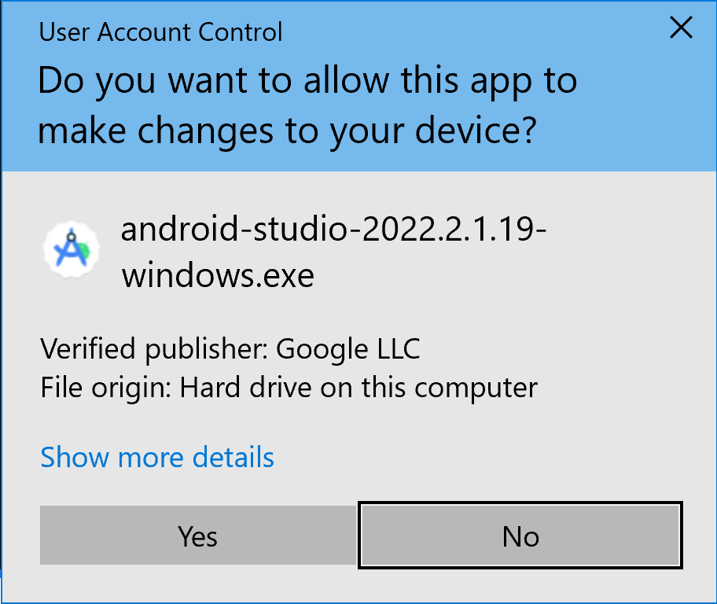
</div>

4. 此时将显示 **Welcome to Android Studio Setup** 对话框。

<div align="center">
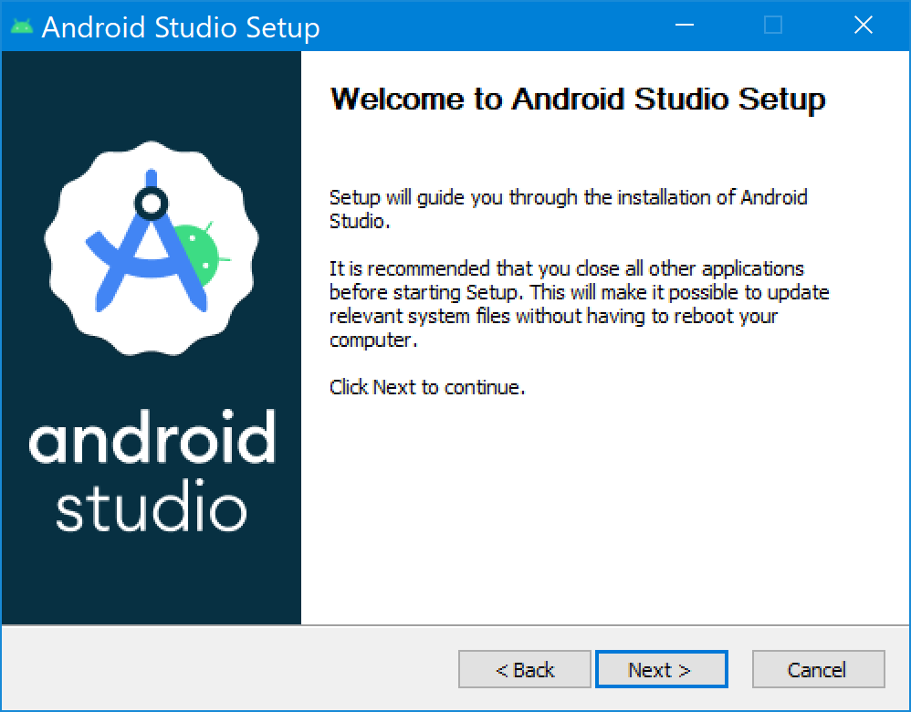
</div>

5. 点击 **Next** 开始安装。
6. 接受所有步骤的默认安装设置。
7. 安装完成后，点击 **Finish** 以启动 Android Studio。

<div align="center">

</div>

8. 在 Android Studio 首次启动时，选择您的主题偏好设置（浅色或深色）。本课程中的屏幕截图使用的是浅色主题，但您可以选择自己偏好的主题。

<div align="center">
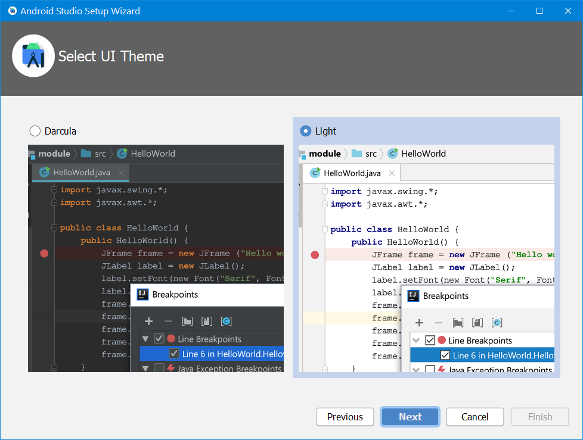
</div>

9. 在安装过程中，设置向导会下载并安装开发 Android 应用所需的其他组件和工具。这可能需要一些时间，具体取决于您的网速。在此期间，您可能会看到针对 **Windows 命令处理程序**的**用户账户控制**对话框。点击**是**以接受该对话框。

<div align="center">
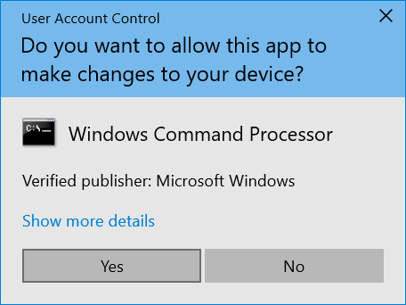
</div>

10. 您可能还会收到有关 adb.exe 的 **Windows 安全提醒**。如有需要，请点击**允许访问**，以继续安装。

<div align="center">
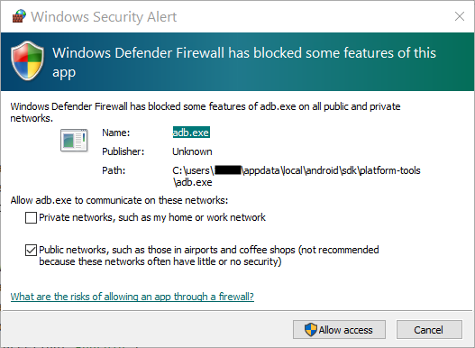
</div>

11. 下载并安装完成后，点击 **Finish**。
12. 此时将显示 **Welcome to Android Studio** 窗口，您可以随时开始创建应用！

<div align="center">
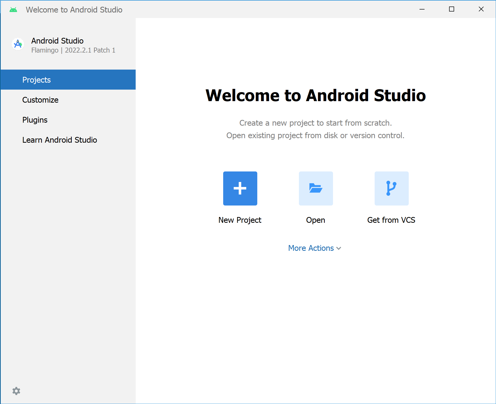
</div>

## 4. macOS：验证系统要求

### Android Studio 系统要求 (macOS)

若要在 macOS 上安装 Android Studio，您的计算机需满足以下系统要求：

- macOS 10.14 (Mojave) 或更高版本
- 基于 ARM 的芯片，或者支持 [Hypervisor Framework](https://developer.android.com/studio/run/emulator-acceleration?hl=zh-cn#vm-mac) 的第 2 代 Intel Core 或更高版本
- 至少有 8 GB 的 RAM
- 至少 8 GB 可用磁盘空间（IDE + Android SDK + Android 模拟器）
- 最低屏幕分辨率：1280 x 800

### 检查系统要求

1. 依次选择

<div align="center">

</div>

> **关于本机**。

2. 在对话框的**概览**标签页下，查找操作系统版本号，并确保其处于要求的范围内。
3. 在**内存**标签页中，检查所列的总内存是否达到或超过所要求的最小值。

例如，在下面的屏幕截图中，操作系统版本为 12.2.1，内存为 16 GB。

<div align="center">
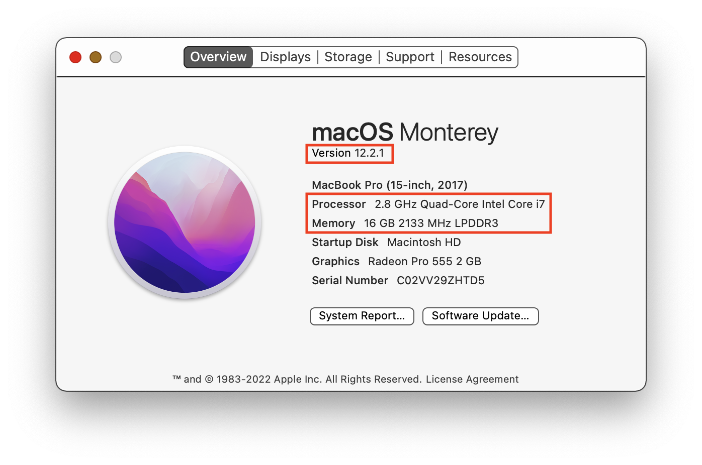
</div>

4. 在同一对话框中，点击**显示器**标签页。
5. 在显示器的说明中，确保计算机的屏幕分辨率达到或超过建议的分辨率。

<div align="center">
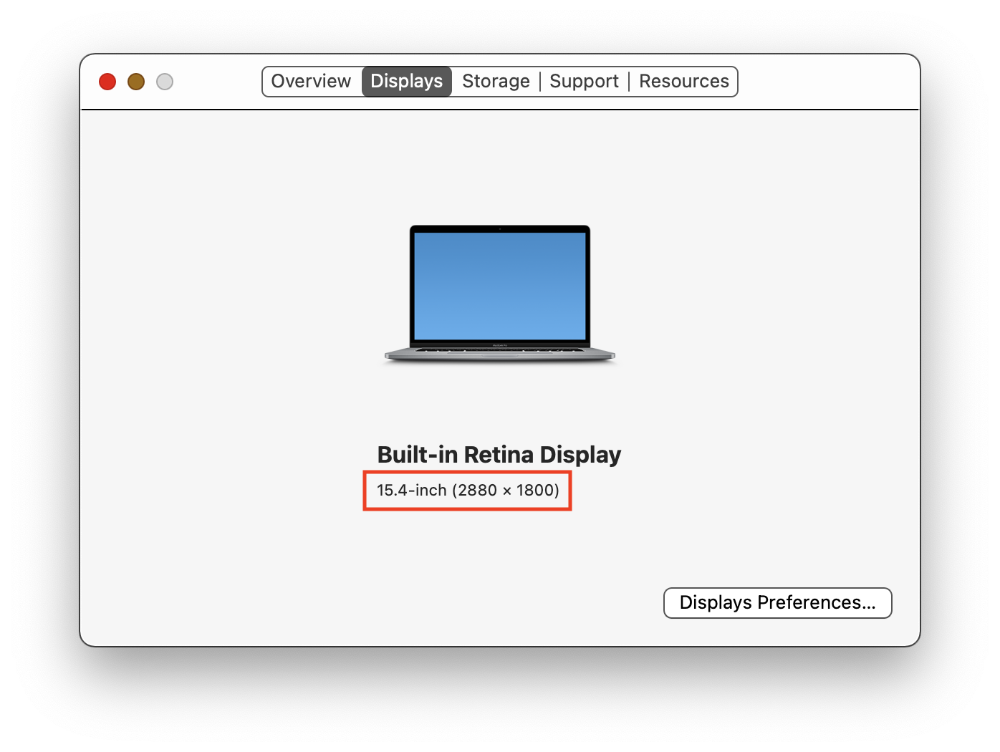
</div>

6. 点击**存储空间**标签页。
7. 检查可用的磁盘空间，并确保该空间大小达到或超出安装和运行 Android Studio 所需的磁盘空间。

<div align="center">
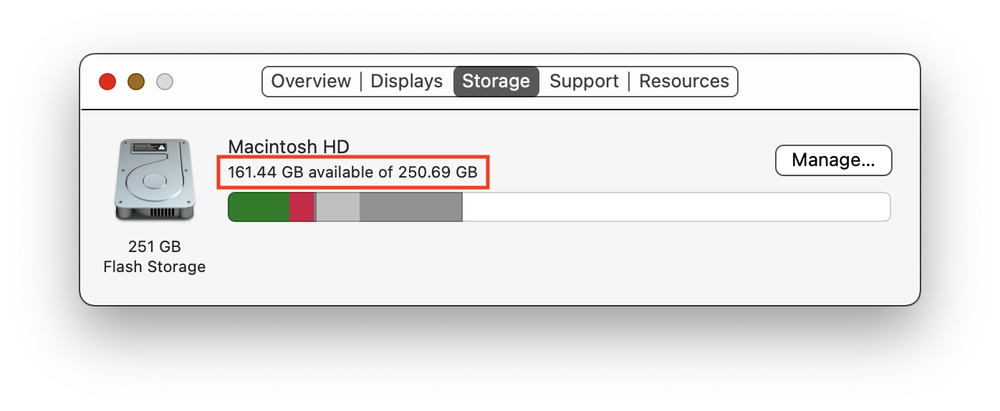
</div>

## 5. macOS：下载并安装 Android Studio

### 下载 Android Studio

1. 打开任意网络浏览器并进入 [Android Studio 下载页面](https://developer.android.com/studio?hl=zh-cn)。您可以在这个 Android 开发者网站上下载 Android Studio。此页面会自动检测您的操作系统。
2. 点击 **Download Android Studio**。系统会打开 Android Studio **许可协议**的 **Terms and Conditions** 页面。
3. 阅读**许可协议**。
4. 如果您同意条款及条件，请在页面底部选中 **I have read and agree with the above terms and conditions** 复选框。
5. 点击 **Mac with Apple chip** 或 **Mac with Intel chip** 开始下载。
6. 当系统提示时，将相应文件保存到您可以轻松找到的位置（例如 **Downloads** 文件夹）。
7. 等待下载完成。下载可能需要一些时间，不妨喝杯茶吧！

> 注意：如果您需要更多帮助或想要自定义安装，请参阅[安装 Android Studio](https://developer.android.com/studio/install?hl=zh-cn) 的相关说明，其中包括抓屏说明。

### 在 macOS 上安装 Android Studio

1. 打开您下载并保存了 Android Studio 安装文件的文件夹。
2. 双击下载的文件。系统会显示以下对话框：

<div align="center">
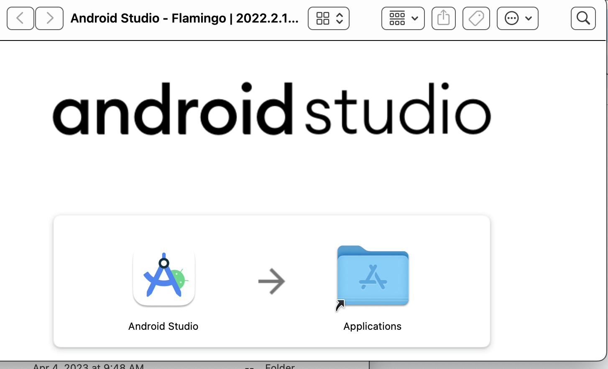
</div>

3. 将 **Android Studio** 图标拖到 **Applications** 文件夹中。
4. 在 **Applications** 文件夹中，双击 **Android Studio** 图标，以启动 **Android Studio 设置向导**。
5. 如果您看到有关安装或运行从互联网下载的文件的警告，请选择接受安装。

<div align="center">
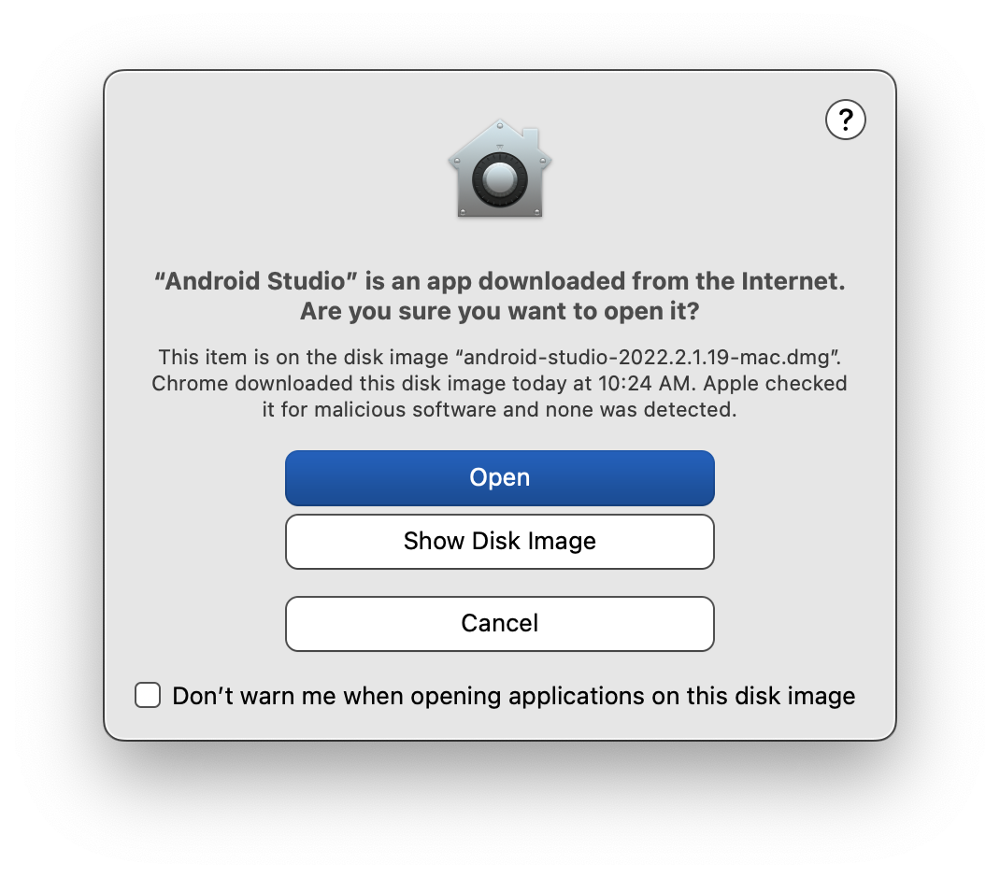
</div>

6. 按照 **Android Studio 设置向导**进行操作，接受所有步骤的默认设置。在安装过程中，设置向导会下载并安装开发 Android 应用所需的其他组件和工具。这可能需要一些时间，具体取决于您的网速。不妨再续一杯茶吧！
7. 安装完成后，Android Studio 会自动启动。
8. 此时将打开 **Welcome to Android Studio** 窗口，您可以随时开始创建应用！

<div align="center">
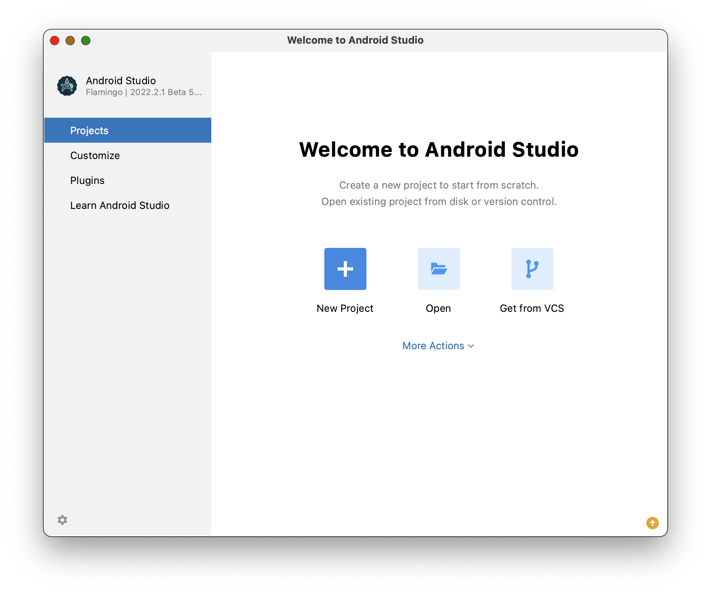
</div>

## 6. Linux：验证系统要求

### Android Studio 系统要求

若要在 Linux 上安装 Android Studio，您的计算机需满足以下系统要求：

- 任何支持 GNOME、KDE 或 Unity DE 的 64 位 Linux 发行版；GNU C 库 (glibc) 2.31 或更高版本。
- x86_64 CPU 架构；第 2 代 Intel Core 或更高版本；或者支持 AMD 虚拟化 (AMD-V) 和 SSSE3 的 AMD 处理器
- 至少有 8 GB 的 RAM
- 至少 8 GB 可用磁盘空间（IDE + Android SDK + Android 模拟器）
- 最低屏幕分辨率：1280 x 800

### 检查系统要求

在安装之前，请使用终端命令检查您的计算机是否符合硬件要求。

> 提示：您可以使用键盘快捷键 Ctrl+Alt+T 快速打开终端窗口。

使用 `lscpu` 检查处理器规格。

```
lscpu
```

<div align="center">
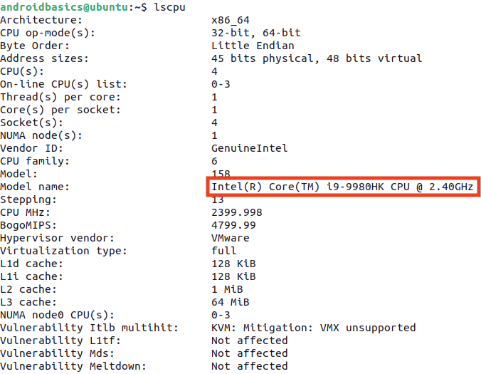
</div>

使用 `free` 命令检查系统总内存。

输出以兆字节为单位，因此以下系统的总内存为 32 GB。

```
free -m
```

<div align="center">
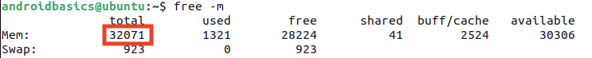
</div>

使用 `df` 命令检查可用的磁盘空间。

```
df -h
```

<div align="center">
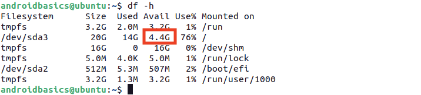
</div>

使用 `xrandr` 检查屏幕分辨率。

```
xrandr | grep '*'
```

<div align="center">

</div>

## 7. Linux：下载并安装 Android Studio

### 下载 Android Studio

1. 打开任意网络浏览器并进入 [Android Studio 下载页面](https://developer.android.com/studio?hl=zh-cn)。
2. 您可以在这个 Android 开发者网站上下载 Android Studio。此页面会自动检测您的操作系统。点击 **Download Android Studio**。系统会打开 **Android Studio 许可协议**的 **Terms and Conditions** 页面。
3. 阅读**许可协议**。
4. 如果您同意条款及条件，请在页面底部选中 **I have read and agree with the above terms and conditions** 复选框。
5. 点击 **Download Android Studio** 以开始下载。
6. 当系统提示时，将相应文件保存到您可以轻松找到的位置（例如 **Downloads** 文件夹）。
7. 等待下载完成。下载可能需要一些时间，不妨喝杯茶吧！

### 在 Linux 上安装 Android Studio

<div align="center">
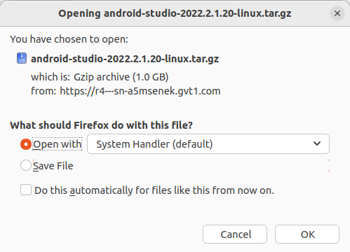
</div>

1. 在终端中打开 **Downloads** 文件夹。
2. 使用 `tar` 命令解压缩归档文件。

```
tar -xzvf android-studio-2022.2.1.20-linux.tar.gz
```

3. 进入 `android-studio/bin` 目录。

```
cd android-studio/bin
```

4. 运行 `studio.sh`

```
./studio.sh
```

5. 让 **Do not import settings** 处于选中状态，然后点击提示中的 **OK**。

<div align="center">
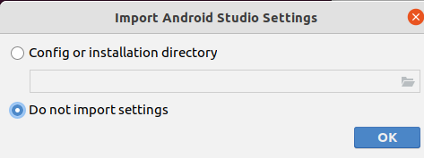
</div>

6. 选择是否与 Google 分享使用情况数据。

<div align="center">
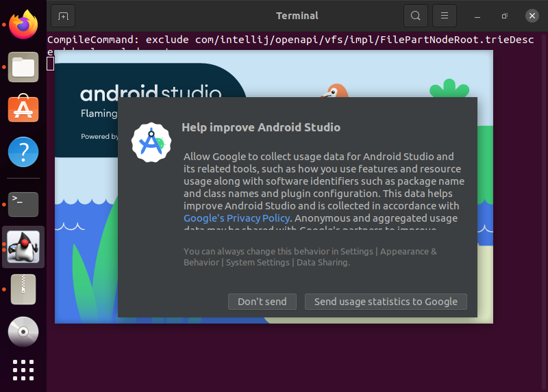
</div>

7. 选中 **Standard** 作为安装类型。然后，点击 **Next** 继续。

<div align="center">
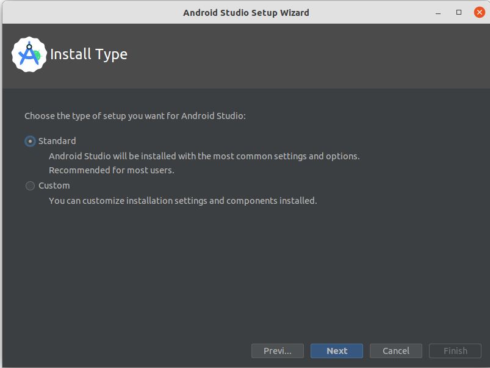
</div>

8. 选择您的主题偏好设置（浅色或深色）。本课程中的屏幕截图使用的是浅色主题，但您可以选择自己偏好的主题。您以后可随时进行更改。

<div align="center">
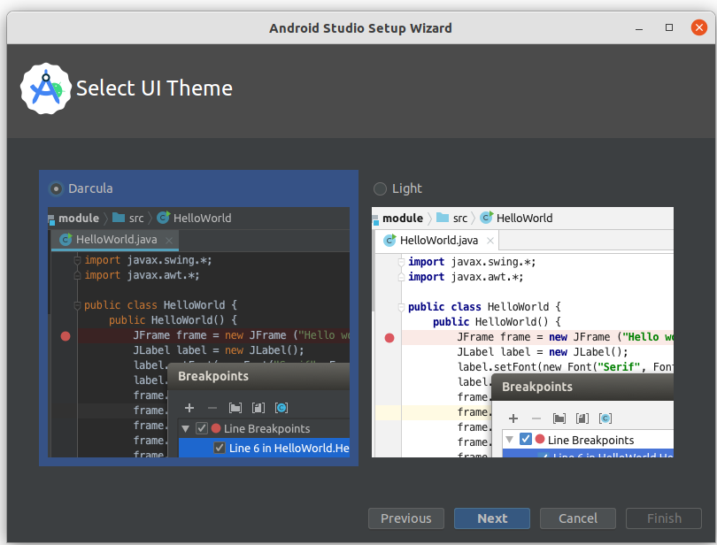
</div>

9. 接受所有默认设置，然后点击 **Next**。

<div align="center">
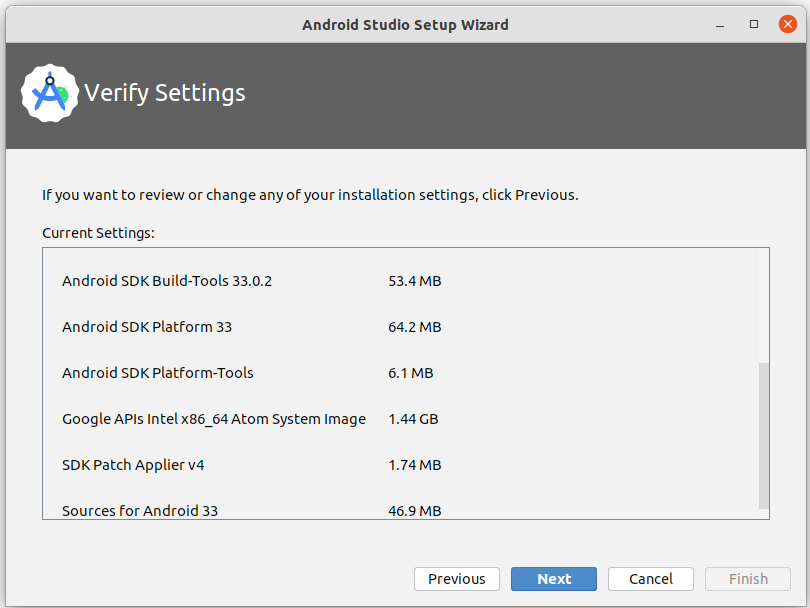
</div>

10. 阅读并同意 Android SDK 和 Android NDK 的**许可协议**，然后点击 **Next**。

<div align="center">
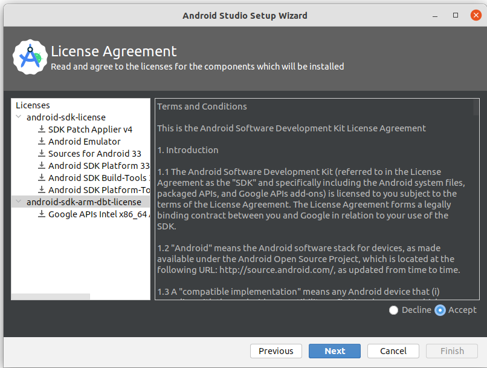
</div>

11. 您可能还会看到有关硬件加速和 Android 模拟器的一些额外信息。点击**完成**。

<div align="center">
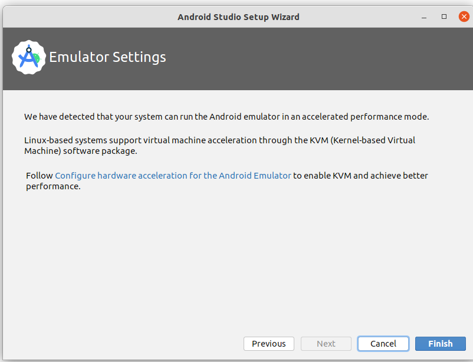
</div>

12. 在安装过程中，设置向导会下载并安装开发 Android 应用所需的其他组件和工具。

<div align="center">
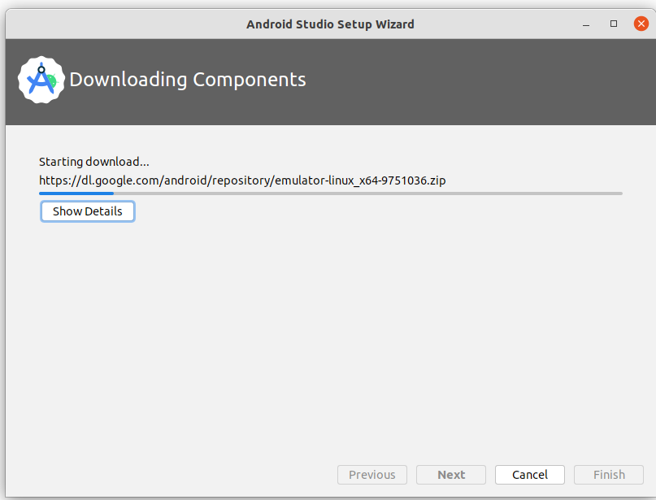
</div>

13. 安装完成后，点击 **Finish**。

<div align="center">
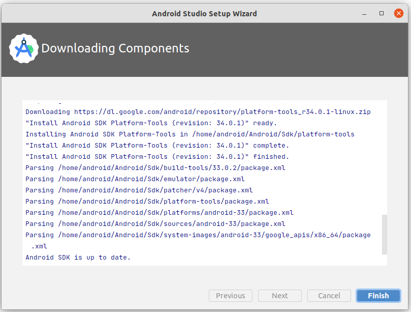
</div>

14. 此时将显示 **Welcome to Android Studio** 对话框，您可以随时开始创建应用！

<div align="center">
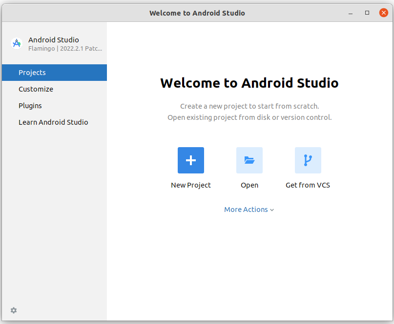
</div>

## 8. 总结

恭喜！您已成功安装 Android Studio。现在，您可以执行下一步了！

如果您在安装过程中遇到任何技术问题，请参阅[问题排查指南](https://developer.android.com/studio/troubleshoot?hl=zh-cn)。

### 摘要

- 集成开发环境 (IDE) 是一组用于开发软件的工具。
- Android Studio 是基于 IntelliJ IDEA 的 IDE，用于 Android 开发。

### 了解更多内容

- [下载 Android Studio](https://developer.android.com/studio?hl=zh-cn)
- [安装 Android Studio](https://developer.android.com/studio/install?hl=zh-cn)
- [探索 Android Studio](https://developer.android.com/studio/intro?hl=zh-cn)
