# 创建您的首个 Android 应用

## 1. 使用前须知

在计算机上安装 [Android Studio](https://developer.android.com/studio?hl=zh-cn)（如果您尚未安装）。确保您的计算机符合运行 Android Studio 的系统要求（位于下载页面的底部）。如果您需要有关设置过程的更详细说明，请参阅[下载并安装 Android Studio](https://developer.android.com/codelabs/basic-android-kotlin-compose-install-android-studio?hl=zh-cn) Codelab。

在此 Codelab 中，您将使用 Android Studio 提供的项目模板创建自己的首个 Android 应用。您可以使用 Kotlin 和 Jetpack Compose 自定义您的应用。请注意，Android Studio 会进行更新，有时候界面还会发生变化，因此，如果您的 Android Studio 看起来与本 Codelab 中显示的屏幕截图略有不同，也没关系。

**前提条件**

- 具备 Kotlin 基础知识

**所需条件**

- 最新版本的 Android Studio

**学习内容**

- 如何使用 Android Studio 创建 Android 应用
- 如何在 Android Studio 中使用预览工具运行应用
- 如何使用 Kotlin 更新文本
- 如何使用 Jetpack Compose 更新 UI
- 如何在 Jetpack Compose 中使用预览功能预览应用

**您将构建的内容**

一个可让您自定义自我介绍的应用！

当您完成本 Codelab 后，所构建的应用将如下所示（只不过它是使用您的名字自定义的！）：

<div align="center">
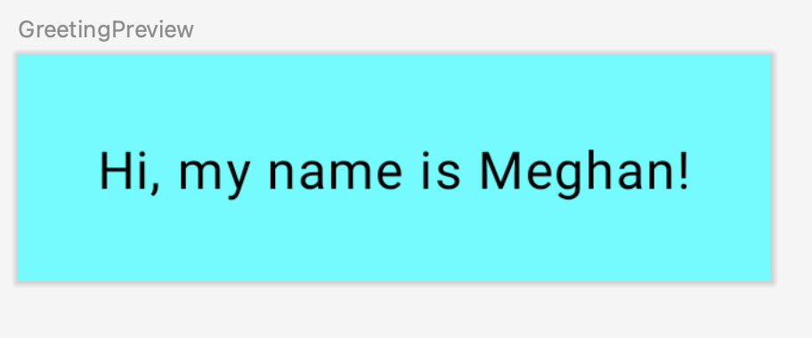
</div>

**所需条件**

- 一台安装了 [Android Studio](https://developer.android.com/studio?hl=zh-cn) 的计算机。

## 2. 使用模板创建项目

在本 Codelab 中，我们将使用 Android Studio 提供的 **Empty Activity** 项目模板创建一个 Android 应用。

如需在 Android Studio 中创建项目，请执行以下操作：

1. 双击 Android Studio 图标来启动 Android Studio。

<div align="center">
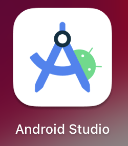
</div>

2. 在 **Welcome to Android Studio** 对话框中，点击 **New Project**。

<div align="center">
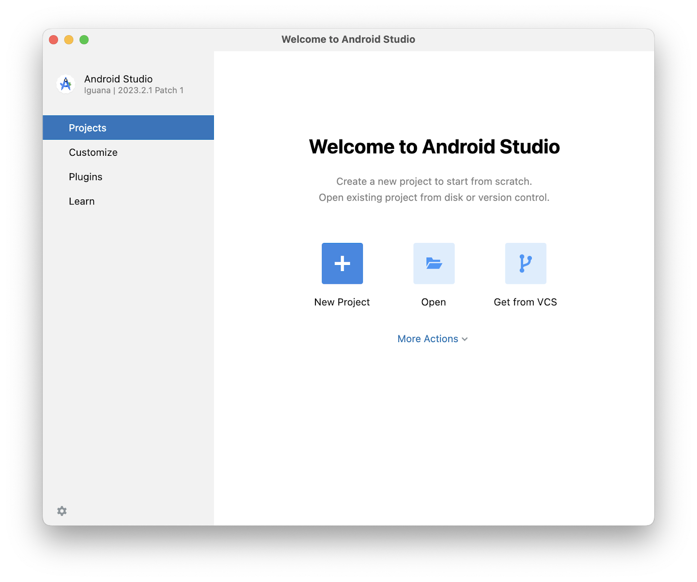
</div>

3. **New Project** 窗口随即会打开，其中列出了 Android Studio 提供的模板。

<div align="center">
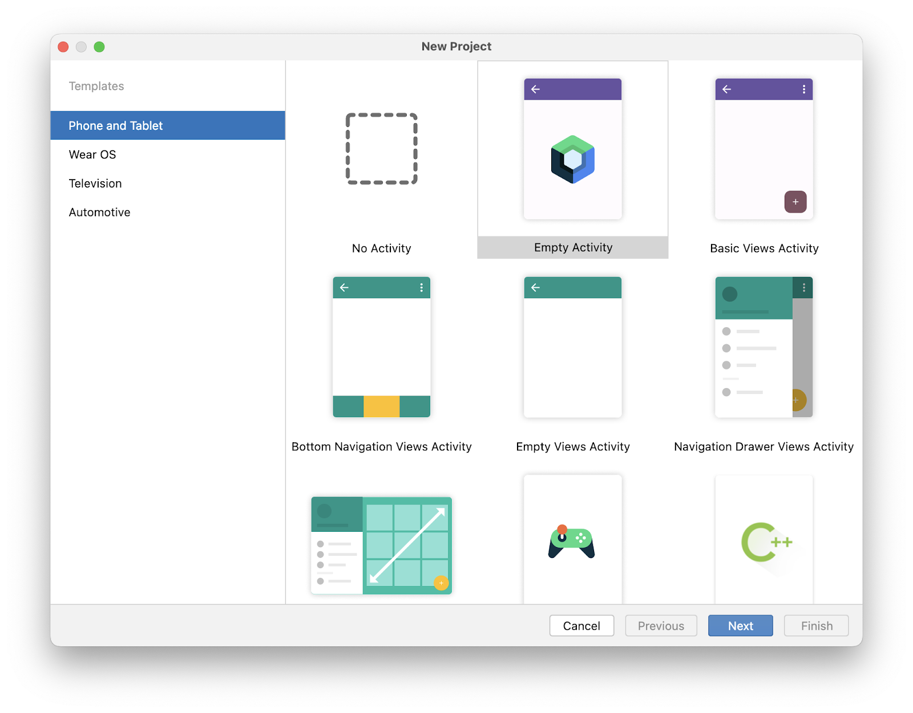
</div>

在 Android Studio 中，项目模板就是用于为特定类型的应用提供蓝图的 Android 项目。模板可用来创建项目结构以及在 Android Studio 中构建项目所需的文件。您选择的模板提供了起始代码，以便您能更快上手。

4. 务必选择 **Phone and Tablet** 标签页。
5. 点击 **Empty Activity** 模板，选择该模板作为您的项目模板。

**Empty Activity** 模板是用于创建简单项目的模板，您可以用它来构建 Compose 应用。这个模板只有一个屏幕，并显示 "Hello Android!" 文本。

6. 点击**下一步**。**New Project** 对话框随即会打开，其中包含一些用于配置项目的字段。
7. 按如下方式配置项目：

- **Name** 字段用于输入项目名称。在本 Codelab 中，请输入"Greeting Card"。
- 保持 **Package name** 字段不变。该字段用于指定文件在文件结构中的组织方式。在本例中，软件包名称为 `com.example.greetingcard`。
- 保持 **Save location** 字段不变。该字段用于指定保存与项目相关的所有文件的位置。请记下这些文件在您计算机上的保存位置，以便查找文件。
- 从 **Minimum SDK** 字段中的菜单中选择 **API 24: Android 7.0 (Nougat)**。

**Minimum SDK** 字段用于指定可运行您应用的最低 Android 版本。

<div align="center">
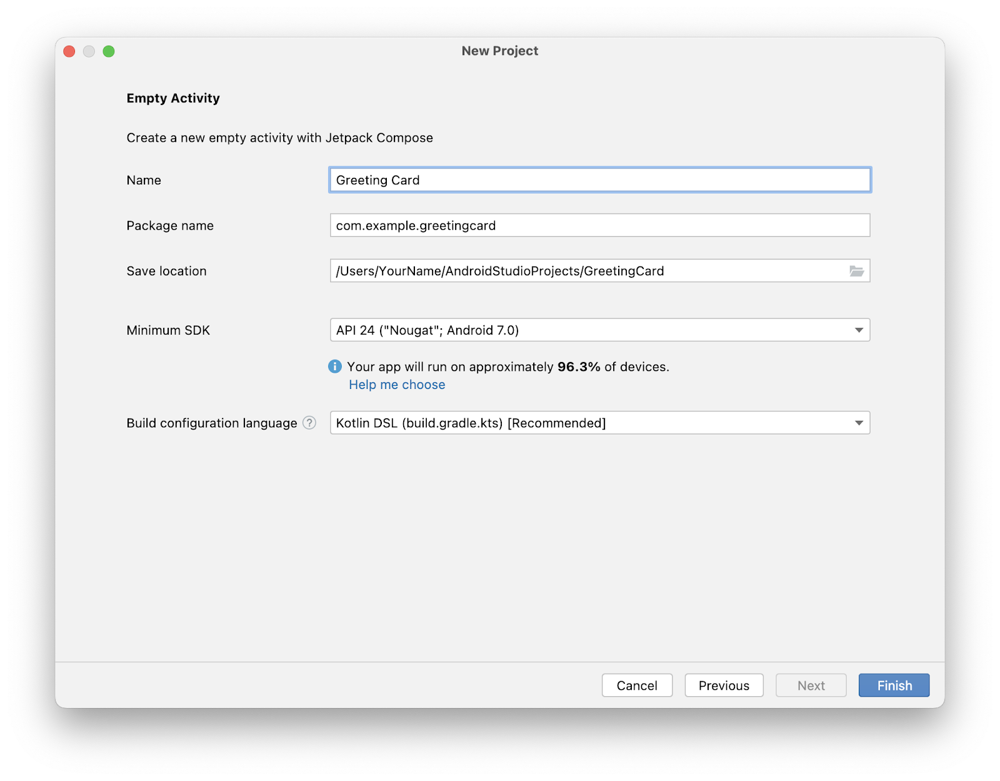
</div>

8. 点击**完成**。此过程可能需要一些时间，不妨喝杯茶，耐心等待！在 Android Studio 设置过程中，界面中会显示进度条和消息来指示 Android Studio 是否仍在设置您的项目，具体可能如下所示：

<div align="center">
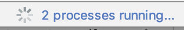
</div>

9. 在创建项目设置时，系统会显示类似如下内容的通知消息。

<div align="center">
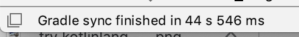
</div>

10. 您可能会看到 **What's New** 窗格，其中包含有关 Android Studio 新功能的最新动态。现阶段，请关闭此窗格。

<div align="center">
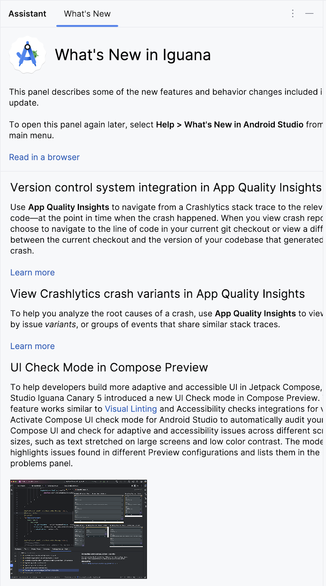
</div>

11. 点击 Android Studio 右上角的 **Split**，即可同时查看代码和设计。您也可以点击 **Code**，仅查看代码；或点击 **Design**，仅查看设计。

<div align="center">
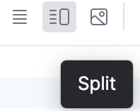
</div>

12. 按下 **Split** 后，您应该会看到以下三个区域：

<div align="center">
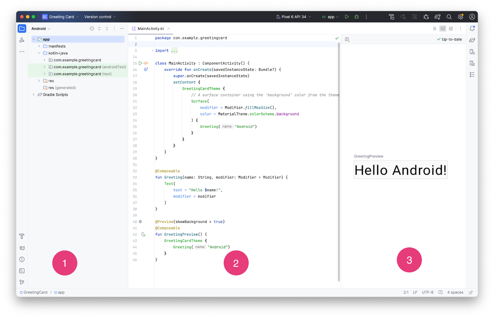
</div>

- **Project** 视图 (1) 用于显示项目的文件和文件夹
- **Code** 视图 (2) 是您修改代码的地方
- **Design** 视图 (3) 是您预览应用外观的地方

13. 在 **Design** 视图中，您会看到一个显示以下内容的空白窗格：

<div align="center">
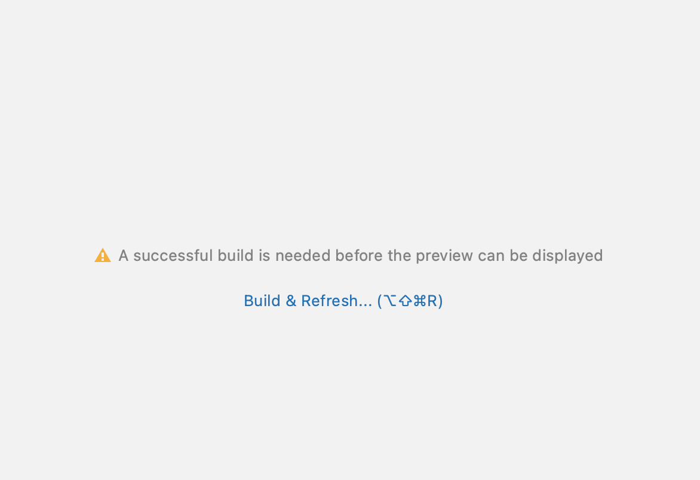
</div>

14. 点击 **Build & Refresh**。构建可能需要花一些时间，不过完成后，预览便会显示一个内容为 `Hello Android!` 的文本框。"Empty Compose Activity"模板会提供创建此应用所需的全部代码。

<div align="center">
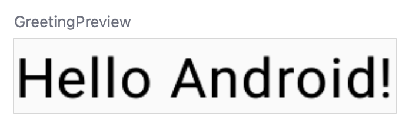
</div>

## 3. 查找项目文件

在此部分中，我们将通过熟悉文件结构，继续对 Android Studio 展开探索。

1. 在 Android Studio 中，进入 **Project** 标签页。**Project** 标签页会显示项目的文件和文件夹。您在设置项目时，已将软件包名称指定为 `com.example.greetingcard`。因此，您可以直接在 **Project** 标签页中看到该软件包。软件包基本上就是代码所在的文件夹。Android Studio 会将项目整理成一个由一组软件包组成的目录结构。
2. 如有必要，请从 **Android** 标签页的下拉菜单中选择 **Android**。

<div align="center">
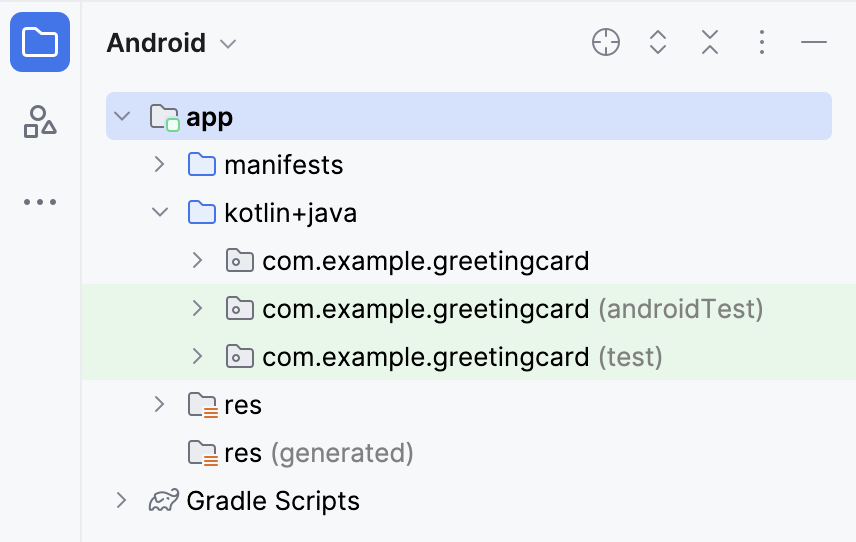
</div>

这就是您使用的标准文件视图和组织方式，在编写项目代码时会非常有用，因为您可以轻松访问将在应用中使用的各个文件。不过，如果您是通过文件浏览器（如 Finder 或 Windows 资源管理器）浏览文件，则文件层次结构的组织方式会明显不同。

3. 从下拉菜单中选择 **Project Source Files**。现在，您可以像在任何文件浏览器中一样浏览文件了。

<div align="center">
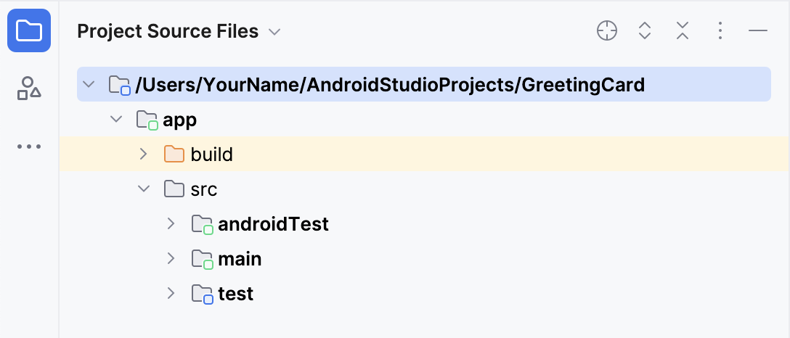
</div>

4. 再次选择 **Android**，切换回上一个视图。在本课程中，我们将使用 **Android** 视图。如果您的文件结构看起来很奇怪，请检查您是否还在 **Android** 视图中。

## 4. 更新文本

现在，您已了解 Android Studio，是时候开始制作贺卡了！

1. 打开 `MainActivity.kt` 文件的 **Code** 视图。请注意，此代码中有一些自动生成的函数，具体而言就是 `onCreate()` 和 `setContent()` 函数。

请记住，函数是程序中用于执行特定任务的部分。

```kotlin
class MainActivity : ComponentActivity() {
    override fun onCreate(savedInstanceState: Bundle?) {
        super.onCreate(savedInstanceState)
        setContent {
            GreetingCardTheme {
                // A surface container using the 'background' color from the theme
                Surface(
                    modifier = Modifier.fillMaxSize(),
                    color = MaterialTheme.colorScheme.background
                ) {
                    Greeting("Android")
                }
            }
        }
    }
}
```

`onCreate()` 函数是此 Android 应用的入口点，并会调用其他函数来构建 UI。在 Kotlin 程序中，`main()` 函数是执行的入口点/起点。在 Android 应用中，则是由 `onCreate()` 函数来担任这个角色。

`onCreate()` 函数中的 `setContent()` 函数用于通过可组合函数定义布局。任何标有 `@Composable` 注解的函数都可通过 `setContent()` 函数或其他可组合函数进行调用。该注解可告知 Kotlin 编译器 Jetpack Compose 使用的这个函数会生成 UI。

> 注意：编译器会接受您编写的 Kotlin 代码，并逐行查看，然后将其转换成计算机可以理解的代码。此过程称为代码编译。

2. 接下来，查看 `Greeting()` 函数。`Greeting()` 函数是一种可组合函数；请留意它上方的 `@Composable` 注解。此可组合函数会接受一些输入并生成屏幕上显示的内容。

```kotlin
@Composable
fun Greeting(name: String, modifier: Modifier = Modifier) {
    Text(
        text = "Hello $name!",
        modifier = modifier
    )
}
```

虽然您在前面已经学习了函数（如需复习，请参阅["在 Kotlin 中创建和使用函数"Codelab](https://developer.android.com/codelabs/basic-android-kotlin-compose-functions?hl=zh-cn)），但可组合函数有一些不同之处。

<div align="center">
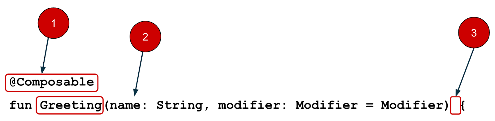
</div>

- 需在该函数前面添加 `@Composable` 注解。
- `@Composable` 函数名称采用首字母大写形式。
- `@Composable` 函数无法返回任何内容。

```kotlin
@Composable
fun Greeting(name: String, modifier: Modifier = Modifier) {
    Text(
        text = "Hello $name!",
        modifier = modifier
    )
}
```

目前，`Greeting()` 函数可接收名称，并会向其用户显示 `Hello`。

3. 更新 `Greeting()` 函数来介绍自己，而不是显示"Hello"：

```kotlin
@Composable
fun Greeting(name: String, modifier: Modifier = Modifier) {
    Text(
        text = "Hi, my name is $name!",
        modifier = modifier
    )
}
```

Android 应自动更新预览。

<div align="center">
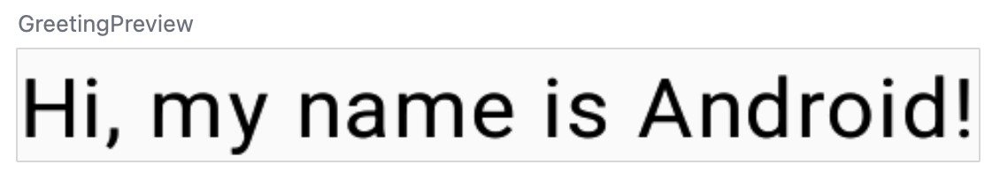
</div>

太好了！您更改了文本，但它介绍您是 Android，这可能不是您的名字吧。接下来，让我们对这个文本进行个性化设置，以便您用自己的名字来做介绍！

`GreetingPreview()` 函数是一项很酷的功能，让您无需构建整个应用就能查看可组合函数的外观。如需实现可组合函数的预览，您需要添加 `@Composable` 和 `@Preview` 注解。

`@Preview` 注解会告知 Android Studio 此可组合函数应显示在此文件的设计视图中。

如您所见，`@Preview` 注解可以接收名为 `showBackground` 的参数。如果 `showBackground` 设置为 `true`，则会向可组合函数预览添加背景。

由于 Android Studio 默认对编辑器使用浅色主题，因此我们很难看出 `showBackground = true` 和 `showBackground = false` 之间的区别。不过，这是所谓区别的示例。请注意，下图中的白色背景已设置为 `true`。

<div align="center">
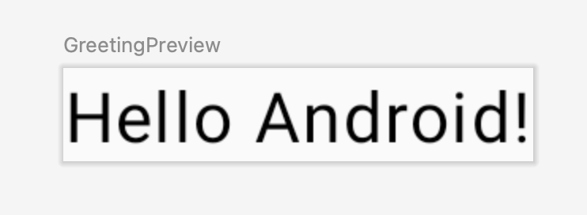
</div>

showBackground = true

<div align="center">
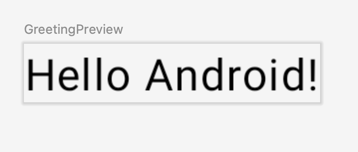
</div>

showBackground = false

4. 使用您的名字更新 `GreetingPreview()` 函数，然后重新构建并查看您的个性化贺卡！

```kotlin
@Preview(showBackground = true)
@Composable
fun GreetingPreview() {
    GreetingCardTheme {
        Greeting("Meghan")
    }
}
```

<div align="center">
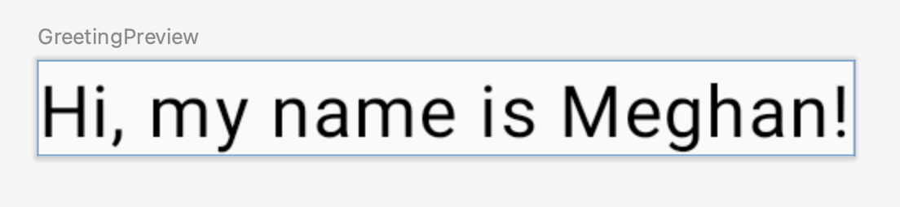
</div>

## 5. 更改背景颜色

现在，我们已经制作出自我介绍文本，但它有点无聊！在这一部分中，我们将了解如何更改背景颜色。

若要为自我介绍设置不同的背景颜色，您需要使用 **Surface** 将文本包围起来。Surface 是一个容器，代表界面的某一部分，您可以在其中更改外观（如背景颜色或边框）。

1. 若要使用 Surface 将文本包围起来，请突出显示该行文本，按下 `Alt+Enter` (Windows) 或 `Option+Enter` (Mac)，然后选择 **Surround with widget**。

<div align="center">
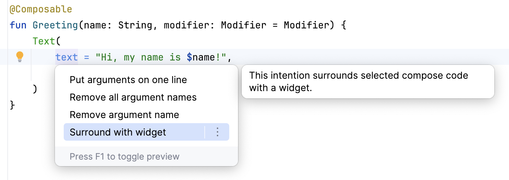
</div>

2. 选择 **Surround with Container**。

<div align="center">
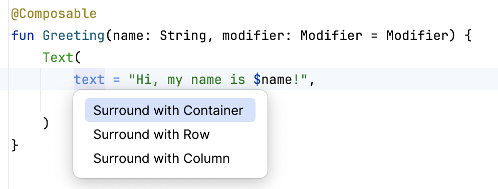
</div>

3. 默认容器为 `Box`，但您可以将其更改为其他容器类型。本课程稍后会介绍 `Box` 布局。

<div align="center">
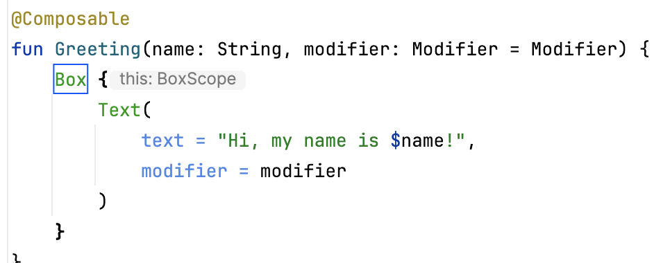
</div>

4. 删除 `Box`，改为输入 `Surface()`。

```kotlin
@Composable
fun Greeting(name: String, modifier: Modifier = Modifier) {
    Surface() {
        Text(
            text = "Hi, my name is $name!",
            modifier = modifier
        )
    }
}
```

5. 向 `Surface` 容器添加 `color` 参数，将其设置为 `Color`。

```kotlin
@Composable
fun Greeting(name: String, modifier: Modifier = Modifier) {
    Surface(color = Color) {
        Text(
            text = "Hi, my name is $name!",
            modifier = modifier
        )
    }
}
```

6. 输入 `Color` 后，您可能会发现它是红色的，这意味着 Android Studio 无法解析它。为了解决此问题，请滚动到文件顶部显示"import"字样的位置，然后按下三点状按钮。

<div align="center">
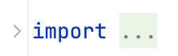
</div>

7. 将以下语句添加到导入列表底部。

```kotlin
import androidx.compose.ui.graphics.Color
```

8. 在您的代码中，最佳实践是确保导入按字母顺序列出并移除未使用的导入。为此，请按下顶部工具栏中的 **Help**，输入 **Optimize Imports**，然后点击 **Optimize Imports**。

<div align="center">
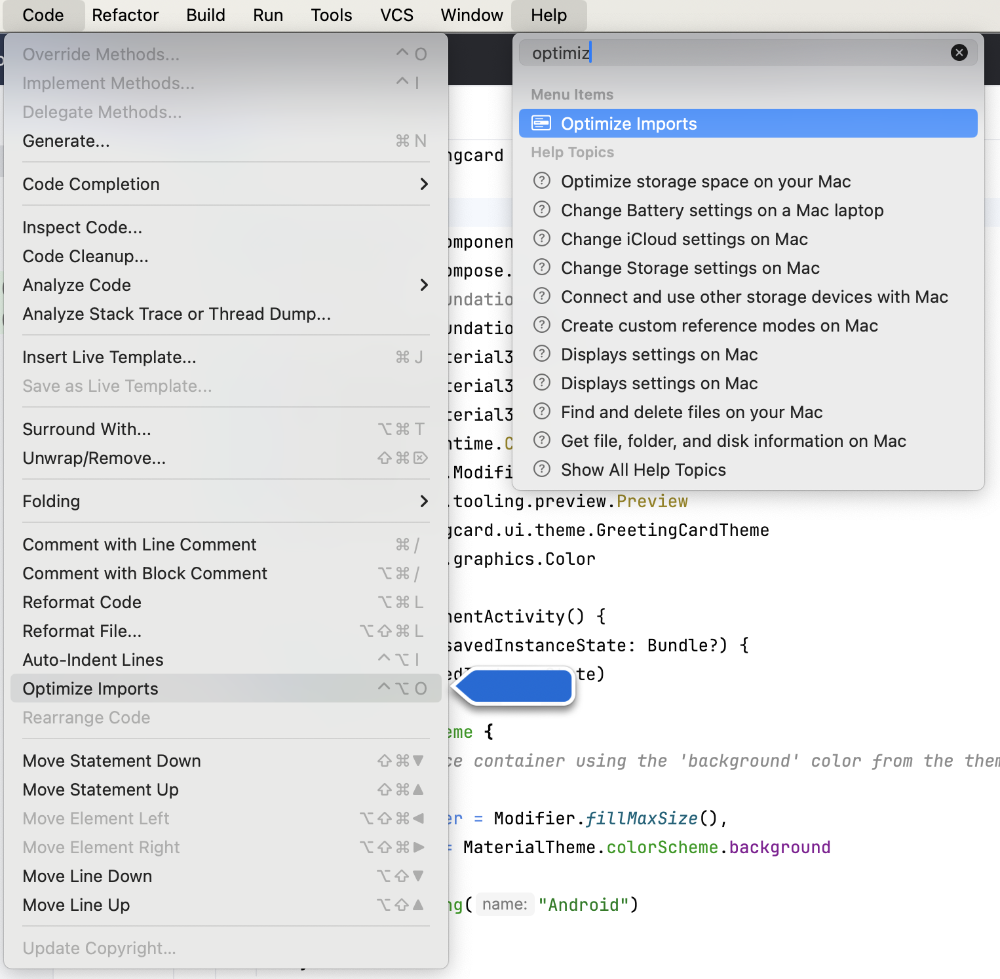
</div>

您可以直接从菜单中打开 **Optimize Imports**：**Code** > **Optimize Imports**。如果您不记得菜单项的位置，使用 Help 的搜索选项可帮助您找到菜单项。

9. 请注意，您在 Surface 后的括号内输入的 `Color` 已从红色更改为带有红色下划线。为了解决该问题，请在其后添加英文句点。您将会看到一个显示不同颜色选项的弹出式窗口。

这是 Android Studio 中一项很棒的功能，它非常智能，可以适时为您提供帮助。在此例中，该功能知道您想指定一种颜色，因此为您建议了各种颜色。

<div align="center">
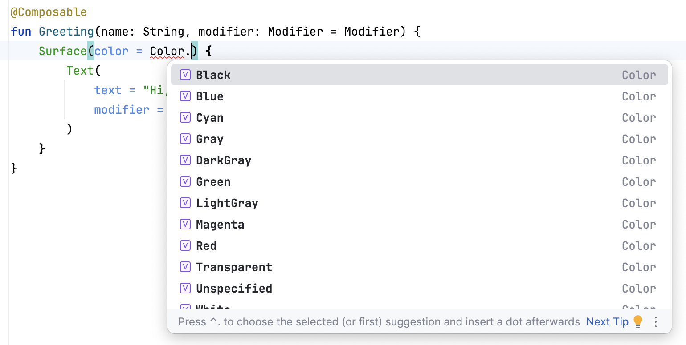
</div>

10. 为表面选择一种颜色。本 Codelab 使用的是**蓝绿色**，但您可以选择自己喜欢的颜色！

```kotlin
@Composable
fun Greeting(name: String, modifier: Modifier = Modifier) {
    Surface(color = Color.Cyan) {
        Text(
            text = "Hi, my name is $name!",
            modifier = modifier
        )
    }
}
```

请注意更新后的预览。

<div align="center">
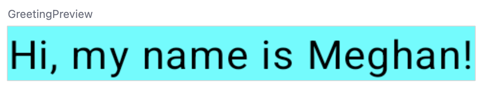
</div>

## 6. 添加内边距

现在文本已有了背景颜色，接下来让我们在文本周围添加一些空格（内边距）。

`Modifier` 用于扩充或修饰可组合项。您可以使用的其中一个修饰符是 `padding` 修饰符，它会在元素周围添加空格（在本例中，是在文本周围添加空格）。为此，请使用 `Modifier.padding()` 函数。

每个可组合函数都应具有 `Modifier` 类型的可选参数。这应是第一个可选参数。

为 `modifier` 添加尺寸为 `24.dp` 的内边距。

> 注意：我们将在下一个开发者在线课程中详细了解密度无关像素 (`dp`)，但如果您现在就想了解更多内容，请参阅[布局 - Material Design 3](https://m3.material.io/foundations/layout/applying-layout/spacing)。

```kotlin
@Composable
fun Greeting(name: String, modifier: Modifier = Modifier) {
    Surface(color = Color.Cyan) {
        Text(
            text = "Hi, my name is $name!",
            modifier = modifier.padding(24.dp)
        )
    }
}
```

将这些导入添加到导入语句部分中。请务必使用 **Optimize Imports** 按字母顺序排列新的导入。

```kotlin
import androidx.compose.ui.unit.dp
import androidx.compose.foundation.layout.padding
```

<div align="center">
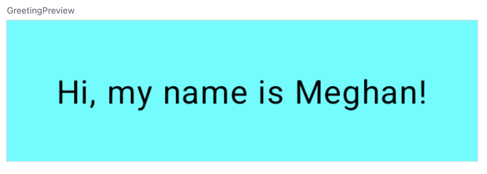
</div>

恭喜，您已经在 Compose 中构建了自己的首个 Android 应用！这不是一件容易的事，但是您做得很好。不妨花些时间试试其他颜色和文本，打造您的个人专属应用吧！

## 7. 查看解决方案代码

### 供审核的代码段

```kotlin
package com.example.greetingcard

import android.os.Bundle
import androidx.activity.ComponentActivity
import androidx.activity.compose.setContent
import androidx.compose.foundation.layout.fillMaxSize
import androidx.compose.foundation.layout.padding
import androidx.compose.material3.MaterialTheme
import androidx.compose.material3.Surface
import androidx.compose.material3.Text
import androidx.compose.runtime.Composable
import androidx.compose.ui.Modifier
import androidx.compose.ui.graphics.Color
import androidx.compose.ui.tooling.preview.Preview
import androidx.compose.ui.unit.dp
import com.example.greetingcard.ui.theme.GreetingCardTheme

class MainActivity : ComponentActivity() {
    override fun onCreate(savedInstanceState: Bundle?) {
        super.onCreate(savedInstanceState)
        setContent {
            GreetingCardTheme {
                // A surface container using the 'background' color from the theme
                Surface(
                    modifier = Modifier.fillMaxSize(),
                    color = MaterialTheme.colorScheme.background
                ) {
                    Greeting("Android")
                }
            }
        }
    }
}

@Composable
fun Greeting(name: String, modifier: Modifier = Modifier) {
    Surface(color = Color.Cyan) {
        Text(
            text = "Hi, my name is $name!",
            modifier = modifier.padding(24.dp)
        )
    }
}

@Preview(showBackground = true)
@Composable
fun GreetingPreview() {
    GreetingCardTheme {
        Greeting("Meghan")
    }
}
```

## 8. 总结

您已了解 Android Studio，并使用 Compose 构建了自己的首个 Android 应用，太棒了！

此 Codelab 是["使用 Compose 进行 Android 开发的基础知识"课程](https://developer.android.com/courses/android-basics-compose/course?hl=zh-cn)的一部分。如需了解如何在模拟器或实体设备上运行应用，请查看[此在线课程](https://developer.android.com/courses/android-basics-compose/course?hl=zh-cn)中的后续 Codelab。

**摘要**

- 创建新项目的具体方法为：打开 Android Studio，依次点击 **New Project > Empty Activity > Next**，输入项目名称，然后配置该项目的设置。
- 如要查看应用的外观，请使用 **Preview** 窗格。
- 可组合函数与常规函数类似，但存在以下区别：函数名称采用首字母大写形式，需在该函数前面添加 `@Composable` 注解，`@Composable` 函数无法返回任何内容。
- `Modifier` 用于扩充或修饰可组合项。

**了解更多内容**

- [探索 Android Studio](https://developer.android.com/studio/intro?hl=zh-cn)
- [项目概览](https://developer.android.com/studio/projects?hl=zh-cn)
- [创建项目](https://developer.android.com/studio/projects/create-project?hl=zh-cn)
- [从模板添加代码](https://developer.android.com/studio/projects/android-templates?hl=zh-cn)
- [Jetpack Compose](https://developer.android.com/jetpack/compose?hl=zh-cn)
- [内边距 - Material Design 3](https://m3.material.io/foundations/layout/applying-layout/spacing)
