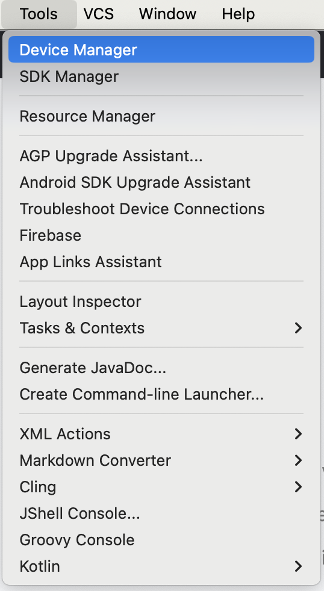
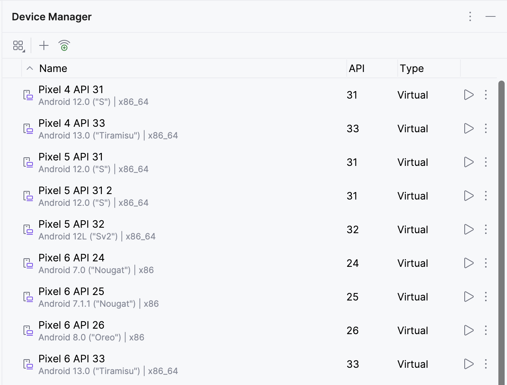
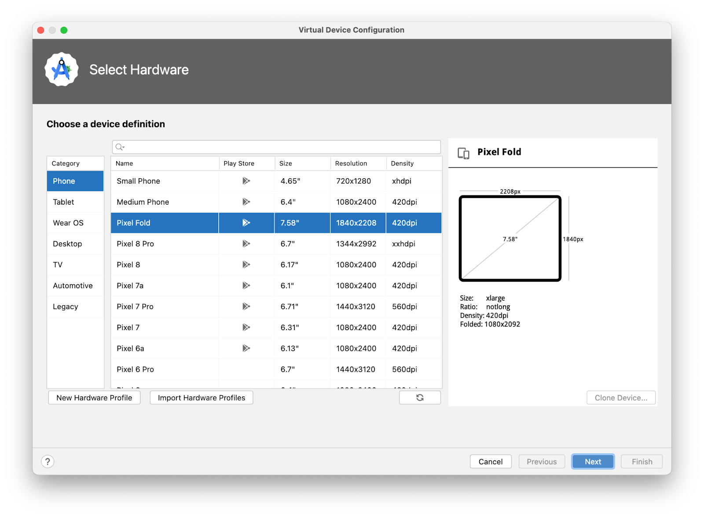
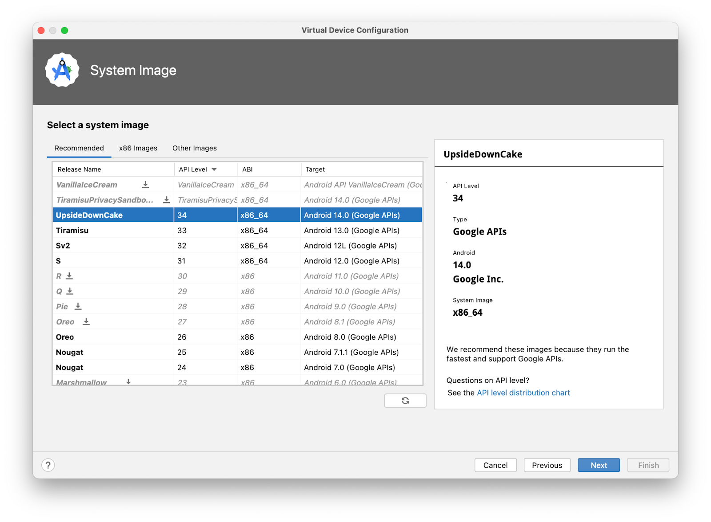
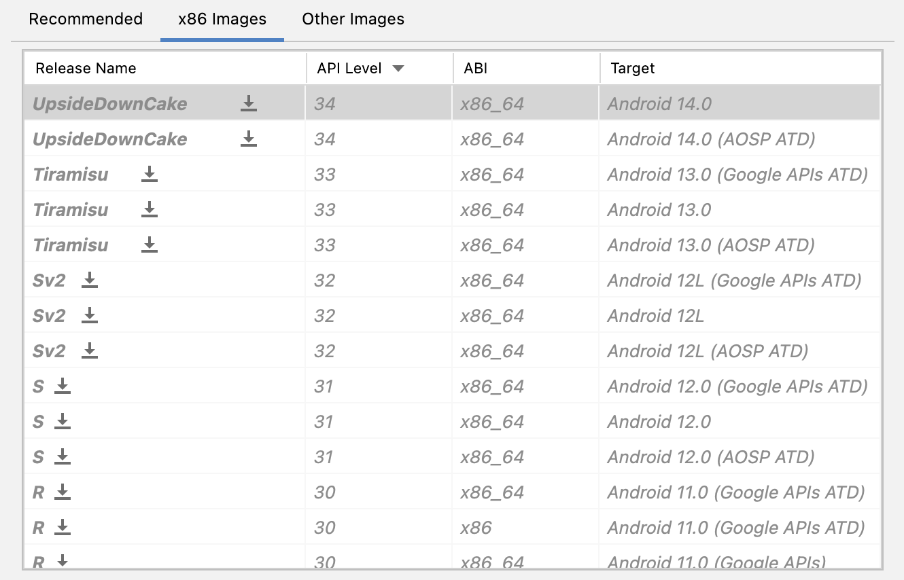
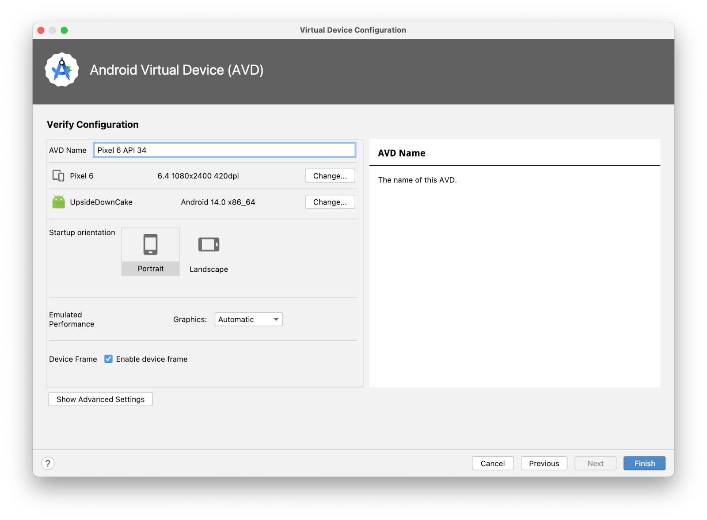
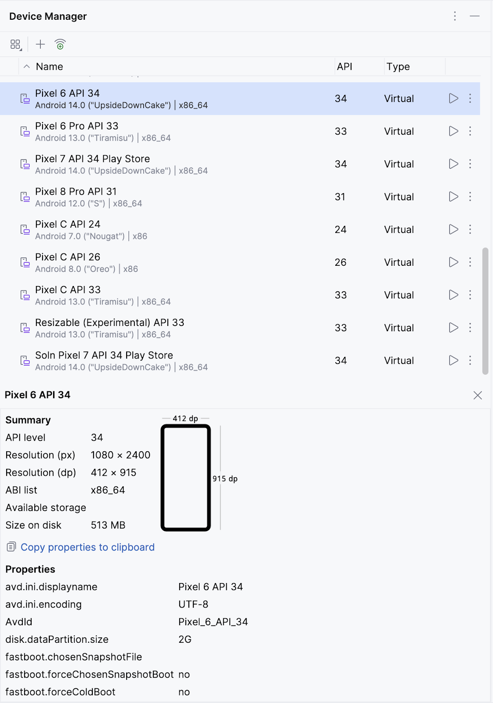
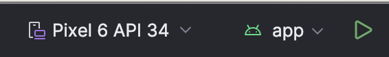
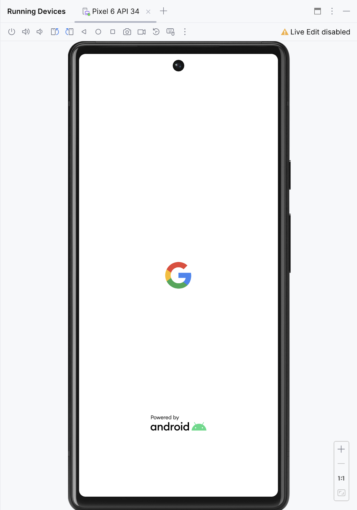
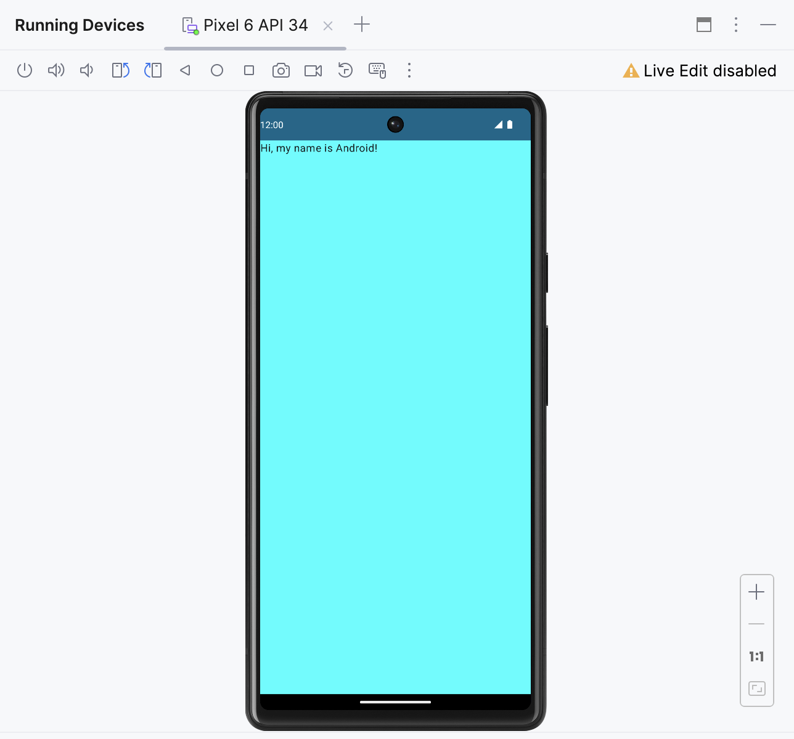

# 在 Android 模拟器上运行您的首个应用

## 1. 使用前须知

在此 Codelab 中，我们将会用到您在学习["创建您的首个 Android 应用"Codelab](https://developer.android.com/codelabs/basic-android-kotlin-compose-first-app?hl=zh-cn)时构建的 Greeting Card 应用，设置 Android 虚拟设备 (AVD)，并会在 Android 模拟器上了解代码的实际运行情况。

**前提条件**

- 了解如何设置、配置和使用文字处理器或电子表格等应用。

**学习内容**

- 如何创建 AVD 并在 Android 模拟器上运行应用

**构建内容**

- 使用模板构建的基本 Android 应用

**所需条件**

- 一台安装了 Android Studio 的计算机

## 2. 观看配套代码演示视频（可选）

如果您想要观看某位课程讲师完成此 Codelab 的过程，请播放以下视频。

建议将视频展开至全屏。您只需点击视频播放器中的**全屏**图标

，即可更清楚地查看 Android Studio 和相关代码。

这是可选步骤。您也可以跳过视频，立即开始按照此 Codelab 中的说明操作。

## 3. 在 Android 模拟器上运行应用

在此任务中，我们将使用**设备管理器**来创建 Android 虚拟设备 (AVD)。AVD 是移动设备的软件版本（也称为模拟器），可在计算机上运行，以及模拟特定类型 Android 设备的配置。它可以是任何手机、平板电脑、电视、手表或 Android Auto 设备。我们将使用 AVD 来运行 Greeting Card 应用。

> 注意：Android 模拟器是一个用于设置虚拟设备的独立应用，有自己的系统要求。虚拟设备可能会占用大量磁盘空间。如果您遇到任何问题，请参阅[在 Android 模拟器上运行应用](https://developer.android.com/studio/run/emulator?hl=zh-cn)。

### 创建 AVD

为了在计算机上通过模拟器运行 Android 应用，我们首先需要创建一个虚拟设备。

1. 在 Android Studio 中，依次选择 **Tools > Device Manager**。

2. 系统随即会打开 **Device Manager** 对话框。如果您以前创建过虚拟设备，则此对话框中会列出该设备。

3. 点击 **+** **Create virtual device**。

系统随即会显示 **Virtual Device Configuration** 对话框。

该对话框会显示一个预配置设备的列表（按类别整理），您可以从中选择。对于每种设备，该表都提供了相应列来分别显示其屏幕尺寸（以英寸为单位）、屏幕分辨率（以像素为单位）和像素密度（每英寸像素数）。

4. 选择 **Phone** 类别。
5. 选择所需手机（例如 **Pixel 6**），然后点击 **Next**。

此步骤会打开另一个屏幕，供您选择在虚拟设备上运行的 Android 版本。这可让您在不同版本的 Android 系统上测试您的应用。

6. 如果 **UpsideDownCake** 旁边显示下载链接，请依次点击 **Download > Accept > Next > Finish**。显示下载链接即表明您的计算机上未安装相关映像。在这种情况下，您必须先安装该映像，然后才能配置虚拟设备。下载过程需要一些时间才能完成。

7. 在 **Recommended** 标签页中，选择 **UpsideDownCake** 作为要在虚拟设备上运行的 Android 版本，然后点击 **Next**。

在撰写本文时，Android 14 UpsideDownCake 是最新 Android 版本，不过您可以选择后续发布的任何稳定版本。如需查看稳定版的列表，请参阅[平台代号、版本、API 级别和 NDK 版本](https://source.android.com/docs/setup/about/build-numbers?hl=zh-cn)。

> 重要提示：这些 Android 系统映像会占用大量磁盘空间，因此您的原始安装中只会包含几个映像。**Recommended** 标签页中只显示了部分 Android 系统版本，除此之外，还有很多版本。如要查看这些版本的映像，请分别进入 **Virtual Device Configuration** 对话框中的 **x86 Images** 和 **Other Images** 标签页。

8. 系统会打开另一个屏幕，您可以在其中为设备选择其他配置详情。

> 注意：如果看到有关将系统映像与 Google API 搭配使用的红色警告，您可以暂时忽略它。

9. 在 **AVD Name** 字段中，输入 AVD 的名称，或使用默认名称。保持其余字段不变。
10. 点击**完成**。

系统会返回到 **Device Manager** 窗格。

11. 关闭 **Device Manager** 对话框。

### 在 Android 模拟器上运行应用

1. 从 Android Studio 窗口顶部的下拉菜单中选择您创建的虚拟设备。

2. 点击

。

虚拟设备的启动方式与实体设备类似。模拟器首次启动需要一些时间，有可能是几分钟。虚拟设备应该会在代码编辑器旁边打开。

3. 当应用准备就绪后，便会在虚拟设备上打开。

太棒了！您的虚拟设备现已启动并运行。当应用启动后，您就可以在屏幕上看到背景颜色和问候语了。

## 4. 总结

恭喜！您已在 Android 模拟器上运行了应用！

**摘要**

- 如需创建 AVD，请打开您的项目，然后依次点击 **Tools > Device Manager**，最后使用**设备管理器**选择硬件设备和系统映像。
- 如要在虚拟设备上运行应用，请确保您已创建设备，从工具栏菜单中选择相应设备，然后点击

。

**了解更多内容**

- [探索 Android Studio](https://developer.android.com/studio/intro?hl=zh-cn)
- [项目概览](https://developer.android.com/studio/projects?hl=zh-cn)
- [创建项目](https://developer.android.com/studio/projects/create-project?hl=zh-cn)
- [从模板添加代码](https://developer.android.com/studio/projects/android-templates?hl=zh-cn)
- [构建和运行您的应用](https://developer.android.com/studio/run?hl=zh-cn)
- [在 Android 模拟器上运行应用](https://developer.android.com/studio/run/emulator?hl=zh-cn)
