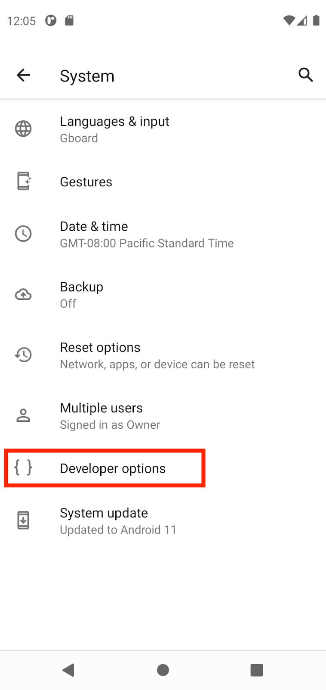
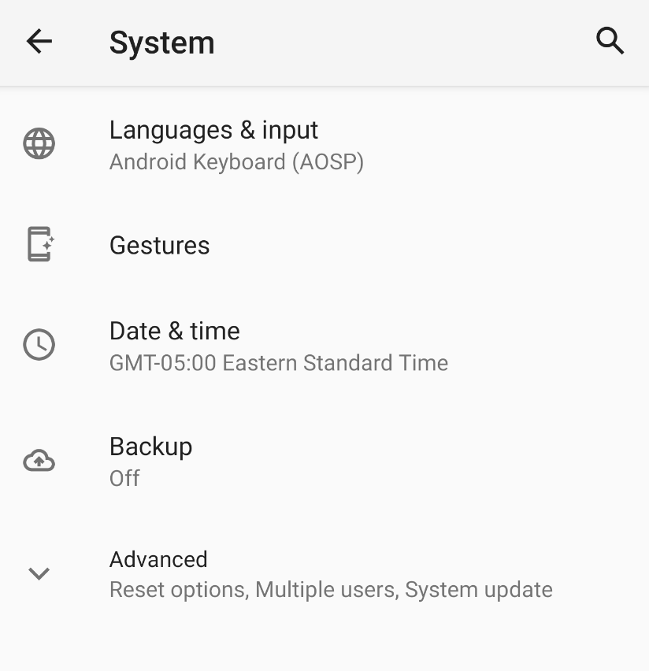
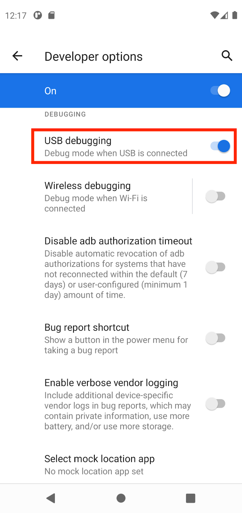
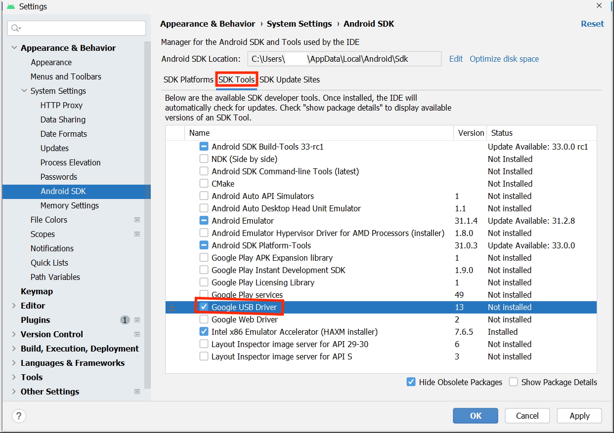
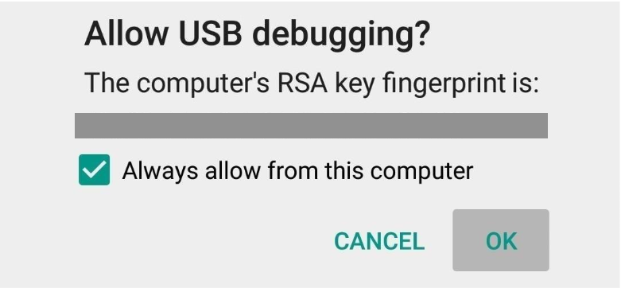
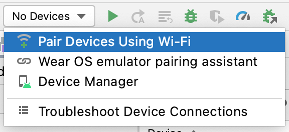
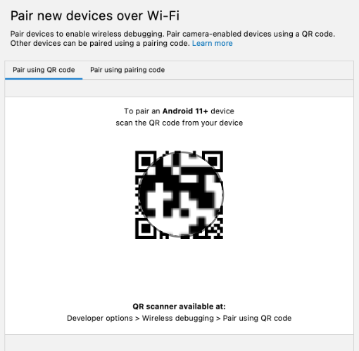
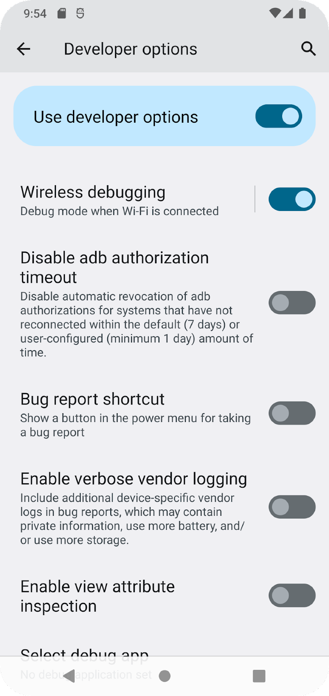
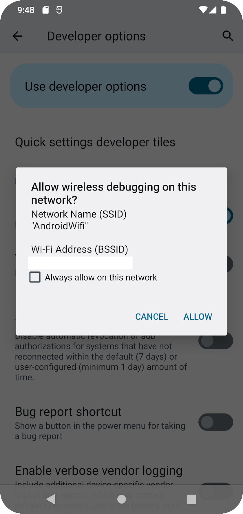

# 如何连接 Android 设备

## 1. 准备工作

在本 Codelab 中，我们将学习如何在 Android Studio 中让应用连接到实体 Android 设备。您可以通过数据线或 Wi-Fi 来连接设备。本 Codelab 将会对这两种方式都做出说明。请注意，Android Studio 会进行更新，有时候界面还会发生变化，因此，如果您的 Android Studio 看起来与本文屏幕中显示的内容略有不同，也没关系。

**前提条件**

- 具备有关如何使用 Android Studio 的基础知识。
- 能够打开和调整 Android 设备上的设置。

**学习内容**

- 如何使 Android 设备能够从 Android Studio 运行应用。
- 如何在 Android Studio 中连接实体 Android 设备并运行应用。

**所需条件**

- 已在计算机上下载并安装 Android Studio。
- 已在 Android Studio 中设置一个应用项目。
- 一部 Android 设备（如搭载 Lollipop 或更高版本的手机或平板电脑）。
- （可选）一根可通过 USB 端口将 Android 设备连接到计算机的 USB 线。

> 注意：如果需要参考信息来帮助确定计算机和 Android 设备配备的 USB 端口类型以及所需的配套数据线，请参阅 USB 一文。

## 2. 观看配套代码演示视频（可选）

如果您想要观看某位课程讲师完成此 Codelab 的过程，请播放以下视频。

建议将视频全屏展开（使用视频右下角的 图标），以便更清楚地查看 Android Studio 和相关代码。

这是可选步骤。您也可以跳过视频，立即开始按照此 Codelab 中的说明操作。

## 3. 启用 USB 调试

如要让 Android Studio 与您的 Android 设备通信，您必须在设备的"开发者选项"设置中启用 USB 调试功能。

如需显示开发者选项并启用 USB 调试功能，请按以下步骤操作：

1. 在 Android 设备上，依次点按**设置 > 关于手机**。
2. 连续点按**版本号**七次。
3. 如果出现提示，输入您的设备密码或 PIN 码。如果显示**您现在处于开发者模式！**消息，则说明您已成功启用开发者模式。

4. 返回设置主屏幕，然后依次点按**系统 > 开发者选项**。

如果您没有看到开发者选项，请点按**高级选项**。

5. 点按**开发者选项**，然后点按 **USB 调试**切换开关将其开启。

### 安装 Google USB 驱动程序（仅适用于 Windows）

如果您在运行 Windows 系统的计算机上安装了 Android Studio，则必须先安装 USB 设备驱动程序，然后才能在实体设备上运行您的应用。

> 注意：对于运行 Ubuntu Linux 系统的计算机，请按照[在硬件设备上运行应用](https://developer.android.com/studio/run/device?hl=zh-cn)一文中的说明进行操作。

1. 在 Android Studio 中，依次点击 **Tools > SDK Manager**。系统随即会打开 **Preferences > Appearance & Behavior > System Settings > Android SDK** 对话框。
2. 点击 **SDK Tools** 标签页。
3. 选择 **Google USB Driver**，然后点击 **OK**。

完成后，驱动程序文件便会下载到 `android_sdk\extras\google\usb_driver` 目录中。现在，您可以连接设备并从 Android Studio 运行您的应用了。

## 4. 通过数据线在 Android 设备上运行应用

您可以通过数据线或 Wi-Fi 这两种方式将设备连接到 Android Studio，也可以选择其他您更喜欢方式。

如需在 Android 设备上从 Android Studio 运行您的应用，请执行以下操作：

1. 使用 USB 线将 Android 设备连接到计算机。设备上应会显示一个对话框，要求您允许进行 USB 调试。

2. 选中**一律允许使用这台计算机进行调试**复选框，然后点按**确定**。
3. 在计算机上的 Android Studio 中，务必从下拉菜单中选择您的设备。点击

。

4. 选择您的设备，然后点击 **OK**。Android Studio 会在设备上安装并运行该应用。

> 注意：对于 Android Studio 3.6 及更高版本，当连接好已开启调试功能的实体设备后，系统会自动选择相应设备。

5. 如果您的设备运行的 Android 平台未在 Android Studio 中安装，并且系统显示消息来询问您是否要安装所需的平台，请依次点击 **Install > Continue > Finish**。Android Studio 会在设备上安装并运行该应用。

## 5. 通过 Wi-Fi 在 Android 设备上运行应用

如果没有数据线，您也可以通过 Wi-Fi 来连接设备并运行您的应用。

**开始**

- 确保您的计算机和设备已连接到同一无线网络。
- 确保您的设备搭载的是 Android 11 或更高版本。如需了解详情，请参阅[查看并更新 Android 版本](https://support.google.com/android/answer/7680439?hl=zh-cn)。
- 确保您的计算机已安装最新版本的 Android Studio。如需下载，请访问 [Android Studio 页面](https://developer.android.com/studio?hl=zh-cn)。
- 确保您的计算机已安装最新版本的 SDK 平台工具。

**与设备配对**

1. 在 Android Studio 中，从运行配置下拉菜单中选择 **Pair Devices Using Wi-Fi**。

系统随即会打开 **Pair devices over Wi-Fi** 对话框。

2. 前往**开发者选项**，向下滚动到**调试**部分，然后开启**无线调试**。

3. 在**要允许通过此网络进行无线调试吗？**弹出式窗口中，选择**允许**。

4. 如需使用二维码配对您的设备，请选择**使用二维码配对设备**，然后在计算机上扫描该二维码。如需使用配对码配对您的设备，请选择**使用配对码配对设备**，然后输入 6 位数配对码。
5. 点击"Run"，然后您就可以将应用部署到设备上了。

> 注意：如果您想与其他设备配对，或在计算机上取消保存此设备，请前往您设备上的**无线调试**，并在**已配对的设备**下点按工作站名称，然后选择**取消保存**。

## 6. 问题排查

- 如果您的计算机运行的是 Linux 或 Windows，并且您无法在实体 Android 设备上运行您的应用，请参阅[在硬件设备上运行应用](https://developer.android.com/studio/run/device?hl=zh-cn)，了解其他步骤。
- 如果您的计算机运行的是 Windows，并且模拟器安装不起作用，请参阅[安装原始设备制造商 (OEM) USB 驱动程序](https://developer.android.com/studio/run/oem-usb?hl=zh-cn)，获取适合您设备的 USB 驱动程序。
- 如果 Android Studio 无法识别您的设备，请尝试拔掉 USB 线，然后再重新插上；或者重新启动 Android Studio。
- 如果您的计算机仍找不到设备或声明设备未经授权，请拔掉 USB 线。在设备上，依次点按**设置 > 开发者选项 > 撤消 USB 调试授权**。将设备重新连接到计算机。当系统提示时，授予 USB 调试授权。

## 7. 总结

您已了解如何在实体 Android 设备上通过 Android Studio 运行应用！

**摘要**

- 您可以通过有线方式或 Wi-Fi 在实体设备上运行 Android 应用。
- Windows 用户需要安装 USB 调试驱动程序，才能在实体设备上运行应用。
- 如果您是通过 Wi-Fi 运行应用，则可以使用二维码或 6 位数配对码进行配对。

**了解更多内容**

- [在硬件设备上运行应用](https://developer.android.com/studio/run/device?hl=zh-cn)
- [安装原始设备制造商 (OEM) USB 驱动程序](https://developer.android.com/studio/run/oem-usb?hl=zh-cn)
- [获取 Google USB 驱动程序](https://developer.android.com/studio/run/win-usb?hl=zh-cn)
