# 使用文本可组合项构建简单的应用

## 1. 准备工作

在本 Codelab 中，您将使用 Jetpack Compose 构建一个会在屏幕上显示生日祝福语的简单 Android 应用。

### 前提条件

- 了解如何在 Android Studio 中创建应用。
- 了解如何在模拟器中或在 Android 设备上运行应用。

### 学习内容

- 了解如何编写可组合函数，例如 Text、Column 和 Row 可组合函数。
- 如何在布局中显示应用里的文本。
- 如何设置文本格式，例如更改文本大小。

### 构建内容

一个以文本格式显示生日祝福的 Android 应用，完成后应如下面的屏幕截图所示：

<div align="center">

</div>

### 所需条件

- 一台安装了 Android Studio 的计算机

## 2. 设置 Happy Birthday 应用

在此任务中，您将在 Android Studio 中使用 Empty Activity 模板设置一个项目，并将文本消息更改为个性化的生日祝福。

### 创建 Empty Activity 项目

1. 在 Welcome to Android Studio 对话框中，选择 **New Project**。
2. 在 New Project 对话框中，选择 **Empty Activity**，然后点击 **Next**。
3. 在 **Name** 字段中输入 **Happy Birthday**，在 **Minimum SDK** 字段中选择最低 API 级别 24 (Nougat)，然后点击 **Finish**。

<div align="center">
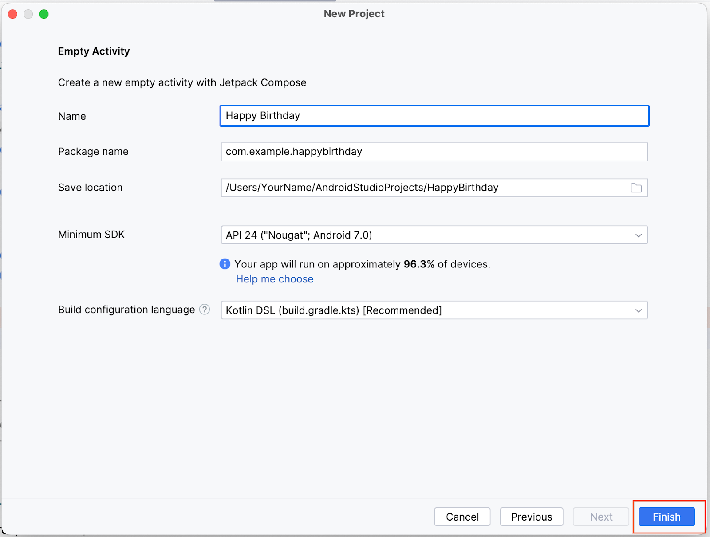
</div>

等待 Android Studio 创建项目文件并构建项目。

点击  **Run 'app'**。

应用应如下面的屏幕截图所示：

<div align="center">
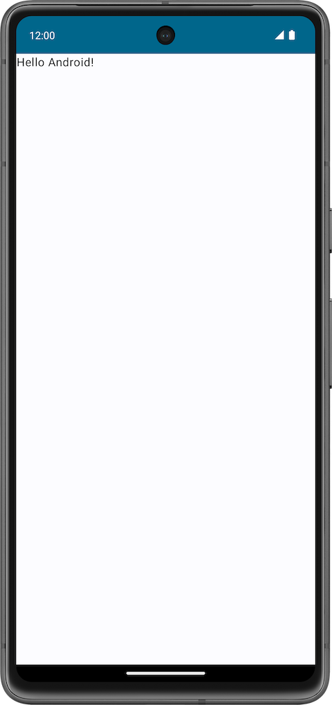
</div>

在您使用 Empty Activity 模板创建这个 Happy Birthday 应用时，Android Studio 会设置基本 Android 应用所需的各项资源，包括在屏幕上显示的 **Hello Android!** 消息。在本 Codelab 中，您将了解如何放置该消息、如何将其文本更改为生日祝福，以及如何添加额外的消息并为其设置格式。

### 什么是界面 (UI)？

应用的界面 (UI) 就是您在屏幕上所看到的内容（文本、图片、按钮和许多其他类型的元素）及其在屏幕上的布局方式。它既是应用向用户显示内容的方式，也是用户与应用展开互动的载体。

下面的图片包含一个可点击的按钮、一则文本消息和一个可供用户输入数据的文本输入字段。

<div align="center">
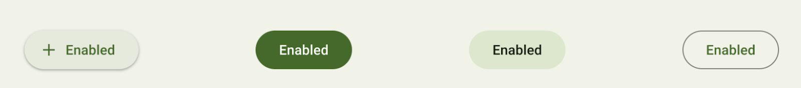
</div>

**可点击的按钮**

<div align="center">
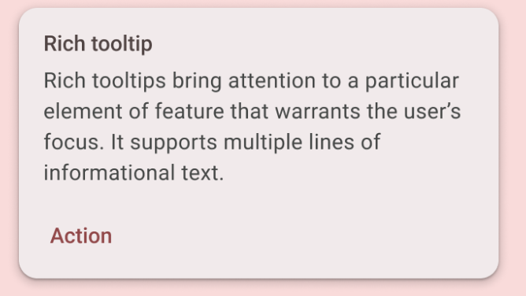
</div>

**卡片中的短信**

<div align="center">
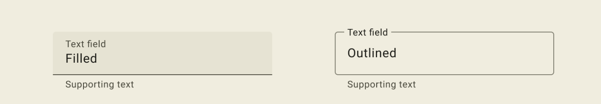
</div>

**文本输入字段**

上述各个元素就是所谓的**界面组件**。您在应用屏幕上看到的所有内容几乎均属于界面元素（也称为界面组件）。这些元素可以是互动元素（例如可点击的按钮或可修改的输入字段），也可以是装饰性图片。

在下面的应用中，尝试找到尽可能多的界面组件。

<div align="center">

</div>

<div align="center">
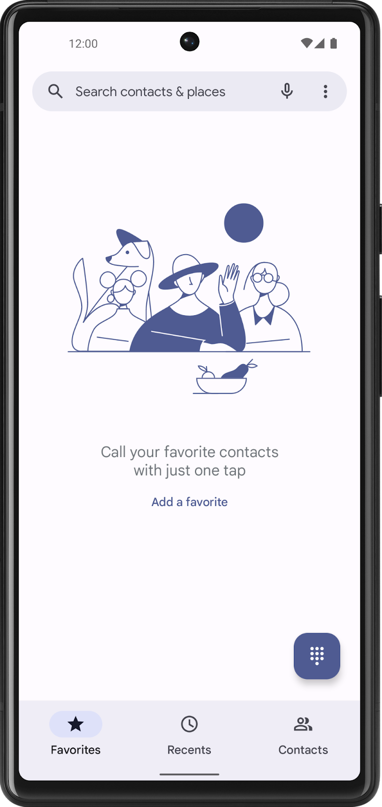
</div>

在本 Codelab 中，您将使用一种用于显示文本的界面元素，即 **Text** 元素。

## 3. 什么是 Jetpack Compose？

Jetpack Compose 是用于构建 Android 界面的新款工具包。Compose 使用更少的代码、强大的工具和直观的 Kotlin 功能，可以帮助您简化并加快 Android 界面开发。借助 Compose，您可以通过定义一组函数来构建界面，这些函数称为**可组合函数**，它们会接受数据并描述界面元素。

### 可组合函数

在 Compose 中，可组合函数是界面的基本构建块。可组合函数：

- 描述界面中的某一部分。
- 不会返回任何内容。
- 接受一些输入并生成屏幕上显示的内容。

### 注释

注解是用于在代码中附加额外信息的方式。此类信息可以帮助 Jetpack Compose 编译器等工具和其他开发者理解应用的代码。

若要应用注解，只需在您要注解的声明开头为其名称（注解）添加 `@` 字符作为前缀即可。您可以为包括属性、函数和类在内的不同代码元素添加注解。本课程稍后会介绍类。

下图是一个带有注解的函数示例：

<div align="center">
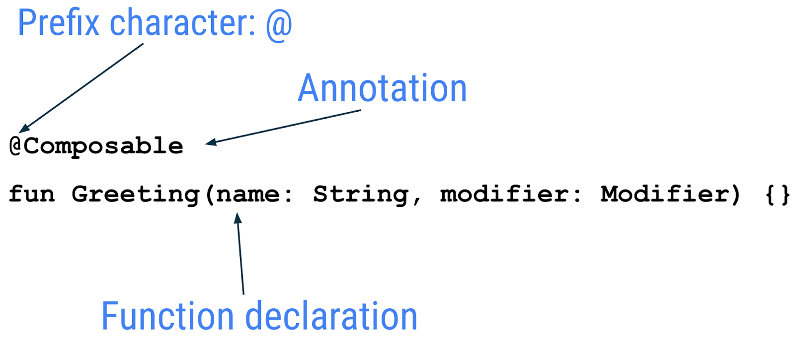
</div>

以下代码段中包含一些带有注解的属性示例。在后续 Codelab 中，您将用到这些属性。

```kotlin
// Example code, do not copy it over
@Json
val imgSrcUrl: String

@Volatile
private var INSTANCE: AppDatabase? = null
```

### 带形参的注解

注解可以接受形参。形参可以为处理它们的工具提供额外信息。以下是带形参和不带形参的 `@Preview` 注解的一些示例。

<div align="center">
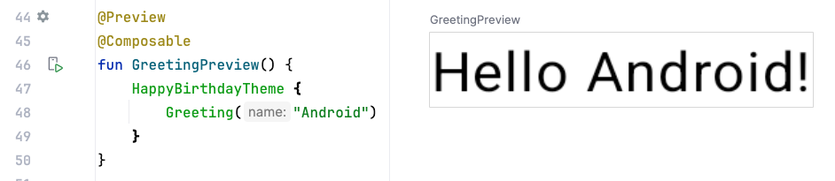
</div>

不带形参的注解

<div align="center">
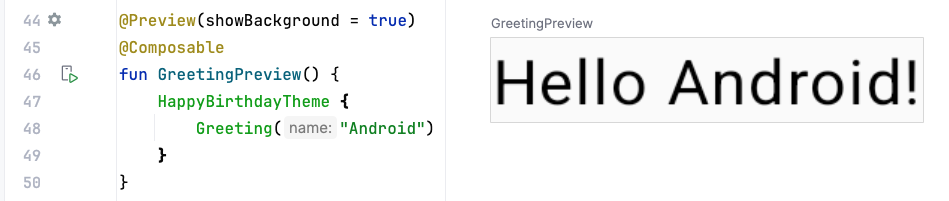
</div>

用于预览背景的注解

<div align="center">
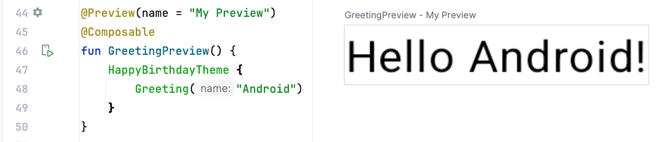
</div>

带有预览标题的注解

您可以向注解传递多个实参，如下所示。

<div align="center">
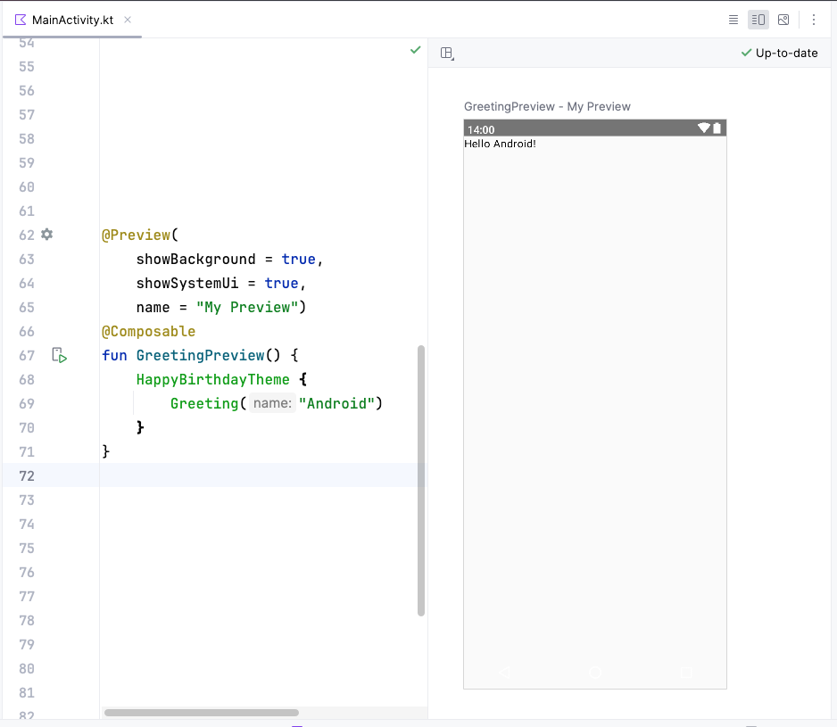
</div>

Android Studio 屏幕截图，显示了代码和预览

带有预览标题和系统界面（手机屏幕）的注解

Jetpack Compose 中有各种各样的内置注解，截至目前为止，本课程中已经出现过 `@Composable` 注解和 `@Preview` 注解。在本课程后面的部分，您将了解更多注解及其用法。

### 可组合函数示例

可组合函数带有 `@Composable` 注解。所有可组合函数都必须带有此注解。此注解可告知 Compose 编译器：此函数用于将数据转换为界面。请注意，编译器是一种特殊的程序，它会接受您编写的代码，逐行查看，然后将其转换成计算机可以理解的指令（机器语言）。

以下代码段是一个简单的可组合函数示例，该函数接受传递的数据（`name` 函数参数）并用其在屏幕上渲染文本元素。

```kotlin
@Composable
fun Greeting(name: String) {
    Text(text = "Hello $name!")
}
```

关于可组合函数的几点说明：

- Jetpack Compose 是围绕可组合函数构建的。这些函数可让您以程序化方式定义应用的界面，只需描述应用界面的外观，而不必关注界面的构建过程。如需创建可组合函数，只需将 `@Composable` 注解添加到函数名称中即可。
- 可组合函数可以接受一些实参，用来让应用逻辑描述或修改界面。在本例中，界面元素接受一个 `String`，以便在问候用户时称呼姓名。

### 注意代码中的可组合函数

1. 在 Android Studio 中，打开 `MainActivity.kt` 文件。
2. 滚动到 `GreetingPreview()` 函数。此可组合函数有助于预览 `Greeting()` 函数。按照最佳实践，您应当始终对函数命名或重命名，以描述其功能。将此函数的名称更改为 `BirthdayCardPreview()`。

```kotlin
@Preview(showBackground = true)
@Composable
fun BirthdayCardPreview() {
    HappyBirthdayTheme {
        Greeting("Android")
    }
}
```

可组合函数可以调用其他可组合函数。在此代码段中，预览函数调用了 `Greeting()` 可组合函数。

请注意，在上一个函数中，`@Composable` 注解前面还有另一个带参数的注解，即 `@Preview` 注解。本课程稍后会详细介绍传递给 `@Preview` 注解的参数。

### 可组合函数名称

不返回任何内容且带有 `@Composable` 注解的 Compose 函数必须使用 **Pascal 命名法**命名。Pascal 命名法是指一种命名惯例，采用这种命名法时，复合词中每个单词的首字母大写。Pascal 命名法与驼峰命名法之间的区别在于：在 Pascal 命名法中，所有单词的首字母都大写；而在驼峰命名法中，首字母可以是大写或小写。

Compose 函数：

- 必须是名词：`DoneButton()`
- 不能是动词或动词短语：`DrawTextField()`
- 不能是名词性介词：`TextFieldWithLink()`
- 不能是形容词：`Bright()`
- 不能是副词：`Outside()`
- 名词可以添加描述性形容词作为前缀：`RoundIcon()`

如需了解详情，请参阅[为可组合函数命名](https://developer.android.com/topic/architecture/ui-layer/compose-function-naming?hl=zh-cn)。

示例代码。请勿复制：

```kotlin
// Do: This function is a descriptive PascalCased noun as a visual UI element
@Composable
fun FancyButton(text: String) {}

// Do: This function is a descriptive PascalCased noun as a non-visual element
// with presence in the composition
@Composable
fun BackButtonHandler() {}

// Don't: This function is a noun but is not PascalCased!
@Composable
fun fancyButton(text: String) {}

// Don't: This function is PascalCased but is not a noun!
@Composable
fun RenderFancyButton(text: String) {}

// Don't: This function is neither PascalCased nor a noun!
@Composable
fun drawProfileImage(image: ImageAsset) {}
```

## 4. Android Studio 中的"Design"窗格

Android Studio 允许您在 IDE 中预览可组合函数，无需将应用安装到 Android 设备或模拟器中。正如您在之前的在线课程中学到的，您可以在 Android Studio 的 **Design** 窗格中预览应用的外观。

<div align="center">
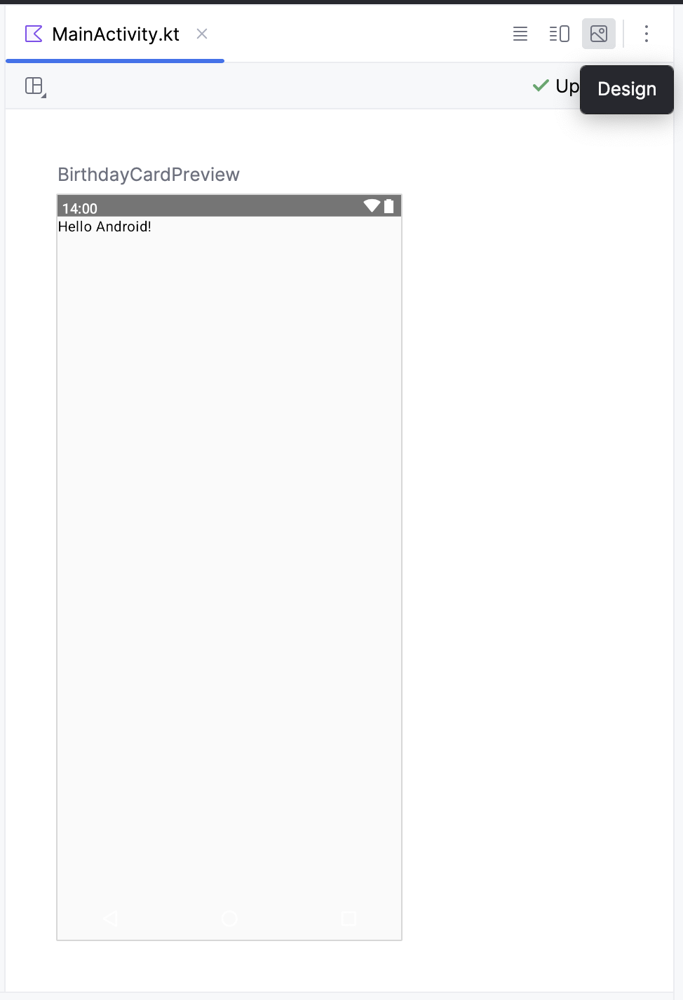
</div>

可组合函数必须为所有形参提供默认值，才能对其进行预览。因此，我们建议您不要直接预览 `Greeting()` 函数，而是需要添加另一个函数（在本例中为 `BirthdayCardPreview()` 函数），由该函数使用适当的形参调用 `Greeting()` 函数。

```kotlin
@Preview(showBackground = true)
@Composable
fun BirthdayCardPreview() {
    HappyBirthdayTheme {
        Greeting("Android")
    }
}
```

> **提示**：点击 **Split** 图标可同时查看代码和设计预览。

<div align="center">
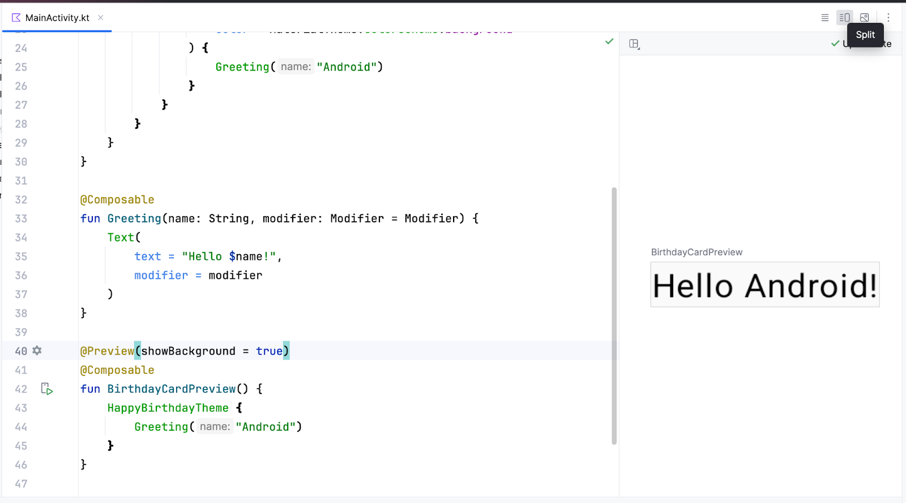
</div>

如需查看预览，请执行以下操作：

在 `BirthdayCardPreview()` 函数中，将 `Greeting()` 函数中的 `"Android"` 实参更改为您的名字。

```kotlin
@Preview(showBackground = true)
@Composable
fun BirthdayCardPreview() {
    HappyBirthdayTheme {
        Greeting("James")
    }
}
```

预览会自动更新。

您应看到更新后的预览。

<div align="center">
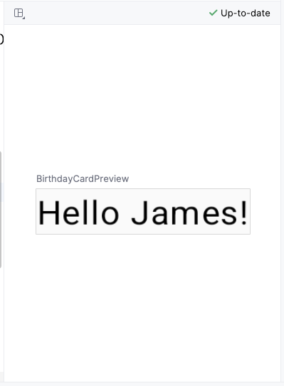
</div>

> **重要提示**：使用 `@Preview` 注解添加到 `BirthdayCardPreview()` 函数中的代码仅用于在 Android Studio 的 Design 窗格中进行预览。这些更改不会反映在应用中。此 Codelab 稍后会介绍如何更改应用。

## 5. 添加新的文本元素

在此任务中，您将移除 **Hello $name!** 问候语并添加生日祝福。

### 添加新的可组合函数

1. 在 `MainActivity.kt` 文件中，删除 `Greeting()` 函数定义。在此 Codelab 稍后的部分，您将添加自己的函数，用于显示生日祝福。

移除以下代码：

```kotlin
@Composable
fun Greeting(name: String, modifier: Modifier = Modifier) {
    Text(
        text = "Hello $name!",
        modifier = modifier
    )
}
```

2. 在 `onCreate()` 函数内，您会看到 `Greeting()` 函数调用现在显示为红色。红色表示存在错误。将光标悬停在此函数调用上，Android Studio 将显示有关该错误的信息。

<div align="center">
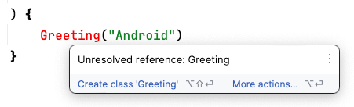
</div>

3. 从 `onCreate()` 和 `BirthdayCardPreview()` 函数中删除 `Greeting()` 函数调用及其实参。此时 `MainActivity.kt` 文件将如下所示：

```kotlin
class MainActivity : ComponentActivity() {
    override fun onCreate(savedInstanceState: Bundle?) {
        super.onCreate(savedInstanceState)
        setContent {
            HappyBirthdayTheme {
                // A surface container using the 'background' color from the theme
                Surface(
                    modifier = Modifier.fillMaxSize(),
                    color = MaterialTheme.colorScheme.background
                ) {
                }
            }
        }
    }
}

@Preview(showBackground = true)
@Composable
fun BirthdayCardPreview() {
    HappyBirthdayTheme {
    }
}
```

4. 在 `BirthdayCardPreview()` 函数前，添加一个名为 `GreetingText()` 的新函数。不要忘记在该函数前添加 `@Composable` 注解，因为该函数是一个用于描述 Text 可组合项的 Compose 函数。

```kotlin
@Composable
fun GreetingText() {}
```

5. 最好让可组合项接受 `Modifier` 形参，并将该 modifier 传递给其第一个子项。在后续任务和 Codelab 中，您将详细了解 `Modifier` 和子元素。现在，请向 `GreetingText()` 函数添加 `Modifier` 形参。

```kotlin
@Composable
fun GreetingText(modifier: Modifier = Modifier) {}
```

6. 将类型为 `String` 的 `message` 形参添加到 `GreetingText()` 可组合函数中。

```kotlin
@Composable
fun GreetingText(message: String, modifier: Modifier = Modifier) {}
```

7. 在 `GreetingText()` 函数中，添加一个 `Text` 可组合项并传入文本消息作为具名实参。

```kotlin
@Composable
fun GreetingText(message: String, modifier: Modifier = Modifier) {
    Text(
        text = message
    )
}
```

此 `GreetingText()` 函数用于在界面中显示文本。为此，它会调用 `Text()` 可组合函数。

### 预览函数

在此任务中，您将在 Design 窗格中预览 `GreetingText()` 函数。

1. 在 `BirthdayCardPreview()` 函数中调用 `GreetingText()` 函数。
2. 将一个 String 参数（其内容是对朋友的生日祝福）传递给 `GreetingText()` 函数。如果愿意，您可以使用朋友的名字进行自定义，例如 `"Happy Birthday Sam!"`。

```kotlin
@Preview(showBackground = true)
@Composable
fun BirthdayCardPreview() {
    HappyBirthdayTheme {
        GreetingText(message = "Happy Birthday Sam!")
    }
}
```

在 Design 窗格中，系统会自动更新。预览您所做的更改。

<div align="center">
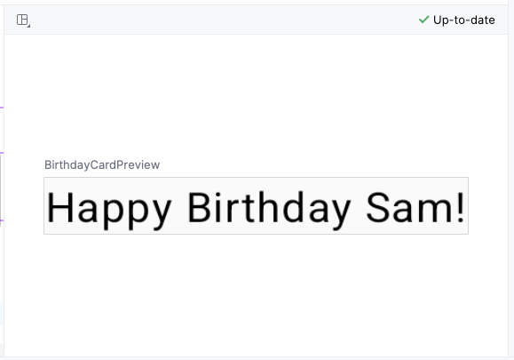
</div>

## 6. 更改字体大小

您已将文本添加到界面中，但它看起来和最终应用还不太一样。在此任务中，您将了解如何更改大小、文本颜色以及影响文本元素外观的其他属性。此外，您还可以尝试使用不同的字体大小和颜色。

### 可缩放像素

可缩放像素 (SP) 是字体大小的度量单位。Android 应用中的界面元素使用两种不同的度量单位：一种是您稍后将为布局使用的密度无关像素 (DP)，另一种就是可缩放像素 (SP)。默认情况下，SP 单位与 DP 单位大小相同，但前者的大小会根据用户在手机设置下的首选文本大小进行调整。

1. 在 `MainActivity.kt` 文件中，滚动到 `GreetingText()` 函数中的 `Text()` 可组合项。
2. 向 `Text()` 函数传递 `fontSize` 实参作为第二个具名实参，并将其值设为 `100.sp`。

```kotlin
Text(
    text = message,
    fontSize = 100.sp
)
```

Android Studio 突出显示了 `.sp` 代码，因为您需要导入一些类或属性来编译应用。

<div align="center">
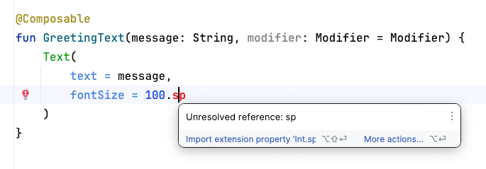
</div>

3. 点击 Android Studio 突出显示的 `.sp`。
4. 点击弹出式窗口中的 **Import** 导入 `androidx.compose.ui.unit.sp`，以使用 `.sp` 扩展属性。

> **注意**：AndroidX（Android 扩展）库包含一组库和类，通过提供核心功能帮助您加快应用开发。您可以使用 `androidx` 软件包获得这些类、属性和其他工件。

滚动到文件顶部，您会发现一些 `import` 语句，其中有一个 `import androidx.compose.ui.unit.sp` 语句，这表示 Android Studio 会将此软件包添加到您的文件中。

<div align="center">
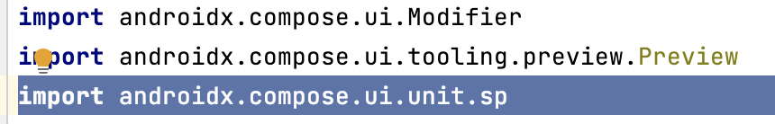
</div>

> **注意**：如果使用 Android Studio 进行导入时遇到任何问题，可以在文件顶部手动添加 import 语句。

请注意更新后的字体大小预览。消息重叠的原因是您需要指定行高。

<div align="center">
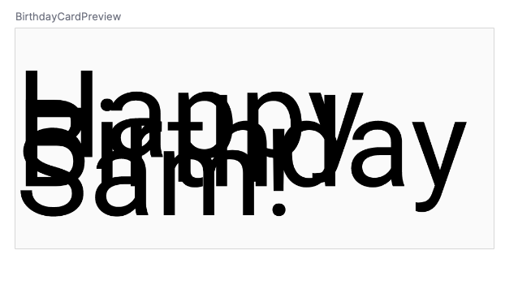
</div>

> **注意**：`sp` 是 `Int` 的扩展属性，用于创建 `sp` 单位。同样，您也可以在 `Float` 和 `Double` 等其他数据类型中使用 `.sp` 扩展属性。

更新 Text 可组合项以包含行高。

```kotlin
@Composable
fun GreetingText(message: String, modifier: Modifier = Modifier) {
    Text(
        text = message,
        fontSize = 100.sp,
        lineHeight = 116.sp,
    )
}
```

<div align="center">
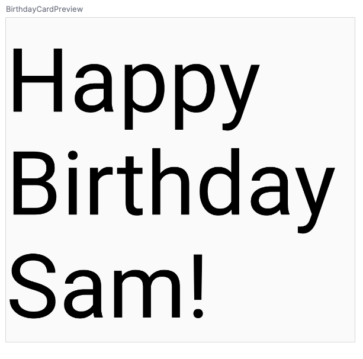
</div>

现在，您可以尝试使用不同的字体大小。

## 7. 再添加一个文本元素

在前面的任务中，您添加了一句对朋友的生日祝福语。在此任务中，您将在生日卡上签上自己的名字。

1. 在 `MainActivity.kt` 文件中，滚动到 `GreetingText()` 函数。
2. 向该函数传递一个类型为 `String` 的 `from` 参数作为您的签名。

```kotlin
fun GreetingText(message: String, from: String, modifier: Modifier = Modifier)
```

> **注意**：如果您在函数调用中使用的是具名实参，那么函数形参的顺序就无关紧要。

3. 在生日祝福语 `Text` 可组合项之后，再添加一个接受 `text` 实参（其值设为 `from`）的 `Text` 可组合项。

```kotlin
@Composable
fun GreetingText(message: String, from: String, modifier: Modifier = Modifier) {
    Text(
        // ...
    )
    Text(
        text = from
    )
}
```

4. 添加一个 `fontSize` 具名实参，并将其值设为 `36.sp`。

```kotlin
Text(
    text = from,
    fontSize = 36.sp
)
```

5. 滚动到 `BirthdayCardPreview()` 函数。
6. 再添加一个 String 实参来为生日卡签名，例如 `"From Emma"`。

```kotlin
GreetingText(message = "Happy Birthday Sam!", from = "From Emma")
```

请注意预览结果。

<div align="center">
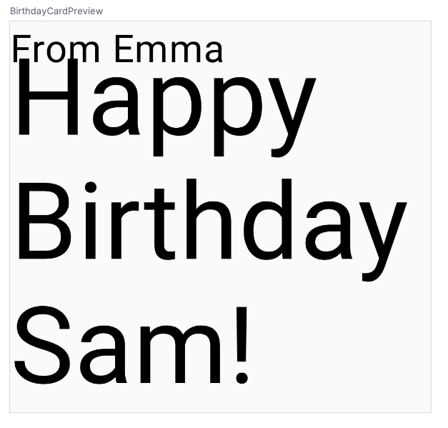
</div>

一个可组合函数可能会描述多个界面元素。不过，如果您未提供有关如何排列这些元素的指导，Compose 可能会以您不喜欢的方式排列它们。例如，上面的代码生成了两个相互重叠的文本元素，因为您没有提供有关如何排列这两个可组合项的指导。

在下一个任务中，您将了解如何将可组合项排列成一行或一列。

## 8. 将文本元素排列成一行或一列

### 界面层次结构

界面层次结构基于包含机制，意即一个组件可以包含一个或多个组件，有时会用"父级"和"子级"这两个词来表述。这种说法是指，父界面元素包含子界面元素，而子界面元素还可以继续包含子界面元素。在此部分中，您将了解可用作父界面元素的 `Column`、`Row` 和 `Box` 可组合项。

<div align="center">
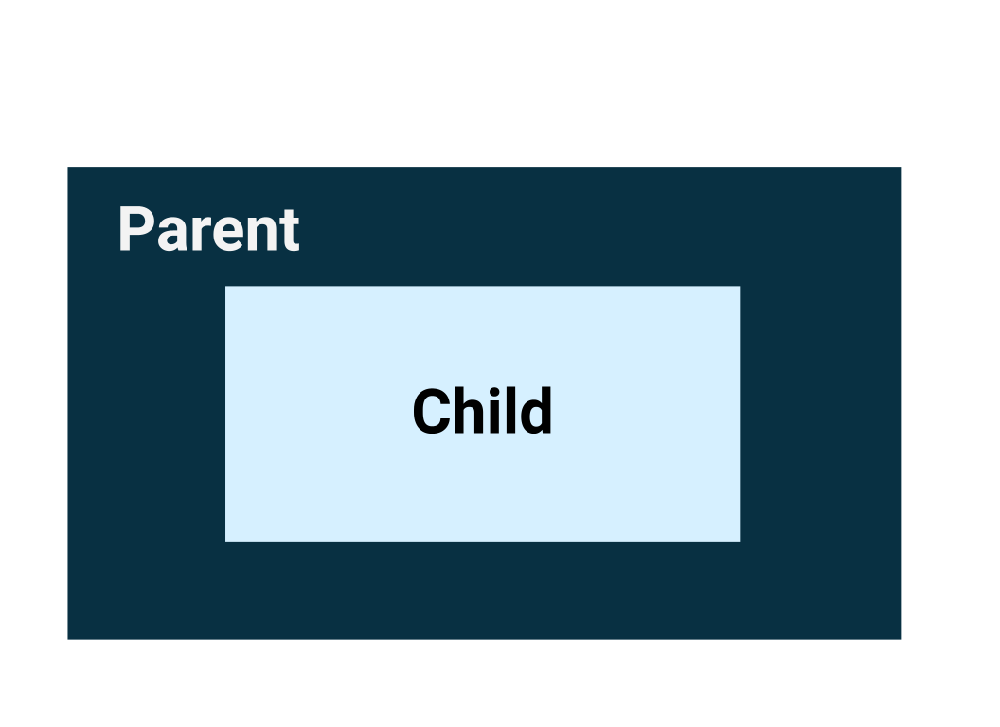
</div>

Compose 中的 3 个基本标准布局元素是 `Column`、`Row` 和 `Box` 可组合项。下一个 Codelab 会详细介绍 `Box` 可组合项。

<div align="center">
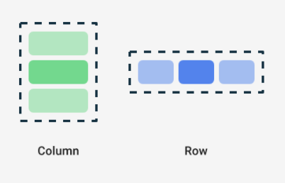
</div>

`Column`、`Row` 和 `Box` 都是接受可组合内容作为参数的可组合函数，因此您可以在这些布局元素内放置项目。例如，`Row` 可组合项中的各个子元素彼此相邻地水平放置成一行。

```kotlin
// Don't copy.
Row {
    Text("First Column")
    Text("Second Column")
}
```

这些文本元素会在屏幕上并排显示，如下图所示。

蓝色边框仅用于演示目的，不会实际显示。

<div align="center">
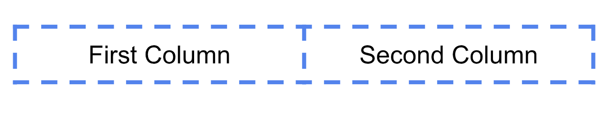
</div>

### 尾随 lambda 语法

请注意，在上一个代码段中，`Row` 可组合函数中使用的是花括号而不是圆括号。这称为**尾随 Lambda 语法**。本课程稍后会详细介绍 lambda 和尾随 lambda 语法。现在，您只需要熟悉这个常用的 Compose 语法。

当最后一个形参是函数时，Kotlin 提供了一种特殊语法来将函数作为形参传递给函数。

<div align="center">
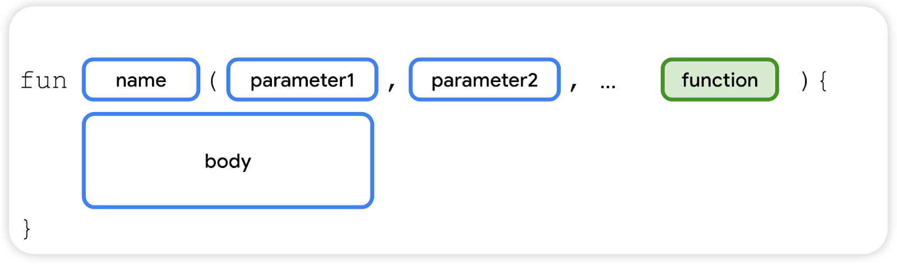
</div>

将函数作为形参传递时，您可以使用尾随 lambda 语法。您可以将函数放在圆括号外部的大括号中，而不是放在圆括号内。这是 Compose 中的一种常见且推荐的做法，因此您需要熟悉代码的格式。

例如，`Row()` 可组合函数中的最后一个形参是 `content` 形参，它是一个描述子界面元素的函数。假设您想要创建一个包含三个文本元素的行。以下代码行得通，但如果为尾随 lambda 使用具名形参，则非常麻烦：

```kotlin
Row(
    content = {
        Text("Some text")
        Text("Some more text")
        Text("Last text")
    }
)
```

由于 `content` 形参是函数签名中的最后一个形参，并且您要将其值作为 lambda 表达式传递（目前，如果您不知道 lambda 是什么也没关系，只需要熟悉一下语法即可），因此您可以移除 `content` 形参和括号，如下所示：

```kotlin
Row {
    Text("Some text")
    Text("Some more text")
    Text("Last text")
}
```

### 将文本元素排列成一行

在此任务中，您要将应用中的文本元素排列成一行，以免相互重叠。

1. 在 `MainActivity.kt` 文件中，滚动到 `GreetingText()` 函数。
2. 添加 `Row` 可组合项将文本元素括起来，以显示包含两个文本元素的一行。选择两个 `Text` 可组合项，然后点击灯泡。依次选择 **Surround with widget** > **Surround with Row**。

<div align="center">
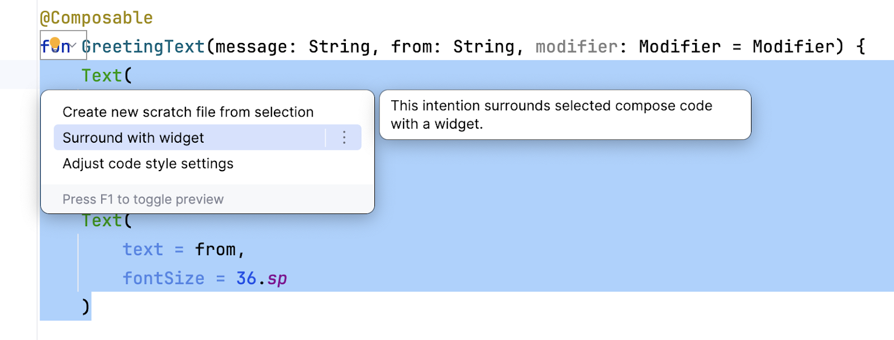
</div>

<div align="center">
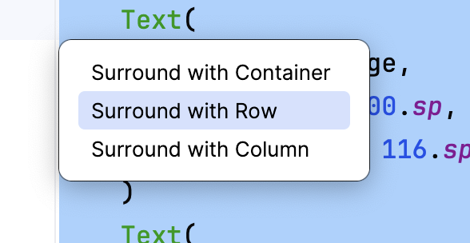
</div>

现在，该函数应如下面的代码段所示：

```kotlin
@Composable
fun GreetingText(message: String, from: String, modifier: Modifier = Modifier) {
    Row {
        Text(
            text = message,
            fontSize = 100.sp,
            lineHeight = 116.sp,
        )
        Text(
            text = from,
            fontSize = 36.sp
        )
    }
}
```

Android Studio 会自动为您导入 `Row` 函数。滚动到顶部，然后观察"import"部分。`import androidx.compose.foundation.layout.Row` 应该已添加。

在 Design 窗格中观察更新后的预览。暂时将生日祝福语的字体大小更改为 `30.sp`。

<div align="center">
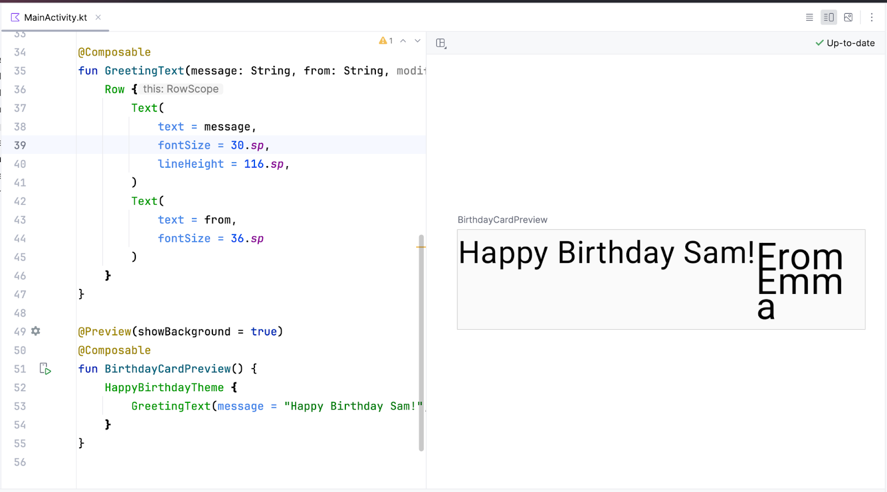
</div>

现在，因为元素不再重叠，预览的效果大为改善。不过，这仍然不是您想要的效果，因为没有充足的空间显示签名。在下一个任务中，您要将文本元素排列成一列来解决此问题。

### 将文本元素排列成一列

在此任务中，该由您更改 `GreetingText()` 函数来将文本元素排成一列了。预览应如下面的屏幕截图所示：

<div align="center">
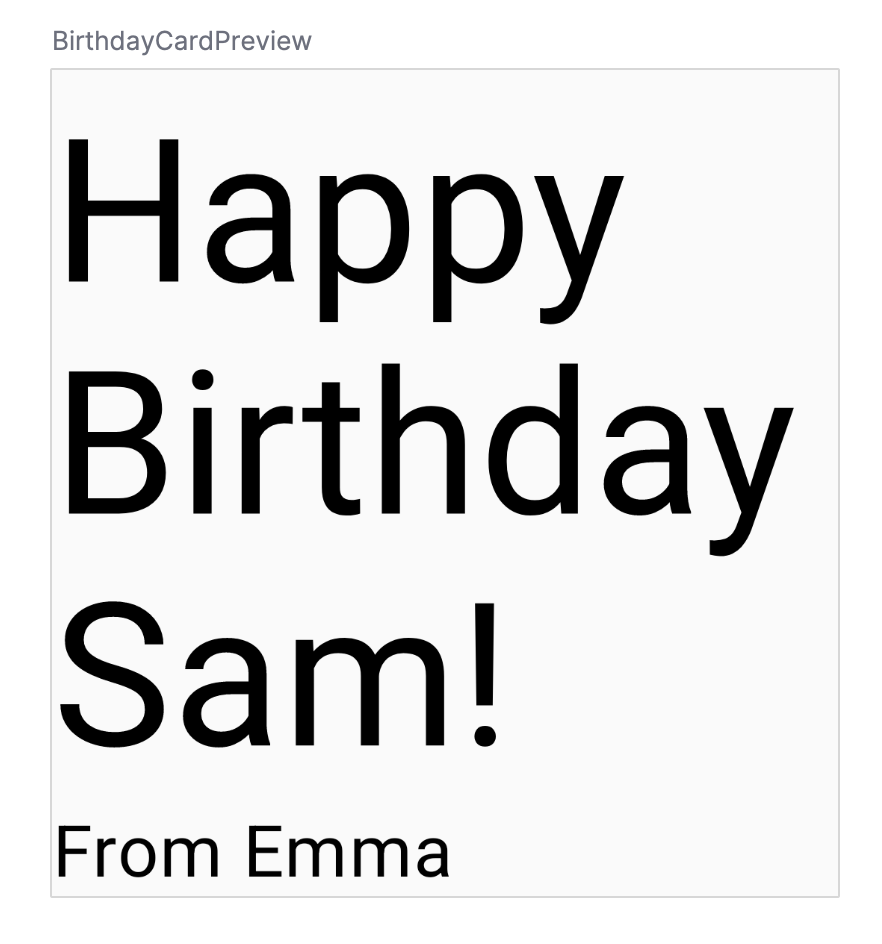
</div>

既然您已尝试自行完成了此任务，那么现在您可以对照以下代码段中的解决方案代码检查您自己的代码：

```kotlin
@Composable
fun GreetingText(message: String, from: String, modifier: Modifier = Modifier) {
    Column {
        Text(
            text = message,
            fontSize = 100.sp,
            lineHeight = 116.sp,
        )
        Text(
            text = from,
            fontSize = 36.sp
        )
    }
}
```

请注意 Android Studio 自动导入的软件包：

```kotlin
import androidx.compose.foundation.layout.Column
```

回想一下，您需要将修饰符形参传递给可组合项中的子元素。这意味着，您需要将修饰符形参传递给 `Column` 可组合项。

```kotlin
@Composable
fun GreetingText(message: String, from: String, modifier: Modifier = Modifier) {
    Column(modifier = modifier) {
        Text(
            text = message,
            fontSize = 100.sp,
            lineHeight = 116.sp,
        )
        Text(
            text = from,
            fontSize = 36.sp
        )
    }
}
```

## 9. 向应用添加问候语

对预览效果感到满意后，即可在设备或模拟器上向应用添加可组合项。

1. 在 `MainActivity.kt` 文件中，滚动到 `onCreate()` 函数。
2. 从 `Surface` 代码块调用 `GreetingText()` 函数。
3. 传递 `GreetingText()` 函数、您的生日祝福和签名。

完成后的 `onCreate()` 函数应该会如同下面的代码段所示：

```kotlin
class MainActivity : ComponentActivity() {
    override fun onCreate(savedInstanceState: Bundle?) {
        super.onCreate(savedInstanceState)
        setContent {
            HappyBirthdayTheme {
                // A surface container using the 'background' color from the theme
                Surface(
                    modifier = Modifier.fillMaxSize(),
                    color = MaterialTheme.colorScheme.background
                ) {
                    GreetingText(message = "Happy Birthday Sam!", from = "From Emma")
                }
            }
        }
    }
}
```

在模拟器中构建并运行您的应用。

<div align="center">
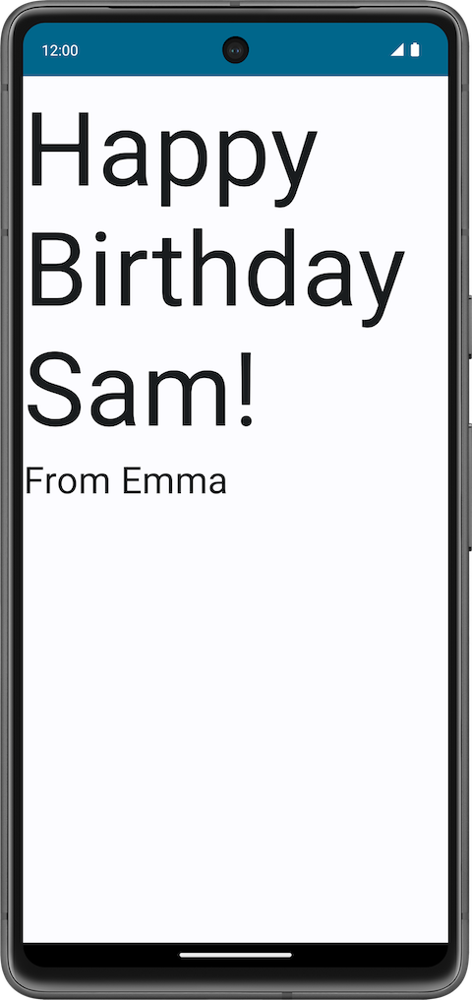
</div>

### 将问候语居中对齐

如需在屏幕中心对齐问候语，请添加一个名为 `verticalArrangement` 的形参，并将其设置为 `Arrangement.Center`。在后续 Codelab 中，您将详细了解 `verticalArrangement`。

```kotlin
@Composable
fun GreetingText(message: String, from: String, modifier: Modifier = Modifier) {
    Column(
        verticalArrangement = Arrangement.Center,
        modifier = modifier
    ) {
        // ...
    }
}
```

围绕列添加 `8.dp` 内边距。最好以 `4.dp` 为增量使用内边距值。

```kotlin
@Composable
fun GreetingText(message: String, from: String, modifier: Modifier = Modifier) {
    Column(
        verticalArrangement = Arrangement.Center,
        modifier = modifier.padding(8.dp)
    ) {
        // ...
    }
}
```

如需进一步美化应用，请使用 `textAlign` 将问候语文本居中对齐。

```kotlin
Text(
    text = message,
    fontSize = 100.sp,
    lineHeight = 116.sp,
    textAlign = TextAlign.Center
)
```

<div align="center">
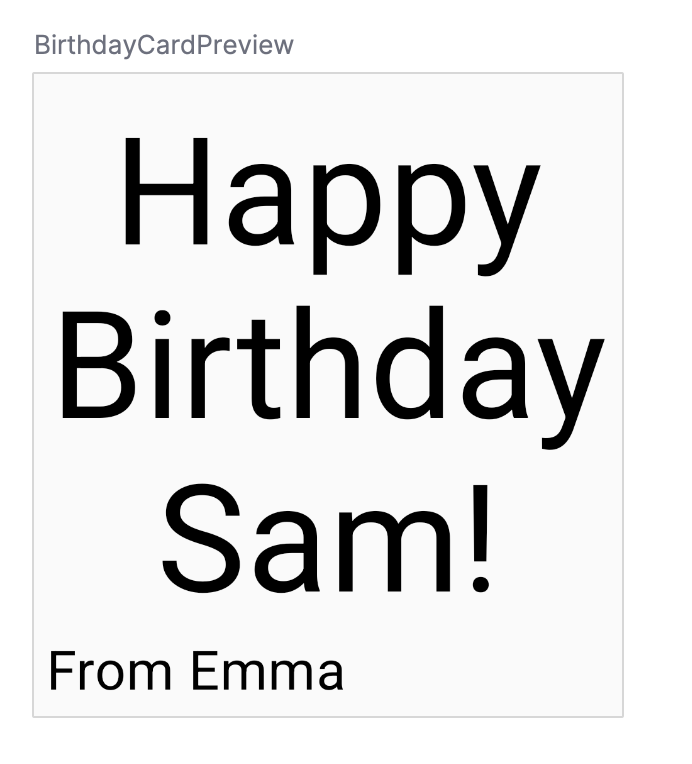
</div>

在上面的屏幕截图中，由于使用了 `textAlign` 形参，因此只有问候语居中对齐。签名 `From Emma` 采用默认的对齐方式。

为签名添加内边距，并使其右对齐。

```kotlin
Text(
    text = from,
    fontSize = 36.sp,
    modifier = Modifier
        .padding(16.dp)
        .align(alignment = Alignment.End)
)
```

<div align="center">
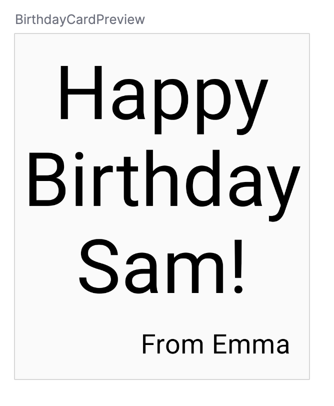
</div>

### 采用最佳实践

最好从父级可组合项传递修饰符属性和修饰符。更新 `GreetingText()` 中的修饰符形参，如下所示：

`onCreate()`：

```kotlin
Surface(
    //...
) {
    GreetingText(
        message = "Happy Birthday Sam!",
        from = "From Emma",
        modifier = Modifier.padding(8.dp)
    )
}
```

`GreetingText()`：

```kotlin
@Composable
fun GreetingText(message: String, from: String, modifier: Modifier = Modifier) {
    Column(
        verticalArrangement = Arrangement.Center,
        modifier = modifier
    ) {
        // ...
    }
}
```

在模拟器上构建并运行应用以查看最终结果。

<div align="center">

</div>

## 10. 获取解决方案代码

完成后的 `MainActivity.kt`：

```kotlin
package com.example.happybirthday

import android.os.Bundle
import androidx.activity.ComponentActivity
import androidx.activity.compose.setContent
import androidx.compose.foundation.layout.Arrangement
import androidx.compose.foundation.layout.Column
import androidx.compose.foundation.layout.fillMaxSize
import androidx.compose.foundation.layout.padding
import androidx.compose.material3.MaterialTheme
import androidx.compose.material3.Surface
import androidx.compose.material3.Text
import androidx.compose.runtime.Composable
import androidx.compose.ui.Alignment
import androidx.compose.ui.Modifier
import androidx.compose.ui.text.style.TextAlign
import androidx.compose.ui.tooling.preview.Preview
import androidx.compose.ui.unit.dp
import androidx.compose.ui.unit.sp
import com.example.happybirthday.ui.theme.HappyBirthdayTheme

class MainActivity : ComponentActivity() {
    override fun onCreate(savedInstanceState: Bundle?) {
        super.onCreate(savedInstanceState)
        setContent {
            HappyBirthdayTheme {
                // A surface container using the 'background' color from the theme
                Surface(
                    modifier = Modifier.fillMaxSize(),
                    color = MaterialTheme.colorScheme.background
                ) {
                    GreetingText(
                        message = "Happy Birthday Sam!",
                        from = "From Emma",
                        modifier = Modifier.padding(8.dp)
                    )
                }
            }
        }
    }
}

@Composable
fun GreetingText(message: String, from: String, modifier: Modifier = Modifier) {
    Column(
        verticalArrangement = Arrangement.Center,
        modifier = modifier
    ) {
        Text(
            text = message,
            fontSize = 100.sp,
            lineHeight = 116.sp,
            textAlign = TextAlign.Center
        )
        Text(
            text = from,
            fontSize = 36.sp,
            modifier = Modifier
                .padding(16.dp)
                .align(alignment = Alignment.End)
        )
    }
}

@Preview(showBackground = true)
@Composable
fun BirthdayCardPreview() {
    HappyBirthdayTheme {
        GreetingText(message = "Happy Birthday Sam!", from = "From Emma")
    }
}
```

## 11. 总结

您已成功创建 Happy Birthday 应用。

在下一个 Codelab 中，您将向应用中添加一张图片，并更改文本元素的对齐方式来进行美化。

### 摘要

- Jetpack Compose 是用于构建 Android 界面的新款工具包。它使用更少的代码、强大的工具和直观的 Kotlin API，可以帮助您简化并加快 Android 界面开发。
- 应用的界面 (UI) 就是您在屏幕上所看到的内容，包括文本、图片、按钮和许多其他类型的元素。
- 可组合函数是 Compose 的基本构建块。可组合函数是用于描述界面中某一部分的函数。
- 可组合函数带有 `@Composable` 注解；此注解可告知 Compose 编译器：此函数用于将数据转换为界面。
- Compose 中的三个基本标准布局元素是 `Column`、`Row` 和 `Box`。它们是接受可组合内容的可组合函数，因此您可以在其中放置项目。例如，`Row` 中的各个子项将彼此相邻地水平放置。

### 了解更多内容

- [可组合项](https://developer.android.com/jetpack/compose/layouts?hl=zh-cn)
- [Compose 布局基础知识](https://developer.android.com/jetpack/compose/layouts/basics?hl=zh-cn)
- [像素密度](https://developer.android.com/training/multiscreen/screendensities?hl=zh-cn)
- [Compose 中的文字](https://developer.android.com/jetpack/compose/text?hl=zh-cn)
- [Kotlin 对 Jetpack Compose 的支持](https://developer.android.com/jetpack/compose/kotlin?hl=zh-cn)
