# 向 Android 应用添加图片

## 1. 使用前须知

在此 Codelab 中，您将学习如何使用 Image 可组合项为应用添加图片。

### 前提条件

- 了解有关如何在 Android Studio 中创建和运行应用的基础知识。
- 了解有关如何添加界面元素（如文本可组合项）的基础知识。

### 学习内容

- 如何为您的 Android 应用添加图片或照片。
- 如何使用 Image 可组合项在应用中显示图片。
- 使用 String 资源的最佳实践。

### 构建内容

改进 Happy Birthday 应用，在其中添加图片。

### 所需条件

- 一台安装了 Android Studio 的计算机。
- 构建包含 Text 可组合项的简单应用 Codelab 中的应用。

## 2. 设置应用

在 Android Studio 中打开上一个 Codelab 中的 Happy Birthday 项目。

运行该应用后，显示的界面将如以下屏幕截图所示。

<div align="center">
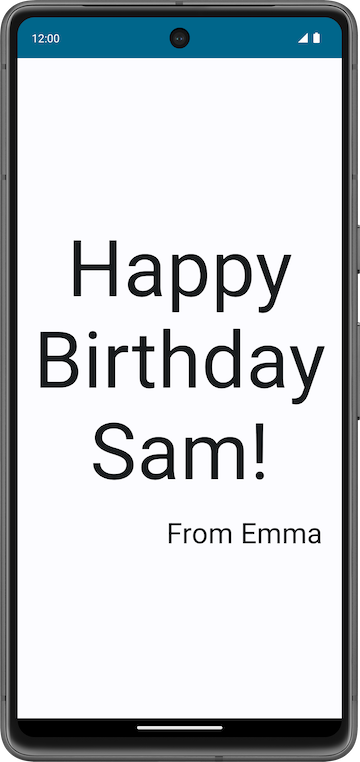
</div>

### 为项目添加图片

在此任务中，您将从互联网上下载一张图片，然后将其添加到您的 Happy Birthday 应用中。

1. 点击[此链接](https://developer.android.com/static/codelabs/basic-android-kotlin-compose-add-images/img/androidparty.png)，打开要在 Happy Birthday 应用中使用的图片。
2. 点击下载。

<div align="center">
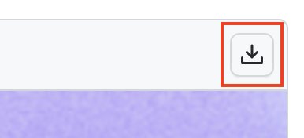
</div>

3. 右键点击该图片，然后在计算机中将该文件另存为 **androidparty.png**。
4. 记下图片的保存位置。

例如，您可能已将其保存在下载文件夹中。

5. 在 Android Studio 中，依次点击 **View > Tool Windows > Resource Manager**，或点击 Project 窗口旁边的 **Resource Manager** 标签页。

<div align="center">
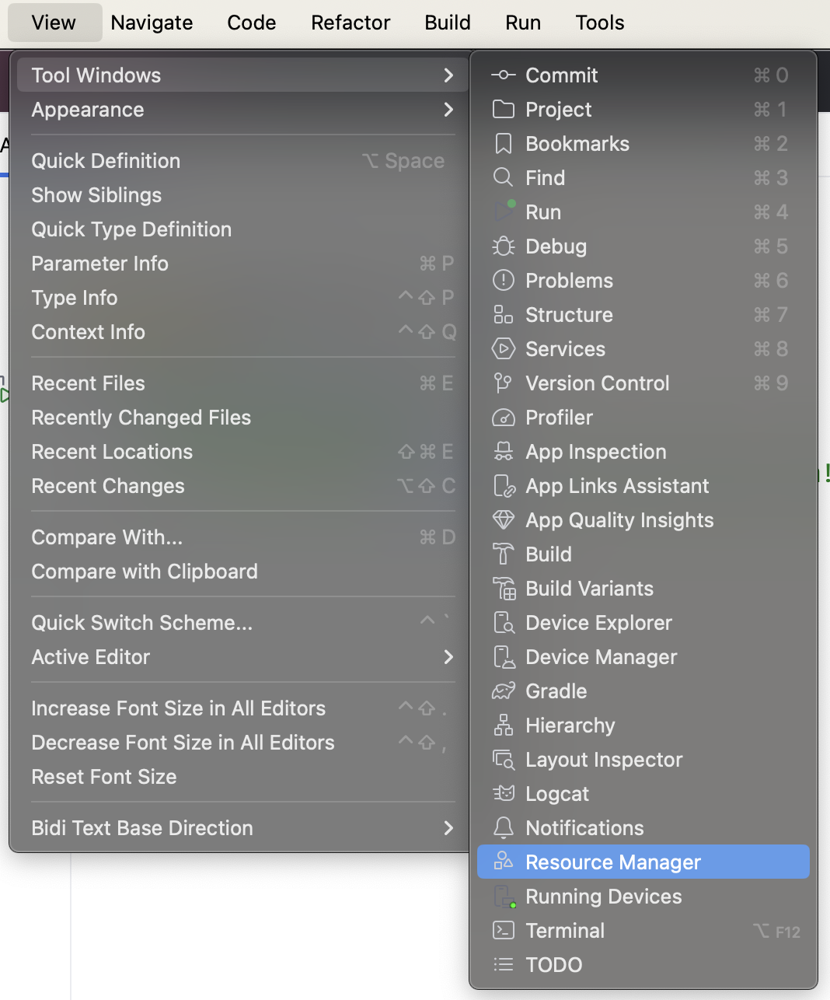
</div>

<div align="center">
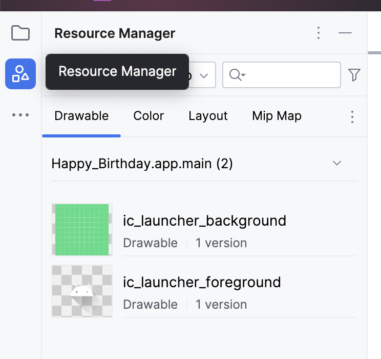
</div>

> **注意**：Resource Manager 是一个工具窗口，可供您在应用中导入、创建、管理和使用资源。

6. 依次点击 **+ (Add resources to the module) > Import Drawables**。

<div align="center">
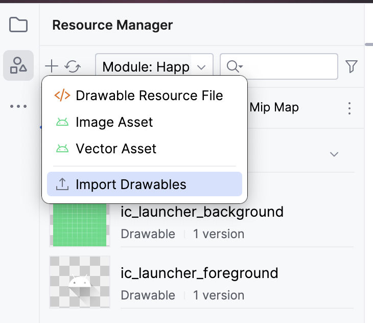
</div>

7. 在文件浏览器中，选择已下载的图片文件，然后点击 **Open**。

此操作会打开 Import drawables 对话框。

<div align="center">
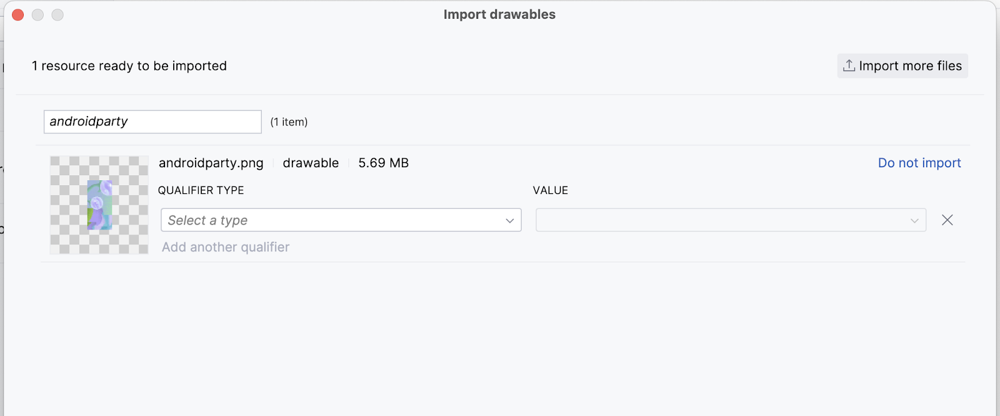
</div>

8. Android Studio 会向您显示该图片的预览。从 **QUALIFIER TYPE** 下拉列表中选择 **Density**。后面会介绍为何要执行此操作。

<div align="center">

</div>

9. 从 **VALUE** 列表中选择 **No Density**。

<div align="center">

</div>

Android 设备具有不同的屏幕尺寸（手机、平板电脑和电视等），而且这些屏幕也具有不同的像素尺寸。也就是说，有可能一部设备的屏幕为每平方英寸 160 个像素，而另一部设备的屏幕在相同的空间内可以容纳 480 个像素。如果不考虑像素密度的这些变化，系统可能会按比例缩放图片，这可能会导致图片模糊或占用大量内存空间，或者图片大小不当。

如果所调整的图片超出了 Android 系统可处理的图片大小，系统会抛出内存不足错误。对于照片和背景图片（如当前图片 androidparty.png），应将其放在 **drawable-nodpi** 文件夹中，这样会停止调整大小行为。

如需详细了解像素密度，请参阅[支持不同的像素密度](https://developer.android.com/training/multiscreen/screendensities?hl=zh-cn)。

10. 点击**下一步**。
11. Android Studio 会显示将在其中放置图片的文件夹结构。请注意 **drawable-nodpi** 文件夹。
12. 点击 **Import(C)**。

<div align="center">

</div>

Android Studio 会创建一个 **drawable-nodpi** 文件夹，并将您的图片放在其中。在 Android Studio 的"Project"视图中，资源名称会显示为 **androidparty.png (nodpi)**。在计算机文件系统中，Android Studio 会创建一个名为 **drawable-nodpi** 的文件夹。

<div align="center">
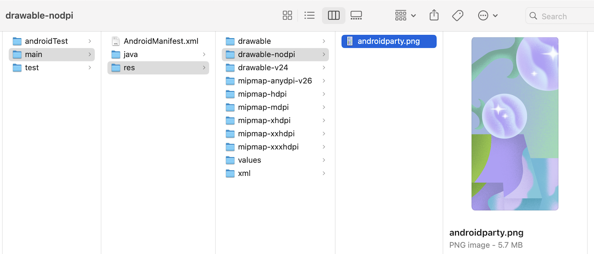
</div>

如果图片导入成功，Android Studio 就会将此图片添加到 **Drawable** 标签页下的列表中。此列表包含该应用的所有图片和图标。现在，您就可以在应用中使用这张图片了。

<div align="center">
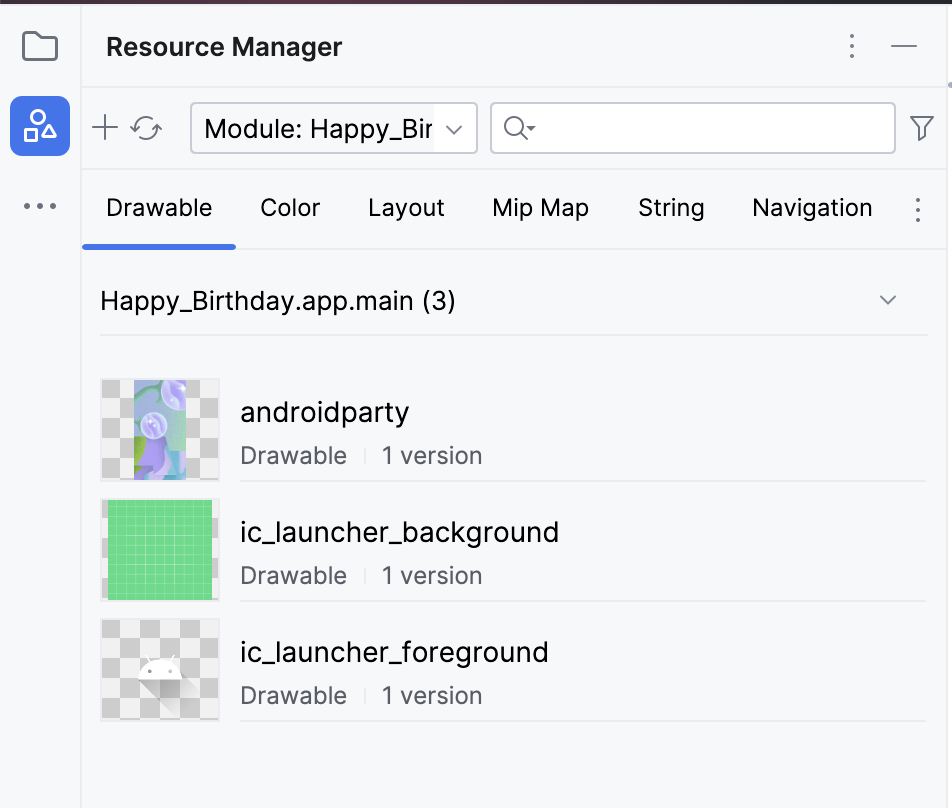
</div>

13. 依次点击 **View > Tool Windows > Project**，或点击最左侧的 **Project** 标签页，切换回"Project"视图。
14. 依次点击 **app > res > drawable**，确认图片位于 **drawable** 文件夹中。

<div align="center">
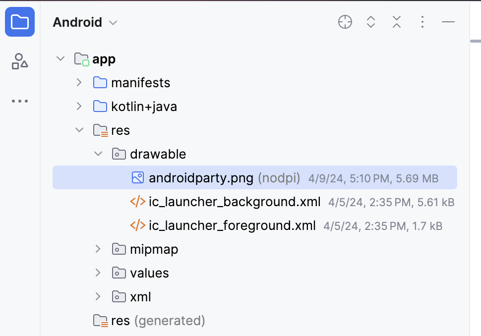
</div>

## 3. 添加 Image 可组合项

若要在应用中显示图片，需要有一个显示位置。就像使用 `Text` 可组合项显示文本一样，可以使用 `Image` 可组合项来显示图片。

在此任务中，您将为应用添加一个 `Image` 可组合项，并将其图片设为您下载的图片，然后调整图片的位置和大小，使其填满整个屏幕。

### 通过添加可组合函数来添加图片

1. 在 `MainActivity.kt` 文件中，在 `GreetingText()` 函数后面添加一个 `GreetingImage()` 可组合函数。
2. 向 `GreetingImage()` 函数传递两个 `String` 形参：一个名为 `message`，用于添加生日祝福语，另一个名为 `from`，用于添加签名。

```kotlin
@Composable
fun GreetingImage(message: String, from: String) {}
```

3. 每个可组合函数都应接受一个可选的 `Modifier` 形参。修饰符用于控制界面元素在其父布局中的放置、显示或行为方式。在 `GreetingImage()` 可组合函数中添加另一个形参。

```kotlin
@Composable
fun GreetingImage(message: String, from: String, modifier: Modifier = Modifier) {}
```

### Jetpack Compose 中的资源

资源是指代码使用的附加文件和静态内容，例如位图、界面字符串、动画说明等。如需详细了解 Android 中的资源，请参阅[应用资源概览](https://developer.android.com/guide/topics/resources/providing-resources?hl=zh-cn)。

您应该始终将应用资源（如图片和字符串）与代码分隔开，以便能够独立地维护这些资源。在运行时，Android 会根据当前配置使用合适的资源。例如，您可能想根据屏幕尺寸提供不同的界面布局，或根据语言设置提供不同的字符串。

#### 将资源分组

您应始终将每种类型的资源放在项目的 `res/` 目录下的相应子目录中。例如，以下是一个简单项目的文件层次结构：

```
MyProject/
    src/
        MyActivity.kt
    res/
        drawable/
            graphic.png
        mipmap/
            icon.png
        values/
            strings.xml
```

在此示例中，`res/` 目录中包含存储在不同子目录中的所有资源，其中包括存储图片资源的 `drawable/` 目录、存储启动器图标的 `mipmap/` 目录和存储字符串资源的 `values/` 目录。如需详细了解应用资源的用法、格式和语法，请参阅[资源类型概览](https://developer.android.com/guide/topics/resources/available-resources?hl=zh-cn)。

#### 访问资源

Jetpack Compose 可以访问您的 Android 项目中定义的资源。可以使用在项目的 `R` 类中生成的资源 ID 访问资源。

`R` 类是 Android 自动生成的类，其中包含了项目中所有资源的 ID。在大多数情况下，资源 ID 与文件名相同。例如，可以使用以下代码访问上面的文件层次结构中的图片：

```kotlin
R.drawable.graphic
```

<div align="center">
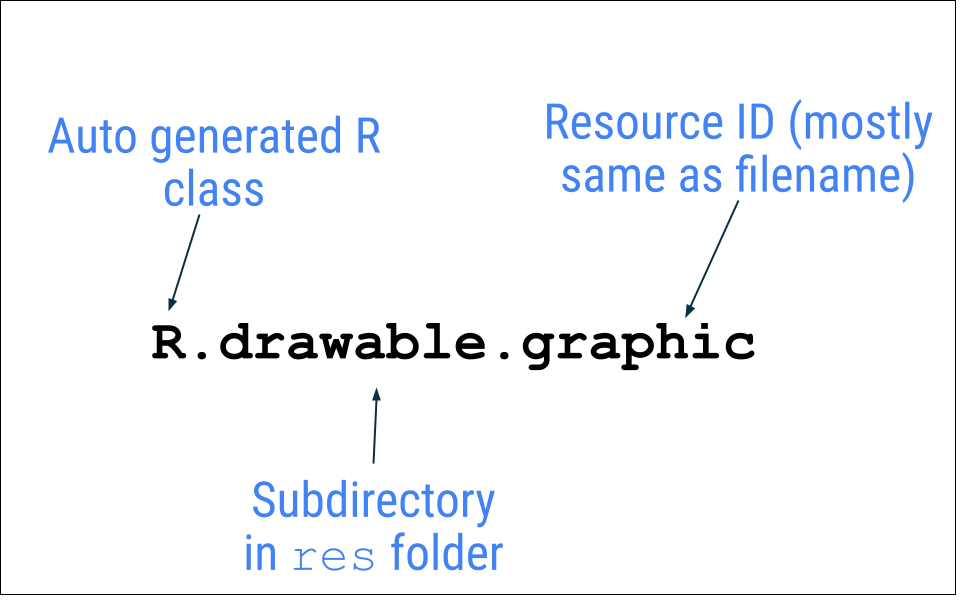
</div>

在下一个任务中，您将使用在上一个任务中添加的图片（`androidparty.png` 文件）。

4. 在 `GreetingImage()` 函数中，声明 `val` 属性并将其命名为 `image`。
5. 通过传入 `androidparty` 资源来调用 `painterResource()` 函数。将返回值分配给 `image` 变量。

```kotlin
val image = painterResource(R.drawable.androidparty)
```

Android Studio 突出显示了 `.painterResource` 代码，因为您需要导入该函数来编译应用。

<div align="center">
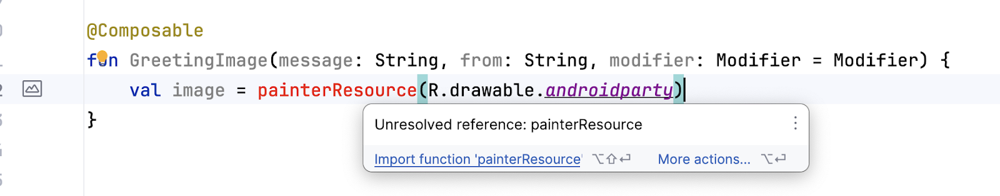
</div>

6. 点击 Android Studio 突出显示的 `.painterResource`。
7. 点击弹出式窗口中的 **Import**，为 `androidx.compose.ui.res.painterResource` 添加 import 语句。

`painterResource()` 函数会加载可绘制图片资源，并将资源 ID（在本例中为 `R.drawable.androidparty`）作为实参。

8. 调用 `painterResource()` 函数后，添加 `Image` 可组合函数，然后传入 `image` 作为 `painter` 的具名实参。

```kotlin
Image(
    painter = image
)
```

Android Studio 突出显示了 `Image` 代码，因为您需要导入该函数来编译应用。

<div align="center">
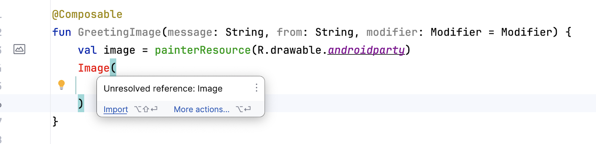
</div>

若要修正此警告，请在 `MainActivity.kt` 文件的顶部添加以下 import 语句：

```kotlin
import androidx.compose.foundation.Image
```

初始警告现已解决，但如果您将鼠标指针悬停在 `Image` 一词上，Android Studio 会显示一条新警告，表明"None of the following functions can be called with the arguments supplied"。这是因为提供的实参与任何 `Image` 函数签名都不匹配。

<div align="center">
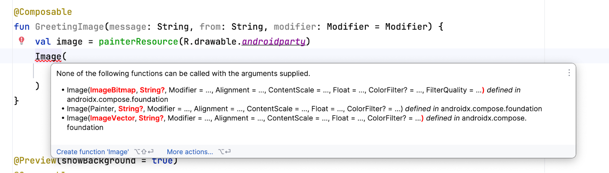
</div>

此警告将在下一部分中修正。

### 检查应用是否支持无障碍功能

如果您遵循无障碍方面的编码实践时，就可以让所有用户（包括残障人士）更轻松地在您的应用中进行导航并与之互动。

> **注意**：Android 为用户提供了许多工具。例如，**TalkBack** 是 Android 设备随附的 Google 屏幕阅读器。TalkBack 可为用户提供语音反馈，这样用户无需查看屏幕即可使用设备。如需详细了解无障碍功能，请参阅[打造无障碍应用](https://developer.android.com/guide/topics/ui/accessibility?hl=zh-cn)。

Android Studio 会提供相应的提示和警告，以便使您的应用更方便更多人使用。内容说明定义了界面元素的用途，可让您的应用更易于通过 TalkBack 进行使用。

不过，在此应用中添加图片只是为了进行装饰。就本例而言，在图片中添加内容说明会使应用更难以通过 TalkBack 进行使用。您可以不设置面向用户的内容说明，而将图片的 `contentDescription` 实参设为 `null`，以便 TalkBack 跳过 `Image` 可组合函数。

9. 在 `Image` 可组合函数中，添加另一个名为 `contentDescription` 的实参，并将其值设为 `null`。

```kotlin
Image(
    painter = image,
    contentDescription = null
)
```

### 预览 Image 可组合函数

在此任务中，您将预览 image 可组合函数，然后在模拟器或设备上运行应用。

1. 在 `BirthdayCardPreview()` 函数中，将 `GreetingText()` 函数调用替换为 `GreetingImage()` 函数。

您的函数应如以下代码段所示：

```kotlin
@Preview(showBackground = true)
@Composable
fun BirthdayCardPreview() {
    HappyBirthdayTheme {
        GreetingImage(
            message = "Happy Birthday Sam!",
            from = "From Emma"
        )
    }
}
```

2. Design 窗格应该会自动更新；如果没有更新，请点击  进行构建。

请注意，界面上不会再显示此文本，因为新函数只有 `Image` 可组合项，没有 `Text` 可组合项。

<div align="center">
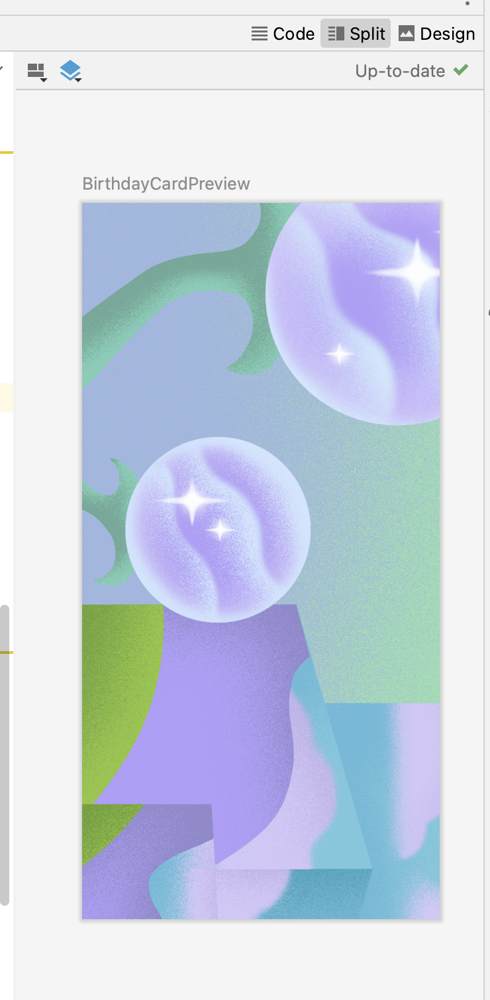
</div>

## 4. 添加盒子布局

Compose 中的 3 个基本标准布局元素是 `Column`、`Row` 和 `Box` 可组合函数。在之前的 Codelab 中，您已了解了 `Column` 和 `Row` 可组合函数，现在您将深入了解 `Box` 可组合函数。

`Box` 布局是 Compose 中的标准布局元素之一。使用 `Box` 布局可将元素堆叠在一起。`Box` 布局还可用于配置它所包含的元素的特定对齐方式。

<div align="center">
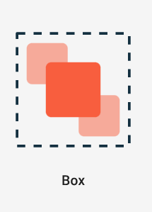
</div>

1. 在 `GreetingImage()` 函数中，添加围绕 `Image` 可组合项的 `Box` 可组合项，如下所示：

```kotlin
@Composable
fun GreetingImage(message: String, from: String, modifier: Modifier = Modifier) {
    val image = painterResource(R.drawable.androidparty)
    Box {
        Image(
            painter = image,
            contentDescription = null
        )
    }
}
```

当 Android Studio 提示时，导入 `androidx.compose.foundation.layout.Box` 函数。

2. 添加代码，以将 `modifier` 形参传递给 `Box` 可组合项。

```kotlin
@Composable
fun GreetingImage(message: String, from: String, modifier: Modifier = Modifier) {
    val image = painterResource(R.drawable.androidparty)
    Box(modifier) {
        Image(
            painter = image,
            contentDescription = null
        )
    }
}
```

3. 在 `Box` 可组合函数的末尾，调用 `GreetingText()` 函数，并将生日祝福语、签名和修饰符传递给该函数，如下所示：

```kotlin
@Composable
fun GreetingImage(message: String, from: String, modifier: Modifier = Modifier) {
    val image = painterResource(R.drawable.androidparty)
    Box(modifier) {
        Image(
            painter = image,
            contentDescription = null
        )
        GreetingText(
            message = message,
            from = from,
            modifier = Modifier
                .fillMaxSize()
                .padding(8.dp)
        )
    }
}
```

请注意 Design 窗格中更新后的预览。

您应该会看到文本和图片。

<div align="center">
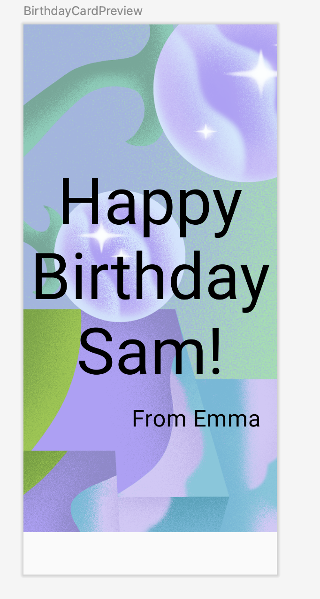
</div>

4. 如需在模拟器或设备中反映出上述更改，请在 `onCreate()` 函数中将 `GreetingText()` 函数调用替换为 `GreetingImage()` 函数调用。

您的 `setContent` 代码块应类似于以下代码段：

```kotlin
setContent {
    HappyBirthdayTheme {
        // A surface container using the 'background' color from the theme
        Surface(
            modifier = Modifier.fillMaxSize(),
            color = MaterialTheme.colorScheme.background
        ) {
            GreetingImage(
                message = "Happy Birthday Sam!",
                from = "From Emma"
            )
        }
    }
}
```

请注意，该图片与屏幕一样宽，但图片固定在屏幕顶部。屏幕底部有空白区域，不太好看。在下一个任务中，您将填充屏幕的宽度和高度，并缩放图片以填满整个屏幕。

## 5. 更改不透明度并缩放图片

在此任务中，您将让图片全屏显示，使应用看起来更美观。为此，您需要使用 `ContentScale` 形参。

### 缩放内容

您已将图片添加到应用并确定了图片的位置。现在，您需要调整图片的缩放类型，即指定如何调整图片大小，以使其全屏显示。

有多种 `ContentScale` 类型可供选择。使用 `ContentScale.Crop` 形参进行缩放时，系统会均匀缩放图片以保持宽高比不变，进而使图片的宽度和高度等于或大于屏幕的相应尺寸。

1. 为图片添加一个 `ContentScale` 具名实参。

```kotlin
Image(
    painter = image,
    contentDescription = null,
    contentScale = ContentScale.Crop
)
```

当 Android Studio 提示时，导入 `androidx.compose.ui.layout.ContentScale` 接口。

2. 查看 Design 窗格。

现在，图片应该会填满整个预览屏幕，如以下屏幕截图所示：

<div align="center">
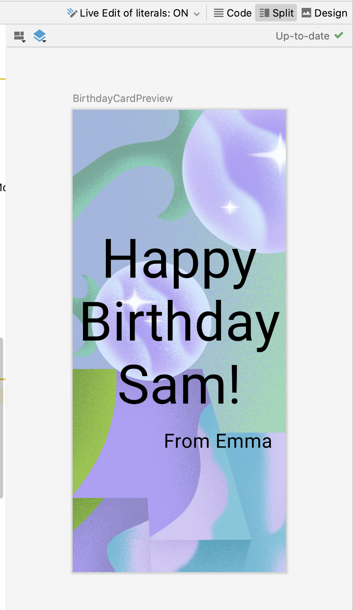
</div>

### 更改不透明度

如需提高应用的对比度，请更改背景图片的不透明度。

向 `Image` 可组合项添加 `alpha` 形参，并将其设置为 `0.5F`。

```kotlin
Image(
    painter = image,
    contentDescription = null,
    contentScale = ContentScale.Crop,
    alpha = 0.5F
)
```

请注意图片不透明度的变化。

<div align="center">
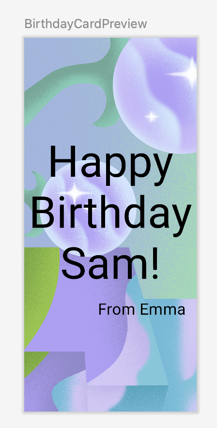
</div>

<div align="center">
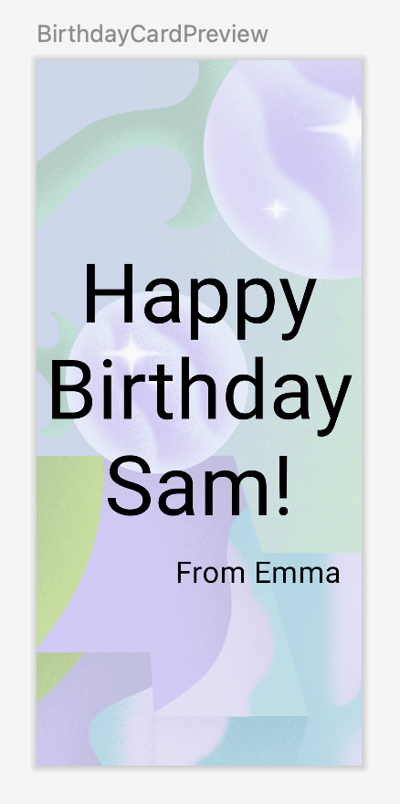
</div>

### 运行应用

编写了这么多代码，现在终于可以预览辛苦工作的成果了。

在设备或模拟器上运行应用。

<div align="center">
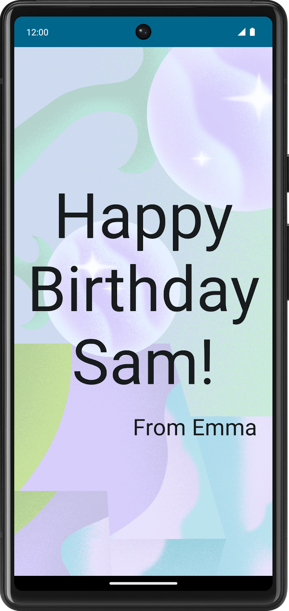
</div>

显示全屏图片和文本消息的界面效果相当不错。此外，您还更改了图片的不透明度。

### 布局修饰符

修饰符用于装饰 Jetpack Compose 界面元素或为其添加行为。例如，您可以为行、文本或按钮添加背景、内边距或行为。若要设置这些效果，可组合项或布局需要接受修饰符作为形参。

在上一个 Codelab 中，您已了解了修饰符，并使用了内边距修饰符 (`Modifier.padding`) 在 `Text` 可组合项的周围添加空间。修饰符有很多用途，您将在本课程以及即将推出的开发者在线课程中看到相关内容。

例如，以下 `Text` 可组合项包含一个用于将背景颜色更改为绿色的 `Modifier` 实参。

```kotlin
// Example
Text(
    text = "Hello, World!",
    // Solid element background color
    modifier = Modifier.background(color = Color.Green)
)
```

与上述示例类似，您可以使用排列方式和对齐方式属性将修饰符添加到布局中，以控制子元素的位置。

如需在 `Row` 中设置子元素的位置，请设置 `horizontalArrangement` 和 `verticalAlignment` 实参。对于 `Column`，请设置 `verticalArrangement` 和 `horizontalAlignment` 实参。

排列方式属性用于在布局大小大于其子元素大小的总和时排列子元素。

例如，当 `Column` 的大小大于其子元素大小的总和时，可以指定 `verticalArrangement` 来定义 `Column` 中的子元素的排列方式。下图显示了不同的垂直排列方式：

<div align="center">
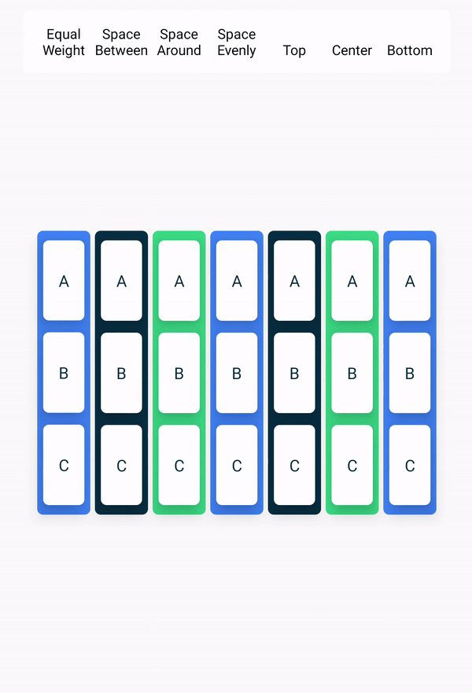
</div>

同样地，当 `Row` 的大小大于其子元素大小的总和时，可以指定 `horizontalArrangement` 来定义 `Row` 中的子元素的排列方式。下图显示了不同的水平排列方式：

<div align="center">
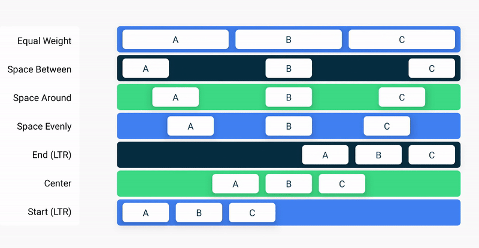
</div>

对齐方式属性用于在布局中按左对齐、居中或右对齐方式对齐子元素。

## 6. 对齐和排列文本

在此任务中，您将观察在上一个 Codelab 中添加用于在应用中排列文本的代码。

在 `MainActivity.kt` 文件中，滚动到 `GreetingText()` 函数。此列中的 `verticalArrangement` 属性设置为 `Arrangement.Center`。因此，文本内容将在屏幕上居中。

```kotlin
@Composable
fun GreetingText(message: String, from: String, modifier: Modifier = Modifier) {
    Column(
        verticalArrangement = Arrangement.Center,
        modifier = modifier
    ) {
        Text(
            text = message,
            fontSize = 100.sp,
            lineHeight = 116.sp,
            textAlign = TextAlign.Center
        )
        Text(
            text = from,
            fontSize = 36.sp,
            modifier = Modifier
                .padding(16.dp)
                .align(alignment = Alignment.End)
        )
    }
}
```

### 内边距

界面元素会用自身包裹住其内容。为避免包裹地过紧，您可以在每一侧指定内边距大小。

<div align="center">
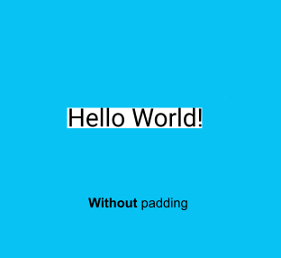
</div>

<div align="center">
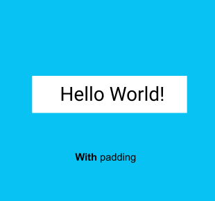
</div>

内边距将作为修饰符使用，这意味着您可以将其应用于任何可组合项。对于可组合项的每一侧，`padding` 修饰符都接受一个可选实参，该实参定义了内边距的大小。

<div align="center">
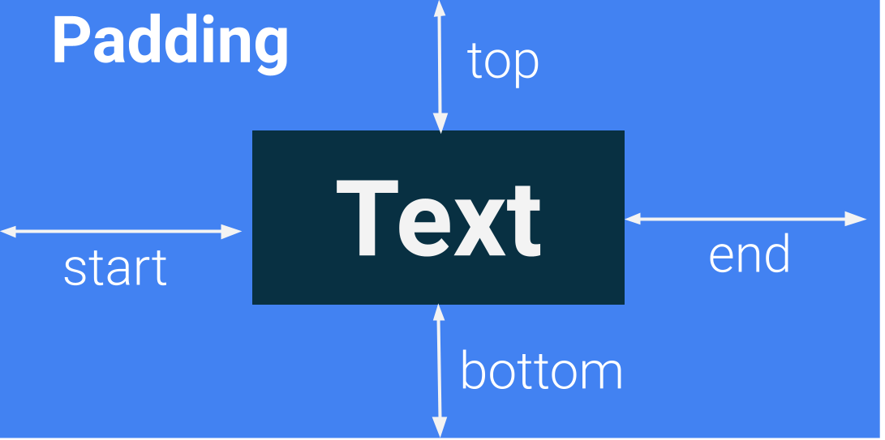
</div>

```kotlin
// This is an example.
Modifier.padding(
    start = 16.dp,
    top = 16.dp,
    end = 16.dp,
    bottom = 16.dp
)
```

轮到你了！在 `MainActivity.kt` 文件中，滚动到 `GreetingText()` 函数被调用的位置并留意内边距属性。

```kotlin
modifier = Modifier
    .fillMaxSize()
    .padding(8.dp)
```

同样，留意 `GreetingText()` 函数内签名 `Text` 可组合函数的内边距。

```kotlin
modifier = Modifier
    .padding(16.dp)
    .align(alignment = Alignment.End)
```

## 7. 遵循良好的编码规范

### 翻译

在编写应用时，请务必注意，应用在某些情况下可能会被翻译成其他语言。正如您在先前的 Codelab 中学到的那样，`String` 数据类型是一连串的字符，例如 `"Happy Birthday Sam!"`。

**硬编码字符串**是直接写在应用代码中的字符串，会使得将应用翻译为其他语言的难度增大，在应用的不同位置重复使用字符串变得更困难。可以通过将字符串提取到资源文件中来解决这类问题。也就是说，您可以不必将字符串硬编码到代码中，而是将字符串放在文件中，并为这些字符串资源命名，然后在想要使用字符串时使用名称进行调用。即使更改了字符串或将其翻译成了其他语言，名称仍将保持不变。

1. 在 `MainActivity.kt` 文件中，滚动到 `onCreate()` 函数。选择生日祝福语，不带引号的 **Happy Birthday Sam!** 字符串。
2. 点击屏幕左侧的灯泡。
3. 选择 **Extract string resource**。

<div align="center">
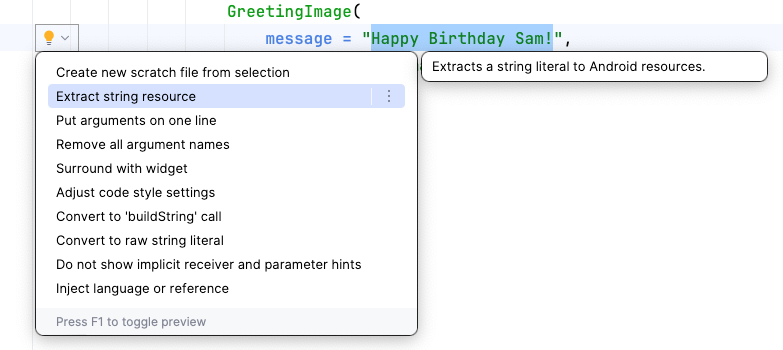
</div>

Android Studio 将打开 Extract Resource 对话框。在此对话框中，您可以自定义字符串资源的名称以及有关如何存储该资源的一些详细信息。**Resource name** 字段用于输入字符串的名称。**Resource value** 字段用于输入字符串的实际内容。

4. 在 Extract Resource 对话框中，将 **Resource name** 更改为 `happy_birthday_text`。

字符串资源应使用小写名称，并且多个单词之间应使用下划线分隔。将其他设置保留为默认值。

<div align="center">
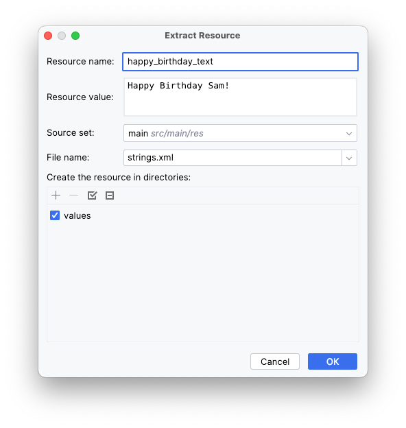
</div>

5. 点击**确定**。

请注意代码的变化。

硬编码字符串现已替换为对 `getString()` 函数的调用。

```kotlin
GreetingImage(
    message = getString(R.string.happy_birthday_text),
    from = "From Emma",
    modifier = Modifier.padding(8.dp)
)
```

> **注意**：某些 Android Studio 版本会将硬编码字符串替换为 `getString()` 函数。在这种情况下，请将函数手动更改为 `stringResource()`。

如果需要，请将 `import androidx.compose.ui.res.stringResource` 添加到"imports"部分。

6. 在 Project 窗格中，从路径 **app > res > values > strings.xml** 打开 `strings.xml` 文件，您会发现 Android Studio 创建了一个名为 `happy_birthday_text` 的字符串资源。

```xml
<resources>
    <string name="app_name">Happy Birthday</string>
    <string name="happy_birthday_text">Happy Birthday Sam!</string>
</resources>
```

`strings.xml` 文件包含用户将在应用中看到的所有字符串。请注意，应用的名称也是一个字符串资源。通过将所有字符串集中放置在一处，您可以更轻松地翻译应用中的所有文本，同时也能更轻松地在应用的不同部分重复使用字符串。

7. 按照相同的步骤提取签名 `Text` 可组合项的文本，但这次请在 **Resource name** 字段中输入 `signature_text`。

完成后的文件应如以下代码段所示：

```xml
<resources>
    <string name="app_name">Happy Birthday</string>
    <string name="happy_birthday_text">Happy Birthday Sam!</string>
    <string name="signature_text">From Emma</string>
</resources>
```

8. 更新 `BirthdayCardPreview()` 以使用 `stringResource()` 和刚才提取的字符串。

```kotlin
@Preview(showBackground = true)
@Composable
fun BirthdayCardPreview() {
    HappyBirthdayTheme {
        GreetingImage(
            message = stringResource(R.string.happy_birthday_text),
            from = stringResource(R.string.signature_text)
        )
    }
}
```

> **注意**：如果当鼠标指针悬停在 `stringResource` 上时，Android Studio 显示"Unresolved reference: stringResource"警告消息，您需要为 `androidx.compose.ui.res.stringResource` 添加 import 语句才能使用 `stringResource()` 函数。

9. 再次运行应用，确认它是否仍可正常运行。

## 8. 尝试新的挑战

您已经出色完成为应用添加图片的任务。下面是一个新的挑战：

排列或对齐签名 `Text` 可组合项，使其与屏幕的中心对齐。

> **提示**：Compose 提供 `align` 修饰符来单独控制子级可组合项的位置，使其不受父布局强制执行的对齐布局规则的约束。将 `.align(alignment = Alignment.CenterHorizontally)` 实参添加到 `Text` 可组合项 `Modifier` 中。

您的应用应如下所示：

<div align="center">
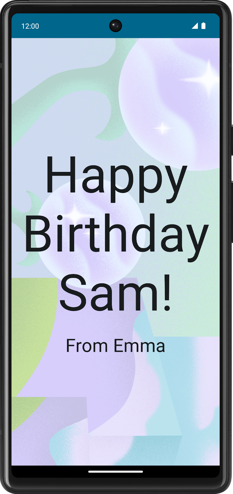
</div>

以下是 `GreetingText()` 函数的解决方案代码，供您参考：

```kotlin
@Composable
fun GreetingText(message: String, from: String, modifier: Modifier = Modifier) {
    Column(
        verticalArrangement = Arrangement.Center,
        modifier = modifier
    ) {
        Text(
            text = message,
            fontSize = 100.sp,
            lineHeight = 116.sp,
            textAlign = TextAlign.Center
        )
        Text(
            text = from,
            fontSize = 36.sp,
            modifier = Modifier
                .padding(16.dp)
                .align(alignment = Alignment.CenterHorizontally)
        )
    }
}
```

## 9. 获取解决方案代码

您可从 GitHub 上获取 Happy Birthday 应用的解决方案代码。

GitHub 服务可让开发者管理自己的软件项目的代码。该服务采用 Git 版本控制系统，可跟踪对每个代码版本所做的更改。如果您见过 Google 文档中某个文档的版本记录，就可以了解该文档的修改记录和修改时间。同理，您也可以跟踪项目中代码的版本记录。当您以个人或团队身份参与项目时，此功能非常有用。

GitHub 还有一个网站，您可以在其中查看和管理自己的项目。您可以通过下面的 GitHub 链接在线浏览 Happy Birthday 项目的文件，也可以将这些文件下载到计算机上。

如需下载完成后的 Codelab 代码，您可以使用以下 Git 命令：

```bash
$ git clone https://github.com/google-developer-training/basic-android-kotlin-compose-birthday-card-app.git
```

或者，您也可以下载 ZIP 文件形式的代码库，将其解压缩并在 Android Studio 中打开。

> **注意**：解决方案代码位于所下载代码库的 `main` 分支中。

如果您想查看解决方案代码，请前往 [GitHub](https://github.com/google-developer-training/basic-android-kotlin-compose-birthday-card-app) 查看。

### GitHub 中的分支

在了解什么是分支之前，请先弄懂什么是"仓库"。仓库可供您在计算机上克隆（复制）整个项目（目录和文件）。分支是仓库的一个版本，换句话说，它是一个独立的开发线。例如，在本课程中，"starter"分支可作为您在学习 Codelab 期间用于构建应用的一个项目版本。"main"或"solution"分支是 Codelab 最后的项目版本，其中包含完整的解决方案代码。

仓库可能包含多个分支，这意味着仓库中有代码的多个版本。

## 10. 总结

您已经完成了以下任务：在 Happy Birthday 应用中添加图片，使用修饰符对文本进行对齐，遵循无障碍功能指南，以及让应用更易于翻译成其他语言！更重要的是，您成功创建了自己的 Happy Birthday 应用！请在社交媒体上分享您的作品，并使用 **#AndroidBasics** 标签，以便我们能够看到它！

### 摘要

- Android Studio 中的 Resource Manager 标签页可帮助您添加和整理图片及其他资源。
- Image 可组合项是用于在应用中显示图片的界面元素。
- Image 可组合项应包含内容说明，以便提高应用的无障碍性。
- 应将向用户显示的文本（例如生日祝福语）提取到字符串资源中，以便让应用更容易翻译成其他语言。

### 了解更多内容

- [使用 Resource Manager 管理应用的界面资源](https://developer.android.com/studio/write/resource-manager?hl=zh-cn)
- [构建无障碍功能更出色的应用](https://developer.android.com/guide/topics/ui/accessibility?hl=zh-cn)
- [支持不同的语言和文化](https://developer.android.com/guide/topics/resources/localization?hl=zh-cn)
- [GitHub 使用入门](https://docs.github.com/cn)
