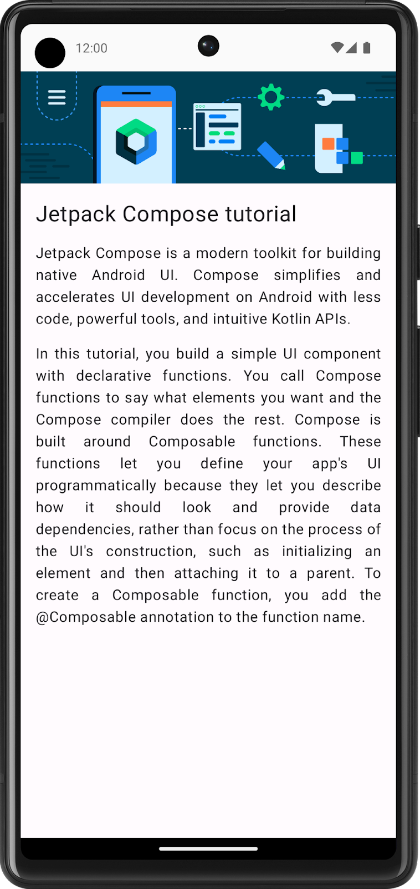
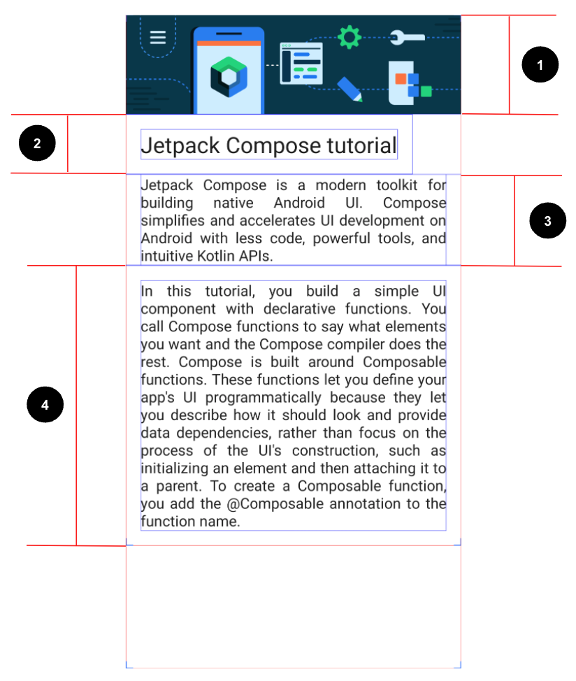
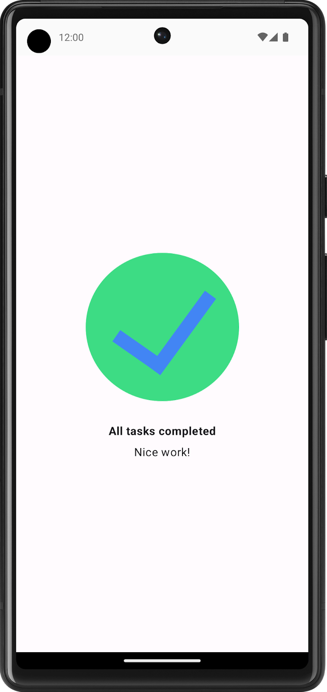
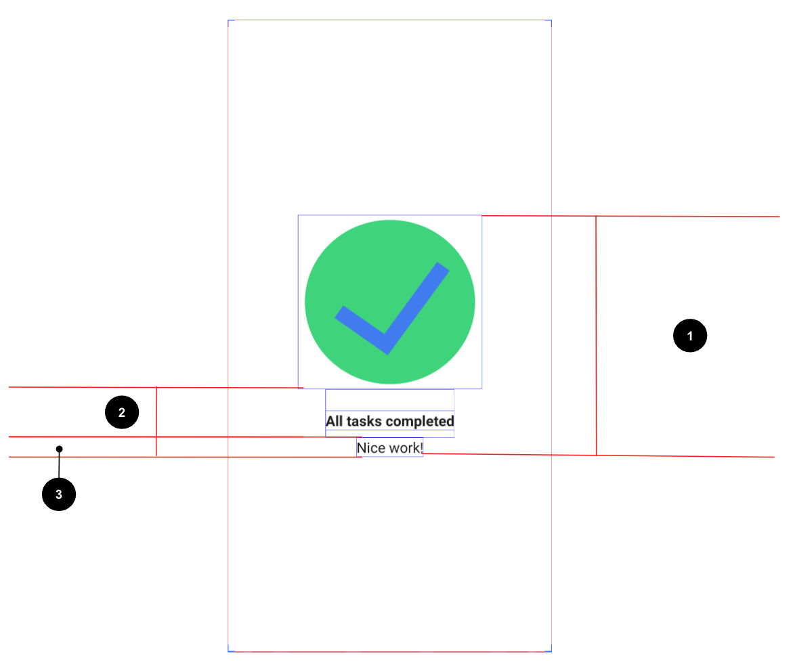
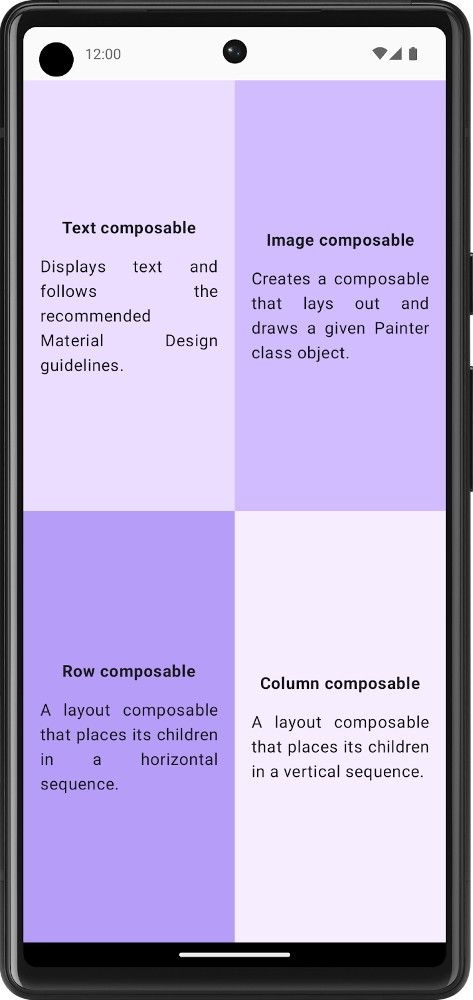
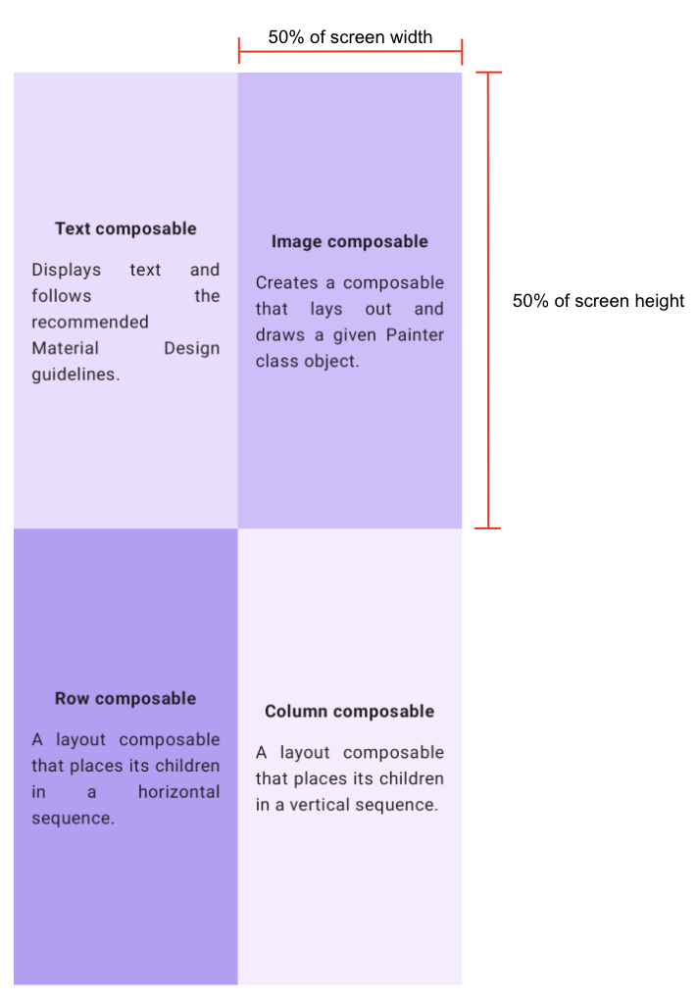
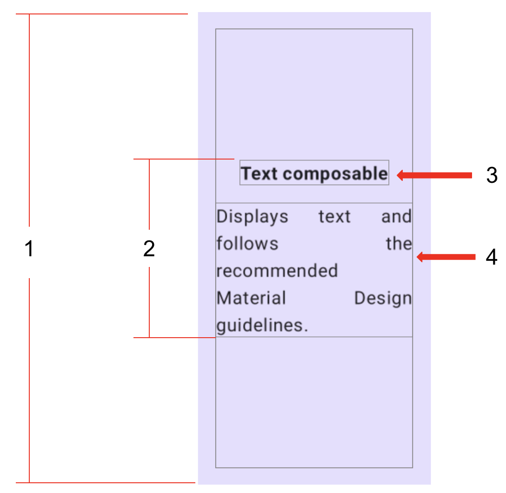

# 练习题：Compose 基础知识

## 1. 准备工作

恭喜！您已经构建了自己的首个应用，并掌握了 Jetpack Compose 的基础知识。现在是时候将所学知识付诸实践了。

这些练习重点讲解如何使用您学过的界面可组合项构建应用。这些练习的灵感来自实际用例，其中有些用例您可能之前就遇到过。

这些练习为您提供了实现代码所需的资源，例如图片和字符串。字符串资源包含界面中显示的文本。您可以将这些字符串添加到 `strings.xml` 文件中，并在代码中使用它们。

此外，这些练习还为您提供了一组规范（例如字体大小），用于在界面组件周围设置文本内容或内边距。这些规范可帮助您构建一致的界面，并且通常可以指导开发者直观呈现和构建屏幕。与组织团队合作时，您可能会遇到类似的规范。

对于某些练习，您可能需要使用 `Modifier`。在这种情况下，请参阅每个问题对应的参考文档部分，您可以在其中找到与修饰符或属性相关的文档的链接。您可以阅读相关文档，并确定如何在应用中运用这些概念。理解文档是一项重要技能，您应该培养这项技能以精进知识。

解决方案代码就在文末，不过建议您先做练习，然后再看答案。不妨将提供的解决方案视为实现应用的方法之一。解决方案代码使用了您目前学到的基本可组合项和概念。这些代码仍有很大的提升空间，因此请放心大胆地尝试其他方法。

您可以按照自己的节奏来解决问题。希望您能尽力而为，认真解决每一个问题。

最后，建议您使用 Android Studio 为这些练习创建单独的项目。

### 前提条件

- 完成"使用文本可组合项构建简单的应用"Codelab。
- 完成"向 Android 应用添加图片"Codelab。
- 安装最新版本的 Android Studio
- 具备 Kotlin 编程语言的基础知识
- 能够在 Android Studio 中使用默认模板创建 Android 项目。
- 了解不同的 Composable 函数，例如 Text、Image、Box、Column 和 Row 函数
- 了解用于界面装饰的 Modifier 类

### 所需条件

- 一台可连接到互联网并安装了 Android Studio 的计算机。

## 2. Compose 文章

Learn Together 应用会显示关于多个 Jetpack 库的文章列表。用户可以选择所需的主题，并了解该主题的最新动态。

在本练习中，您将为应用构建一个屏幕，并在其中显示 Jetpack Compose 教程。在此过程中，您可以使用资源部分中提供的图片和字符串资源。

### 最终屏幕截图

完成实现后，您的设计应与以下屏幕截图一致：

<div align="center">

</div>

### 界面规范

请遵循以下界面规范：

<div align="center">

</div>

- 设置图片，使其占满整个屏幕的宽度。
- 将第一个 Text 可组合项的字体大小设为 24sp，内边距（start、end、bottom 和 top 四个方向）设为 16dp。
- 将第二个 Text 可组合项的字体大小设为默认值，内边距（start 和 end 两个方向）设为 16dp，文本对齐方式设为 Justify。
- 将第三个 Text 可组合项的字体大小设为默认值，内边距（start、end、bottom 和 top 四个方向）设为 16dp，文本对齐方式设为 Justify。

### 资源

您需要将此图片导入项目中，并使用以下字符串：

```
Jetpack Compose tutorial
Jetpack Compose is a modern toolkit for building native Android UI. Compose simplifies and accelerates UI development on Android with less code, powerful tools, and intuitive Kotlin APIs.
In this tutorial, you build a simple UI component with declarative functions. You call Compose functions to say what elements you want and the Compose compiler does the rest. Compose is built around Composable functions. These functions let you define your app's UI programmatically because they let you describe how it should look and provide data dependencies, rather than focus on the process of the UI's construction, such as initializing an element and then attaching it to a parent. To create a Composable function, you add the @Composable annotation to the function name.
```

> **提示**：哪个可组合项与其子项垂直对齐？

### 参考文档

- [TextAlign.Justify 属性](https://developer.android.com/reference/kotlin/androidx/compose/ui/text/style/TextAlign#Justify())

## 3. 任务管理器

借助"任务管理器"应用，用户可以管理自己的日常任务，以及检查他们需要完成的任务。

在本练习中，您将构建一个屏幕，用户在完成给定日期的所有任务时会看到该屏幕。

### 最终屏幕截图

完成实现后，您的设计应与以下屏幕截图一致：

<div align="center">

</div>

### 界面规范

请遵循以下界面规范：

<div align="center">

</div>

- 在屏幕上垂直和水平居中对齐所有内容。
- 将第一个 Text 可组合项的字体粗细设为 Bold，top 方向内边距设为 24dp，bottom 方向内边距设为 8dp。
- 将第二个 Text 可组合项的字体大小设为 16sp。

### 资源

您需要下载此图片然后将其导入项目中，并使用以下字符串：

```
All tasks completed
Nice work!
```

## 4. Compose 象限

在本练习中，您需要运用到目前为止学到的大部分概念，然后更进一步，探索新的 Modifier 和属性。这可能会给您带来额外的挑战，但不必担心！您可以查看参考文档部分来了解此问题，在其中找到这些 Modifier 类和属性的链接，并在实现代码中运用这些类和属性。

您需要构建一个应用，并让该应用显示您学过的 Composable 函数的相关信息。

屏幕划分为四个象限。每个象限都提供 Composable 函数的名称，并用一句话描述它。

### 最终屏幕截图

完成实现后，您的设计应与以下屏幕截图一致：

<div align="center">

</div>

### 界面规范

请遵循以下针对整个屏幕的界面规范：

将整个屏幕分成四个相等部分，每个部分都包含一张 Compose 卡片，并显示 Composable 函数的相关信息。

<div align="center">

</div>

请遵循以下针对每个象限的规范：

<div align="center">

</div>

- 将整个象限（start、end、top 和 bottom 四个方向）的内边距设为 16dp。
- 在每个象限中垂直和水平居中对齐所有内容。
- 将第一个 Text 可组合项设置为粗体，并将其 bottom 内边距设为 16dp。
- 将第二个 Text 可组合项的字体大小设为 Default。

### 资源

您需要用到这些颜色：

```kotlin
Color(0xFFEADDFF)
Color(0xFFD0BCFF)
Color(0xFFB69DF8)
Color(0xFFF6EDFF)
```

以及这些字符串：

```
Text composable
Displays text and follows the recommended Material Design guidelines.
Image composable
Creates a composable that lays out and draws a given Painter class object.
Row composable
A layout composable that places its children in a horizontal sequence.
Column composable
A layout composable that places its children in a vertical sequence.
```

### 参考文档

- [Weight modifier 函数](https://developer.android.com/reference/kotlin/androidx/compose/foundation/layout/ColumnScope#weight())
- [FontWeight.Bold 属性](https://developer.android.com/reference/kotlin/androidx/compose/ui/text/font/FontWeight#Bold())
- [TextAlign.Justify 属性](https://developer.android.com/reference/kotlin/androidx/compose/ui/text/style/TextAlign#Justify())

## 5. 解决方案代码

- [Compose 文章](https://github.com/google-developer-training/basic-android-kotlin-compose-composables-practice-problems/tree/main/ComposeArticle)
- [任务管理器](https://github.com/google-developer-training/basic-android-kotlin-compose-composables-practice-problems/tree/main/TaskManager)
- [Compose 象限](https://github.com/google-developer-training/basic-android-kotlin-compose-composables-practice-problems/tree/main/ComposeQuadrant)
