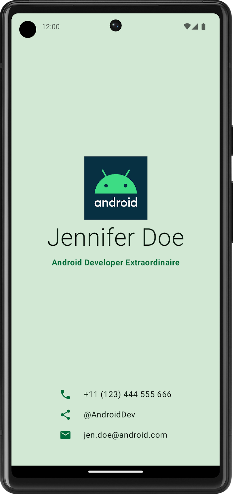
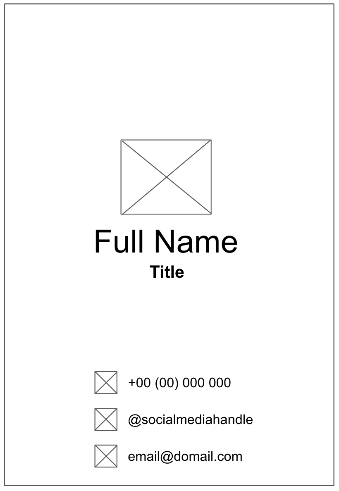
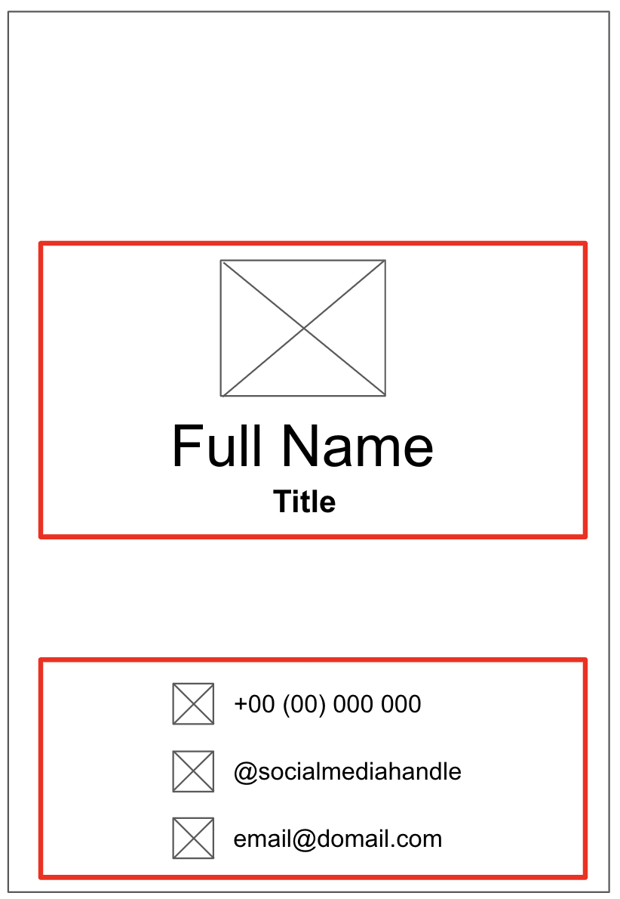
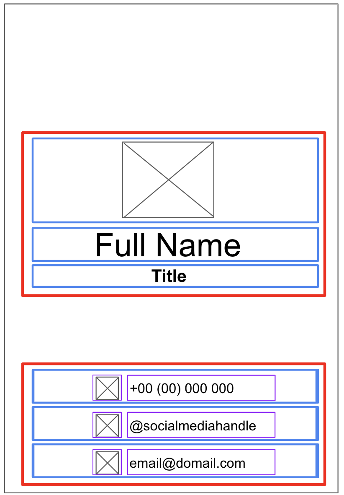

# 项目：创建名片应用

## 1. 使用前须知

您将运用您在本单元学到的知识构建您自己的名片应用。与之前为您提供了分步说明的 Codelab 不同，本 Codelab 仅提供了有关您可以用目前学到的概念构建什么的指南和建议。建议您充分发挥创造力，在有限的指导下独立构建应用。

自行构建应用并非易事，但不用担心，因为您已经有足够多的实践经验！您可以将已经掌握的技能运用到这一新情境中。如果您不确定如何实现应用的特定部分，可以随时参考之前的 Codelab。

如果您自行构建该应用并解决一路上遇到的问题，学习起来就更快，概念在脑海中的留存时间会更长。附带的好处是，这款应用是完全定制的，因此您可以进行个性化设置，并将其展示给亲朋好友！

### 前提条件

- 能够在 Android Studio 中创建和运行项目。
- 有使用可组合函数（包括 Text 和 Image 可组合项）的经验。

### 学习内容

- 如何使用 Row 和 Column 可组合项构建简单布局，并使用 horizontalAlignment 和 verticalArrangement 参数安排布局。
- 如何使用 Modifier 对象自定义 Compose 元素。

### 构建内容

- 一个显示名片的 Android 应用。

### 所需条件

- 一台安装了 Android Studio 的计算机。
- 要在应用中显示的 Android 徽标，此[repo](https://github.com/google-developer-training/basic-android-kotlin-compose-business-card)中为您提供了该徽标。

以下示例展示了此项目结束时可能的应用外观：

<div align="center">

</div>

## 2. 使用可组合项构建界面

### 创建低保真度原型

当您开始某个项目时，直观呈现各个界面元素如何在屏幕上组合在一起很有用。在专业开发工作中，经常会有设计师或设计团队为开发者提供包含确切规范的界面模型或设计。但是，如果您不与设计师合作，则可以自行创建低保真原型。低保真原型是指一个简单的模型或绘图，可让人大致了解应用外观是什么样的。

令人惊讶的是，不与设计师合作的情况很常见，因此，能够草拟简单的界面模型对开发者来说是一项很有用的技能。不用担心，您无需成为专业设计师，甚至不需要知道如何使用设计工具。您只需使用钢笔和纸张、幻灯片或绘图即可构建应用。

如需创建低保真度原型，请执行以下操作：

1. 在您的首选媒介上，添加组成应用的元素。您需要考虑的部分元素包括 Android 徽标、您的姓名、职位和联系信息，以及表示联系信息的图标。例如，电话图标表示电话号码。
2. 将这些元素添加到不同位置，然后用肉眼检查一下。不要指望第一次就做到完美。您可以先敲定一项设计，以后再反复改进。

> **注意**：有一些原则有助于为用户提供更好的设计，而这不在此项目的讨论范围之内。如需了解详情，请参阅[了解布局](https://developer.android.com/courses/android-basics-compose/unit-1?hl=zh-cn)。

您可能会想出一种低保真度设计，如下图所示：

<div align="center">

</div>

### 将设计转换为代码

如需借助原型来将您的设计转换为代码，请执行以下操作：

1. 识别应用的不同逻辑部分，并在其周围绘制边界。此步骤可帮助您将屏幕划分为小可组合项，并思考可组合项的层次结构。

在此示例中，您可以将屏幕划分为两个部分：

- 徽标、姓名和职位
- 联系信息

每个部分都可以转换为一个可组合项。通过这种方式，您可以使用可组合的小型构建块构建界面。您可以使用布局可组合项（例如 Row 或 Column 可组合项）排列各个部分。

<div align="center">

</div>

2. 对于包含多个界面元素的各个应用部分，请在这些元素周围绘制边界。这些边界有助于您了解相应部分中不同元素之间的关联。

<div align="center">

</div>

现在，您可以轻松了解如何使用布局可组合项排列 Text、Image、Icon 和其他可组合项。

关于您可能使用的各种可组合项的一些说明：

**Row 或 Column 可组合项**

在 Row 和 Column 可组合项中尝试使用各种 horizontalArrangement 和 verticalAlignment 参数，使其与您拥有的设计相吻合。

**Image 可组合项**

别忘了填写 contentDescription 参数。如前一个 Codelab 中所述，TalkBack 使用 contentDescription 参数来支持应用的无障碍功能。如果 Image 可组合项仅用于装饰目的，或者存在描述 Image 可组合项的 Text 元素，您可以将 contentDescription 参数设置为 null。您还可以通过在 modifier 参数中指定 height 和 width 修饰符来自定义图片的大小。

**Icon 可组合项**

您可以使用 Icon 可组合项添加 Material Design 提供的图标。您可以更改 Tint 参数来调整图标颜色，以契合您的名片风格。与 Image 可组合项类似，别忘了填写 contentDescription 参数。

**Text 可组合项**

您可以尝试使用 fontSize、textAlign、color 和 fontWeight 参数的各个值来设置文本样式。

**间距和对齐**

您可以使用 Modifier 参数（例如 padding 和 weight 修饰符）来帮助排列可组合项。

您还可以使用 Spacer 可组合项进一步明确间距。

**颜色自定义**

您可以将自定义颜色与 Color 类和颜色十六进制代码（以十六进制形式表示采用 RGB 格式的颜色）结合使用。例如，Android 的绿色用 #3DDC84 这个十六进制代码表示。您可以使用以下代码将文本设为同一绿色：

```kotlin
Text("Example", color = Color(0xFF3ddc84))
```

3. 在模拟器中或在 Android 设备上运行应用，确保它可以编译。

## 3. 祝您好运！

希望您能从本指南中获得启发，从而使用 Compose 创建自己的名片！您可以使用自己的徽标甚至自己的照片进一步自定义您的应用！完成后，向亲朋好友展示您的作品。如果您想在社交媒体上分享您的作品，请使用 **#AndroidBasics** 标签。
