# 在 Kotlin 中编写条件

## 1. 准备工作

条件是编程最重要的基础之一。条件是编程语言中用于处理决策的命令。使用条件时，代码是动态的，也就是说，代码可以根据不同的条件表现出不同的行为。

在此 Codelab 中，您将学习如何在 Kotlin 中使用 if/else 和 when 语句和表达式来编写条件。

### 前提条件

- 了解 Kotlin 编程基础知识，包括变量以及 println() 和 main() 函数

### 学习内容

- 如何编写布尔表达式。
- 如何编写 if/else 语句。
- 如何编写 when 语句。
- 如何编写 if/else 表达式。
- 如何编写 when 表达式。
- 如何在 when 条件中使用英文逗号为多个分支定义共同的行为。
- 如何在 when 条件中使用 in 范围为一系列分支定义共同的行为。
- 如何使用 is 关键字编写 when 条件语句。

### 所需条件

- 一个能够访问 [Kotlin 园地](https://play.kotlinlang.org/) 的网络浏览器

## 2. 使用 if/else 语句来表达条件

在生活中，我们常常会因为遇到不同的情况而采取不同的做法。例如，如果天气寒冷，您要穿夹克；而如果天气暖和，您就不会穿夹克。

<div align="center">
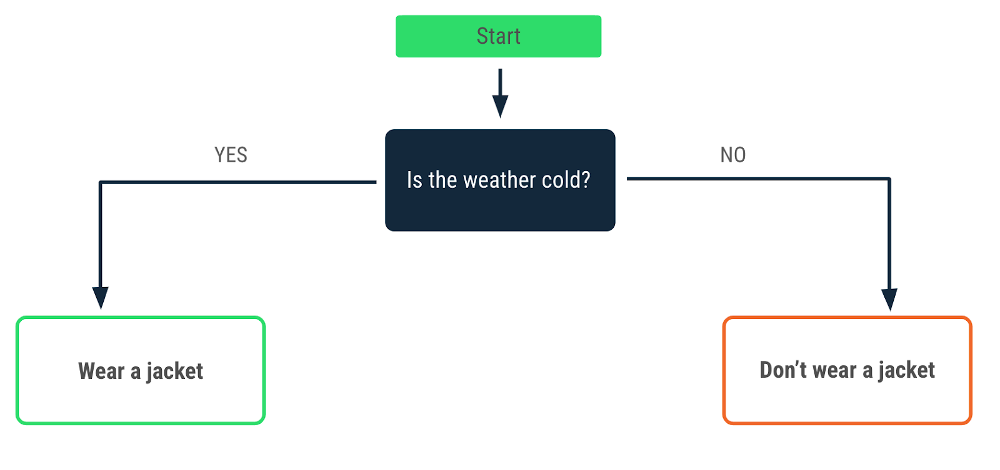
</div>

决策也是编程中的基本概念。您可以编写指令，指定程序在特定情况下的行为，让程序能够在相应情况出现时做出相应的处理或响应。在 Kotlin 中，如果您想让程序根据条件执行不同的操作，可以使用 if/else 语句。在下一部分中，您将编写一个 if 语句。

### 使用布尔表达式编写 if 条件

假设您要构建一个程序，用于告知驾驶人员在遇到红绿灯时应该做什么。我们将重点放在第一个条件上：红灯。遇到红灯时，您会做什么？停！

<div align="center">
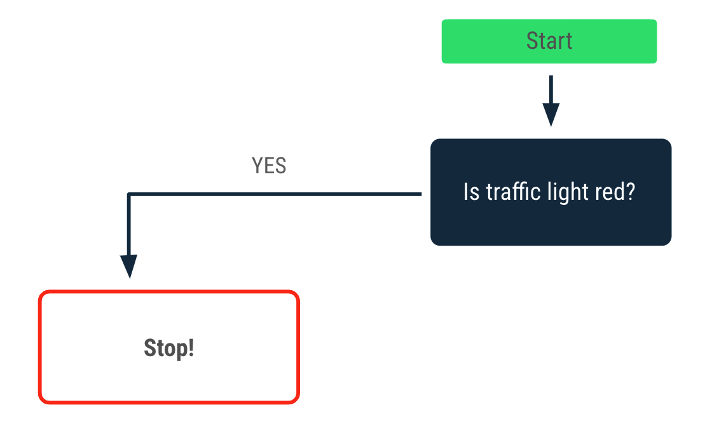
</div>

在 Kotlin 中，您可以使用 if 语句来表达该条件。我们来看一下 if 语句的详解：

<div align="center">
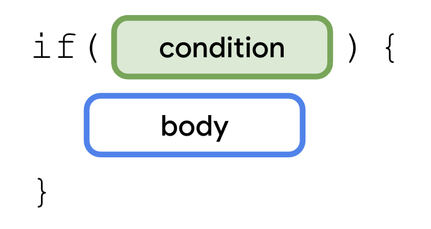
</div>

如需使用 if 语句，您需要使用 if 关键字，后跟要评估的条件。您需要使用布尔表达式来表达条件。表达式会组合各种值、变量以及运算符，并返回值。布尔表达式会返回一个布尔值。

之前，您学习过赋值运算符，例如：

```kotlin
val number = 1
```

`=` 赋值运算符会为 number 变量赋一个 1 值。

相比之下，布尔表达式使用的是比较运算符，此类运算符可以比较等式两端的值或变量。请看以下比较运算符。

```kotlin
1 == 1
```

`==` 比较运算符会对值进行互相比较。您认为该表达式会返回哪个布尔值？

找到该表达式的布尔值：

1. 使用 Kotlin 园地运行代码。
2. 在函数正文中，添加一个 println() 函数，然后将其作为实参传递到 `1 == 1` 表达式：

```kotlin
fun main() {
    println(1 == 1)
}
```

3. 运行程序，然后查看输出：

```
true
```

第一个 1 值等于第二个 1 值，因此布尔表达式会返回一个 true 值，这是一个布尔值。

#### 试试看

除了 `==` 比较运算符以外，您还可以使用其他比较运算符来创建布尔表达式：

- 小于：`<`
- 大于：`>`
- 小于或等于：`<=`
- 大于或等于：`>=`
- 不等于：`!=`

请通过以下简单的表达式练习使用比较运算符：

1. 在该实参中，将 `==` 比较运算符替换为 `<` 比较运算符：

```kotlin
fun main() {
    println(1 < 1)
}
```

2. 运行程序，然后查看输出：

输出会返回一个 false 值，因为第一个 1 值不小于第二个 1 值。

```
false
```

3. 使用其他比较运算符和数字重复前两个步骤。

### 编写一个简单的 if 语句

现在您已经查看了一些有关如何编写布尔表达式的示例，接下来您可以编写自己的第一个 if 语句了。if 语句的语法如下：

<div align="center">
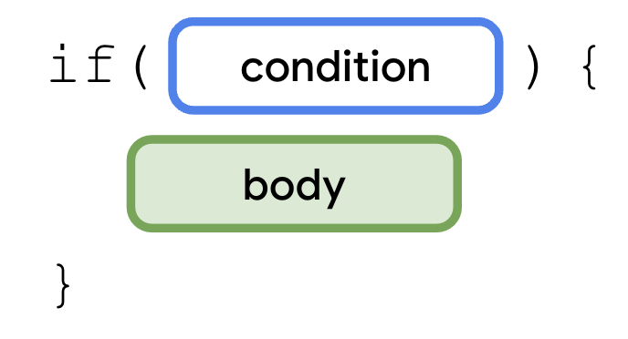
</div>

if 语句以 if 关键字开头，后跟条件，即圆括号内的布尔表达式和一对大括号。正文是指您在位于条件后面的一对大括号中放置的一系列语句或表达式。仅当满足条件时，这些语句或表达式才会执行。换言之，仅当 if 分支中的布尔表达式返回 true 值时，大括号中的语句才会执行。

为红灯条件编写一个 if 语句：

1. 在 main() 函数内，创建一个 trafficLightColor 变量并为其赋一个 "Red" 值：

```kotlin
fun main() {
    val trafficLightColor = "Red"
}
```

2. 为红灯条件添加一个 if 语句，然后向其传递一个 `trafficLightColor == "Red"` 表达式：

```kotlin
fun main() {
    val trafficLightColor = "Red"
    if (trafficLightColor == "Red") {
        
    } 
}
```

3. 在 if 语句的正文中，添加一个 println() 函数，然后向其传递一个 "Stop" 实参：

```kotlin
fun main() {
    val trafficLightColor = "Red"
    if (trafficLightColor == "Red") {
        println("Stop")
    } 
}
```

4. 运行程序，然后查看输出：

```
Stop
```

`trafficLightColor == "Red"` 表达式会返回一个 true 值，因此系统会执行 `println("Stop")` 语句，从而输出 Stop 消息。

<div align="center">
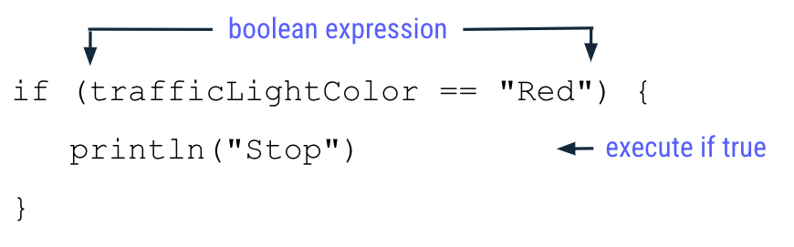
</div>

### 添加 else 分支

现在，您可以扩展程序，使其在红绿灯未亮红灯时告知驾驶人员驾车行驶。

<div align="center">
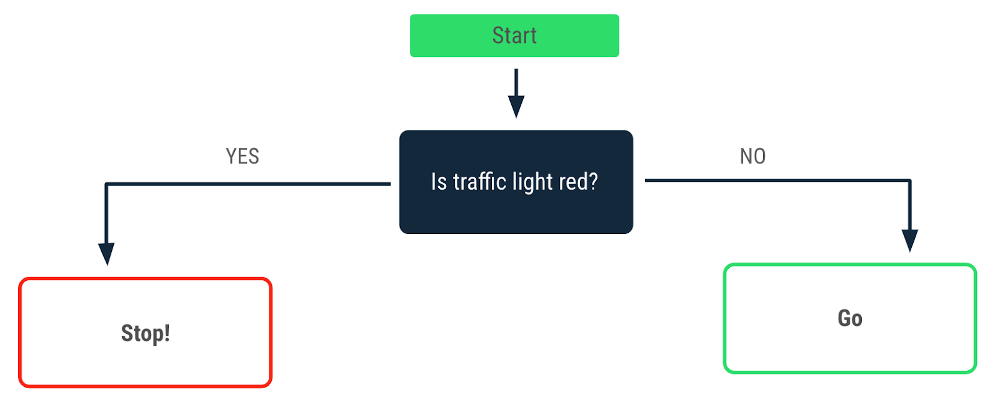
</div>

您需要添加 else 分支才能创建 if/else 语句。分支是代码的不完整部分，您可以将其连接起来形成语句或表达式。else 分支需要跟在 if 分支后面。

<div align="center">
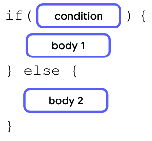
</div>

在 if 语句的右大括号后面，您要添加 else 关键字，后跟一对大括号。在 else 语句的大括号内，您可以添加仅当 if 分支中的条件为 false 时才执行的第二个正文。

将 else 分支添加到程序中：

1. 在 if 语句的右大括号后，添加 else 关键字，后跟另一对大括号：

```kotlin
fun main() {
    val trafficLightColor = "Red"
    if (trafficLightColor == "Red") {
        println("Stop")
    } else {
    }
}
```

2. 在 else 关键字的大括号内，添加一个 println() 函数，然后向其传递一个 "Go" 实参：

```kotlin
fun main() {
    val trafficLightColor = "Red"
    if (trafficLightColor == "Red") {
        println("Stop")
    } else {
        println("Go")
    }
}
```

3. 运行此程序，然后查看输出：

```
Stop
```

程序的行为仍与您添加 else 分支之前相同，但它不会输出 Go 消息。

4. 为 trafficLightColor 变量重新赋一个 "Green" 值，因为您想让驾驶人员在绿灯时驾车行驶：

```kotlin
fun main() {
    val trafficLightColor = "Green"
    if (trafficLightColor == "Red") {
        println("Stop")
    } else {
        println("Go")
    }
}
```

5. 运行此程序，然后查看输出：

```
Go
```

如您所见，程序现在会输出 Go 消息，而不是 Stop 消息。

<div align="center">
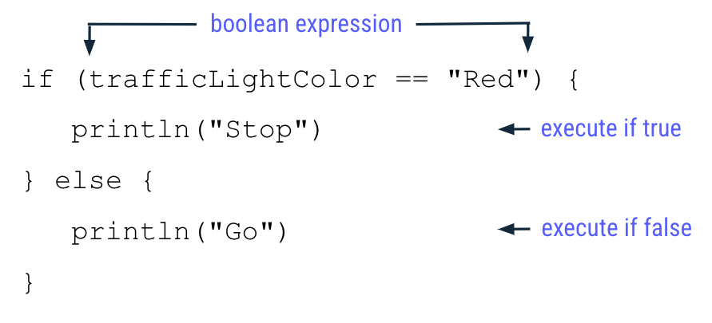
</div>

您已将 trafficLightColor 变量重新分配到 "Green" 值，因此 if 分支中评估的 `trafficLightColor == "Red"` 表达式会返回 false 值，因为 "Green" 值不等于"Red" 值。

因此，程序会跳过 if 分支中的所有语句，并改为执行 else 分支中的所有语句。这意味着，系统会执行 `println("Go")` 函数，但不会执行 `println("Stop")` 函数。

### 添加 else if 分支

通常，红绿灯里面还有一盏黄灯，用于指示驾驶人员慢速前行。您可以扩展程序的决策流程来体现这一点。

<div align="center">
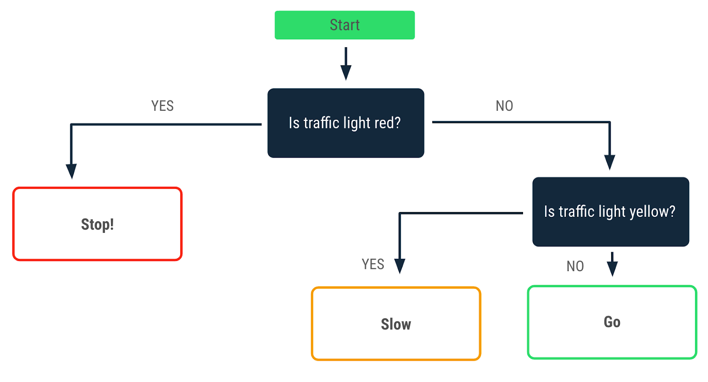
</div>

您学会了使用包含单个 if 分支和单个 else 分支的 if/else 语句来编写满足单个决策点的条件语句。对于包含多个决测点的更复杂的分支，该怎么处理？当您面临多个决测点时，您需要创建包含多重条件的条件语句，为此，您可以向 if/else 语句添加 else if 分支。

在 if 分支的右大括号后面，您需要添加 else if 关键字。在 else if 关键字的圆括号内，您需要添加一个布尔表达式作为 else if 分支的条件；圆括号后跟一对大括号，而大括号内则是正文。仅当条件 1 失败，但条件 2 满足时，该正文才会执行。

<div align="center">
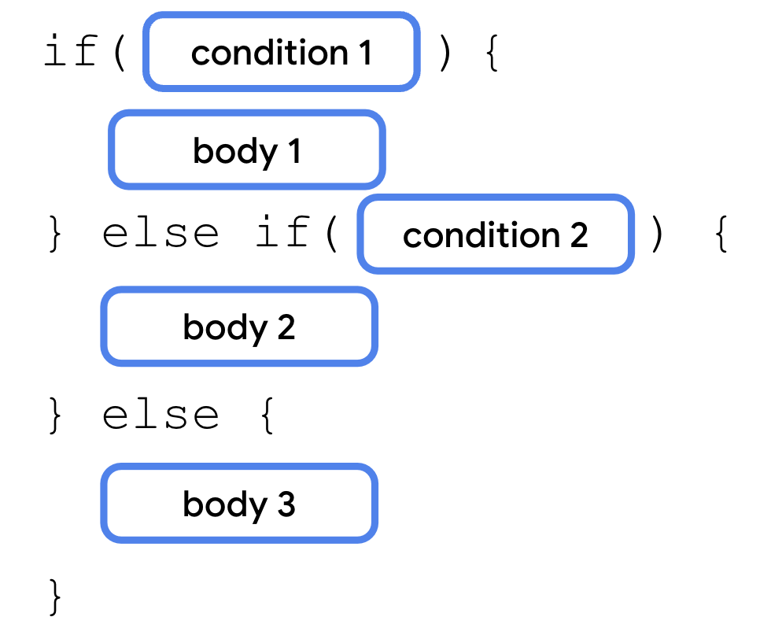
</div>

else if 分支始终位于 if 分支后面，但位于 else 分支前面。您可以在一个语句中使用多个 else if 分支：

<div align="center">
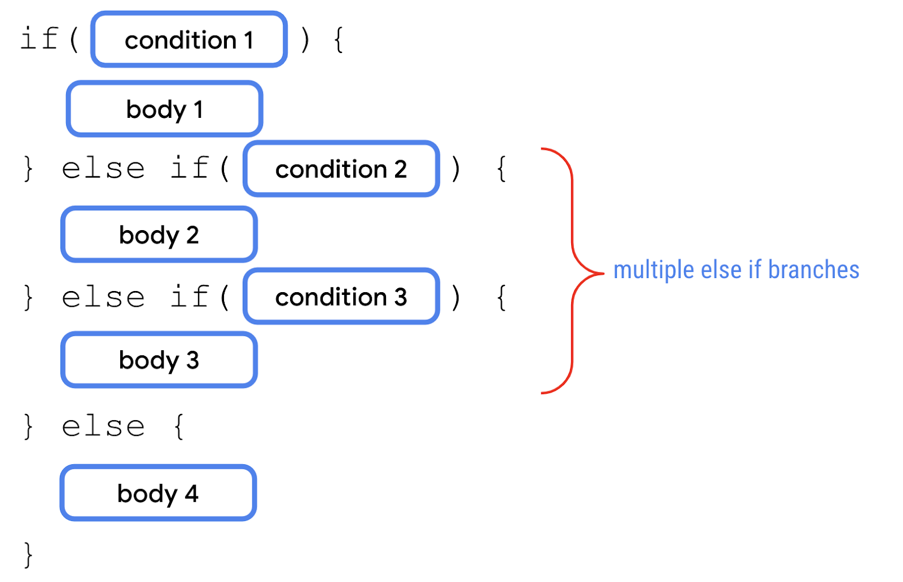
</div>

if 语句还可以包含 if 分支和 else if 分支，而不包含任何 else 分支：

<div align="center">
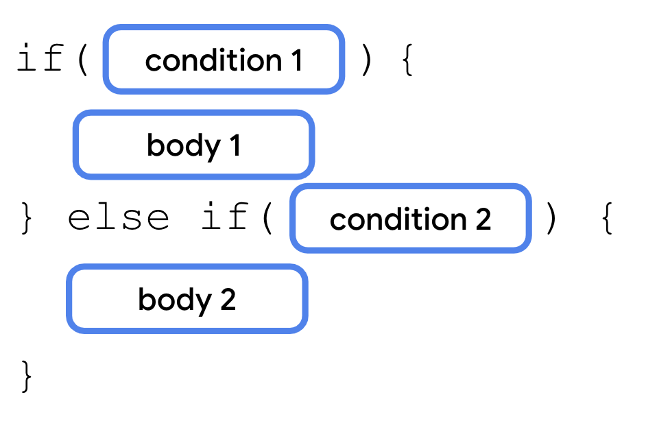
</div>

将 else if 分支添加到程序中：

1. 在 if 语句的右大括号后面，添加一个 `else if (trafficLightColor == "Yellow")` 表达式，后跟花括号：

```kotlin
fun main() {
    val trafficLightColor = "Green"
    if (trafficLightColor == "Red") {
        println("Stop")
    } else if (trafficLightColor == "Yellow") {
    } else {
        println("Go")
    }
}
```

2. 在 else if 分支的大括号内，添加一个 println() 语句，然后向其传递一个 "Slow" 字符串实参：

```kotlin
fun main() {
    val trafficLightColor = "Green"
    if (trafficLightColor == "Red") {
        println("Stop")
    } else if (trafficLightColor == "Yellow") {
        println("Slow")
    } else {
        println("Go")
    }
}
```

3. 将 trafficLightColor 变量重新分配到一个 "Yellow" 字符串值：

```kotlin
fun main() {
    val trafficLightColor = "Yellow"
    if (trafficLightColor == "Red") {
        println("Stop")
    } else if (trafficLightColor == "Yellow") {
        println("Slow")
    } else {
        println("Go")
    }
}
```

4. 运行此程序，然后查看输出：

```
Slow
```

现在，程序会输出 Slow 消息，而不是 Stop 或 Go 消息。

<div align="center">
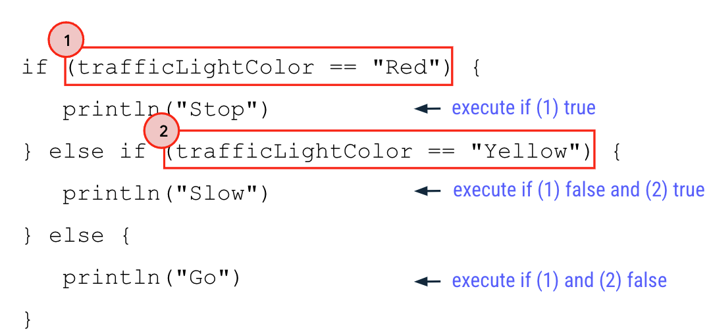
</div>

以下是它仅输出 Slow 消息而不输出其他行的原因：

- 为 trafficLightColor 变量赋一个 "Yellow" 值。
- "Yellow" 值不等于 "Red" 值，因此 if 分支的布尔值表达式（图片中备注为 1）会返回 false 值。程序会跳过 if 分支中的所有语句，并且不会输出 Stop 消息。
- 由于 if 分支会生成一个 false 值，程序会继续评估 else if 分支中的布尔表达式。
- "Yellow" 值等于 "Yellow" 值，因此 else if 分支的布尔值表达式（图片中备注为 2）会返回 true 值。程序会执行 else if 分支中的所有语句，并输出 Slow 消息。
- 由于 else if 分支的布尔表达式会返回一个 true 值，因此程序会跳过其余分支。因此，else 分支中的所有语句都不会执行，并且程序不会输出 Go 消息。

### 试试看

当前程序存在一个 bug，您发现了吗？

在第 1 单元中，您了解了一种称为"编译错误"的 bug，即由于代码中存在语法错误，因此 Kotlin 无法编译代码且程序无法运行。在这里，您将遇到另一种称为"逻辑错误"的 bug，即程序可以运行，但无法生成预期输出。

假设您只想让驾驶人员仅在亮绿灯时才驾车行驶。如果红绿灯坏了，并且关闭了，该怎么办？您是想让驾驶人员驾车行驶，还是接收关于出现错误的警告？

遗憾的是，在当前程序中，如果红绿灯是除亮红灯或黄灯以外的其他状态，系统仍会建议驾驶人员驾车行驶。

如需修复该问题，请执行以下操作：

1. 将 trafficLightColor 变量重新分配到一个 "Black" 值，以指示处于关闭状态的红绿灯：

```kotlin
fun main() {
    val trafficLightColor = "Black"
    if (trafficLightColor == "Red") {
        println("Stop")
    } else if (trafficLightColor == "Yellow") {
        println("Slow")
    } else {
        println("Go")
    }
}
```

2. 运行此程序，然后查看输出：

```
Go
```

请注意，即使 trafficLightColor 变量没有赋 "Green" 值，程序也会输出 Go 消息。您能否修复此程序以使其反映正确的行为？

<div align="center">

</div>

您需要修改此程序，使其能够输出以下消息：

- 仅当为 trafficLightColor 变量赋了 "Green" 值时，才输出 Go 消息。
- 当 trafficLightColor 变量未赋 "Red"、"Yellow" 或 "Green" 值时，输出 Invalid traffic-light color 消息。

### 修复 else 分支

else 分支始终位于 if/else 语句的末尾，因为它是一个通用分支。当前面的分支中的所有其他条件都不满足时，它会自动执行。因此，如果您想让系统仅在满足特定条件时才执行某项操作，else 分支并不适用。对于红绿灯，您可以使用 else if 分支指定绿灯的条件。

使用 else if 分支评估绿灯的条件：

1. 在当前 else if 分支后面，再添加一个 `else if (trafficLightColor == "Green")` 分支：

```kotlin
fun main() {
    val trafficLightColor = "Black"
    if (trafficLightColor == "Red") {
        println("Stop")
    } else if (trafficLightColor == "Yellow") {
        println("Slow")
    } else if (trafficLightColor == "Green") {
        println("Go")
    }
}
```

2. 运行此程序，然后查看输出。

输出为空，因为您没有在前面的条件均不符合时执行的 else 分支。

3. 在最后一个 else if 分支后面，添加一个 else 分支，其中包含一个 `println("Invalid traffic-light color")` 语句：

```kotlin
fun main() {
    val trafficLightColor = "Black"
    if (trafficLightColor == "Red") {
        println("Stop")
    } else if (trafficLightColor == "Yellow") {
        println("Slow")
    } else if (trafficLightColor == "Green") {
        println("Go")
    } else {
        println("Invalid traffic-light color")
    }
}
```

4. 运行此程序，然后查看输出：

```
Invalid traffic-light color
```

5. 为 trafficLightColor 变量赋 "Red"、"Yellow" 或 "Green" 之外的其他值，然后重新运行程序。

最好的编程做法是，使用一个显式 else if 分支作为绿灯的输入验证，并使用一个 else 分支来捕获其他无效输入。这样可以确保仅在亮绿灯时才指示驾驶人员驾车行驶。在其他情况下，系统会传递一条显式消息，以指明红绿灯行为异常。

## 3. 使用 when 语句处理多个分支

由于使用了多个条件（也称为"分支"），因此您的 trafficLightColor 程序显得更复杂了。您可能想知道，对于分支数量更多的程序，您能否进行简化。

在 Kotlin 中，当处理多个分支时，您可以使用 when 语句（而非 if/else 语句），因为该语句可以提高可读性，而可读性是指人类读者（通常是开发者）阅读代码的难易程度。编写代码时务必要考虑可读性，因为在代码的生命周期内，其他开发者可能需要对其进行查看和修改。良好的可读性可确保开发者能够正确理解您的代码，并且不会在无意中引入 bug。

如果需要考虑的分支数量超过两个，应首选使用 when 语句。

<div align="center">
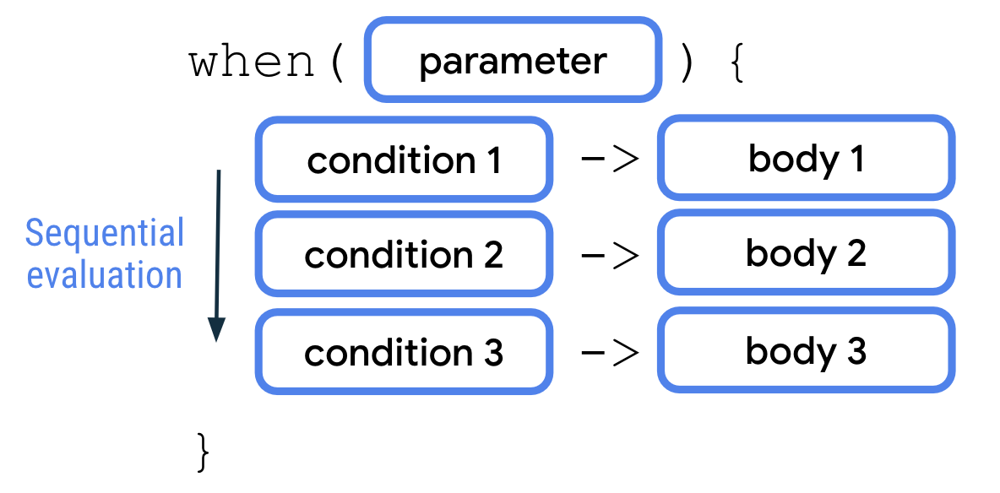
</div>

when 语句通过形参接受单个值。然后，系统依序评估每个条件。接着，系统执行所满足的第一个条件对应的正文。各条件和正文均以箭头 (`->`) 分隔。与 if/else 语句类似，每对条件和正文都称为 when 语句的一个分支。此外，与 if/else 语句类似，您还可以在 when 语句中添加一个 else 分支作为最终条件，使其发挥通用分支的作用。

### 使用 when 语句重写 if/else 语句

红绿灯程序已包含多个分支：

- 红色的红绿灯颜色
- 黄色的红绿灯颜色
- 绿色的红绿灯颜色
- 其他红绿灯颜色

将程序转换为使用 when 语句：

1. 在 main() 函数中，移除 if/else 语句：

```kotlin
fun main() {
    val trafficLightColor = "Black"
}
```

2. 添加一个 when 语句，然后向其传递一个 trafficLightColor 变量作为实参：

```kotlin
fun main() {
    val trafficLightColor = "Black"
    when (trafficLightColor) {
    }
}
```

3. 在 when 语句的正文中添加 "Red" 条件，后跟箭头和 `println("Stop")` 正文：

```kotlin
fun main() {
    val trafficLightColor = "Black"
    when (trafficLightColor) {
        "Red" -> println("Stop")
    }
}
```

4. 在下一代码行中，添加 "Yellow" 条件，后跟箭头和 `println("Slow")` 正文：

```kotlin
fun main() {
    val trafficLightColor = "Black"
    when (trafficLightColor) {
        "Red" -> println("Stop")
        "Yellow" -> println("Slow")
    }
}
```

5. 在下一行代码中，添加 "Green" 条件，后跟箭头和 `println("Go")` 正文：

```kotlin
fun main() {
    val trafficLightColor = "Black"
    when (trafficLightColor) {
        "Red" -> println("Stop")
        "Yellow" -> println("Slow")
        "Green" -> println("Go")
    }
}
```

6. 在下一代码行中，添加 else 关键字，后跟箭头，然后添加 `println("Invalid traffic-light color")` 正文：

```kotlin
fun main() {
    val trafficLightColor = "Black"
    when (trafficLightColor) {
        "Red" -> println("Stop")
        "Yellow" -> println("Slow")
        "Green" -> println("Go")
        else -> println("Invalid traffic-light color")
    }
}
```

7. 将 trafficLightColor 变量重新分配到一个 "Yellow" 值：

```kotlin
fun main() {
    val trafficLightColor = "Yellow"
    when (trafficLightColor) {
        "Red" -> println("Stop")
        "Yellow" -> println("Slow")
        "Green" -> println("Go")
        else -> println("Invalid traffic-light color")
    }
}
```

运行程序，然后查看输出：

```
Slow
```

<div align="center">
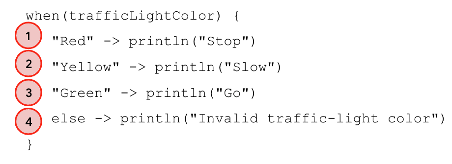
</div>

输出为 Slow 消息，原因如下：

- 为 trafficLightColor 变量赋一个 "Yellow" 值。
- 此程序会依次逐个评估每个条件。
- "Yellow" 值不等于 "Red" 值，因此程序会跳过第一个正文。
- "Yellow" 值等于 "Yellow" 值，因此程序会执行第二个正文并输出 Slow 消息。
- 已执行正文，因此程序会忽略第三个和第四个分支，并退出 when 语句。

> **注意**：when 语句有一个变体，它不接受任何形参，并且用于替换 if/else 链。如需了解详情，请参阅 [When 表达式](https://kotlinlang.org/docs/control-flow.html#when-expression)。

### 在 when 语句中编写更复杂的条件

到目前为止，您已经学习了如何为单个等式条件编写 when 条件，例如为 trafficLightColor 变量赋 "Yellow" 值时。接下来，您将学习如何使用英文逗号 (,)、in 关键字和 is 关键字来组成更复杂的 when 条件。

构建一个程序，用于确定 1 到 10 之间的数字是否为质数：

1. 在单独的窗口中打开 Kotlin 园地。（稍后，您会回到红绿灯程序。）

2. 定义一个 x 变量，然后为其赋一个 3 值：

```kotlin
fun main() {
    val x = 3
}
```

3. 添加一个 when 语句，其中包含针对 2、3、5 和 7 条件的多个分支，并在每个分支后面分别添加一个 `println("x is prime number between 1 and 10.")` 正文：

```kotlin
fun main() {
    val x = 3
    when (x) {
        2 -> println("x is a prime number between 1 and 10.")
        3 -> println("x is a prime number between 1 and 10.")
        5 -> println("x is a prime number between 1 and 10.")
        7 -> println("x is a prime number between 1 and 10.")
    }
}
```

4. 添加一个具有 `println("x is not prime number between 1 and 10.")` 正文的 else 分支：

```kotlin
fun main() {
    val x = 3
    when (x) {
        2 -> println("x is a prime number between 1 and 10.")
        3 -> println("x is a prime number between 1 and 10.")
        5 -> println("x is a prime number between 1 and 10.")
        7 -> println("x is a prime number between 1 and 10.")
        else -> println("x isn't a prime number between 1 and 10.")
    }
}
```

5. 运行程序，然后验证输出是否符合预期：

```
x is a prime number between 1 and 10.
```

#### 使用英文逗号 (,) 处理多个条件

质数程序包含大量重复的 println() 语句。编写 when 语句时，您可以使用英文逗号 (,) 指示与同一正文对应的多个条件。

<div align="center">
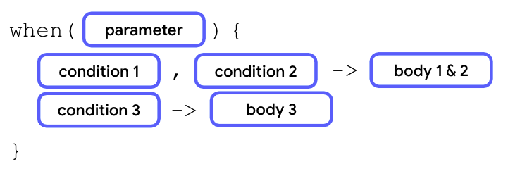
</div>

在上图中，如果满足第一个或第二个条件，系统会执行对应的正文。

根据以下概念重写质数程序：

1. 在 2 条件的分支中，添加 3、5 和 7，并以英文逗号分隔 (,)：

```kotlin
fun main() {
    val x = 3
    when (x) {
        2, 3, 5, 7 -> println("x is a prime number between 1 and 10.")
        3 -> println("x is a prime number between 1 and 10.")
        5 -> println("x is a prime number between 1 and 10.")
        7 -> println("x is a prime number between 1 and 10.")
        else -> println("x isn't a prime number between 1 and 10.")
    }
}
```

2. 移除 3、5 和 7 条件的各个分支：

```kotlin
fun main() {
    val x = 3
    when (x) {
        2, 3, 5, 7 -> println("x is a prime number between 1 and 10.")
        else -> println("x isn't a prime number between 1 and 10.")
    }
}
```

3. 运行程序，然后验证输出是否符合预期：

```
x is a prime number between 1 and 10.
```

#### 使用 in 关键字处理一系列条件

除了使用英文逗号 (,) 符号来表示多个条件以外，您也可以在 when 分支中使用 in 关键字和一个值范围。

<div align="center">
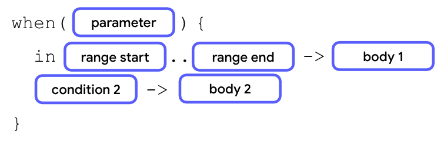
</div>

如需使用某个范围内的值，请添加一个表示范围起点的数字，后跟两个不含空格的点，然后使用另一个表示范围终点的数字作为结尾。

当形参值等于范围起点到范围终点之间的任意值时，第一个正文执行。

在质数程序中，如果数字介于 1 到 10 之间，但不是质数，您能否输出消息？

添加另一个包含 in 关键字的分支：

1. 在 when 语句的第一个分支后面，添加第二个分支，其中首先是 in 关键字，然后跟一个 `1..10` 范围和一个 `println("x is a number between 1 and 10, but not a prime number.")` 正文：

```kotlin
fun main() {
    val x = 3
    when (x) {
        2, 3, 5, 7 -> println("x is a prime number between 1 and 10.")
        in 1..10 -> println("x is a number between 1 and 10, but not a prime number.")
        else -> println("x isn't a prime number between 1 and 10.")
    }
}
```

2. 将 x 变量更改为 4 值：

```kotlin
fun main() {
    val x = 4
    when (x) {
        2, 3, 5, 7 -> println("x is a prime number between 1 and 10.")
        in 1..10 -> println("x is a number between 1 and 10, but not a prime number.")
        else -> println("x isn't a prime number between 1 and 10.")
    }
}
```

3. 运行程序，然后验证输出：

```
x is a number between 1 and 10, but not a prime number.
```

程序会输出第二个分支的消息，但不会输出第一个或第三个分支的消息。

<div align="center">
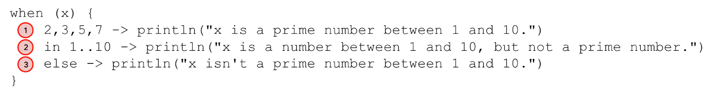
</div>

此程序的运作方式如下：

- 为 x 变量赋了 4 值。
- 程序继续评估第一个分支的条件。4 的值不是 2、3、5 或 7 值，因此程序会跳过第一个分支正文的执行，并继续评估第二个分支。
- 4 值介于 1 和 10 之间，因此系统输出 `x is a number between 1 and 10, but not a prime number.` 正文的消息。
- 已执行正文，因此程序会继续退出 when 语句并忽略 else 分支。

#### 使用 is 关键字检查数据类型

您可以使用 is 关键字作为条件，以检查所评估值的数据类型。

<div align="center">
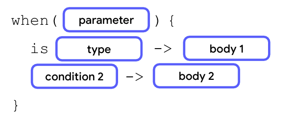
</div>

在上图中，如果实参的值是所声明的数据类型，系统会执行第一个正文。

在质数程序中，如果输入值不是介于 1 到 10 范围内的整数，您能否输出消息？

再添加一个包含 is 关键字的分支：

1. 将 x 修改为 Any 类型。这表示 x 的值可以不是 Int 类型。

```kotlin
fun main() {
    val x: Any = 4
    when (x) {
        2, 3, 5, 7 -> println("x is a prime number between 1 and 10.")
        in 1..10 -> println("x is a number between 1 and 10, but not a prime number.")
        else -> println("x isn't a prime number between 1 and 10.")
    }
}
```

2. 在 when 语句的第二个分支后面，添加 is 关键字和一个 Int 数据类型，以及一个 `println("x is an integer number, but not between 1 and 10.")` 正文：

```kotlin
fun main() {
    val x: Any = 4
    when (x) {
        2, 3, 5, 7 -> println("x is a prime number between 1 and 10.")
        in 1..10 -> println("x is a number between 1 and 10, but not a prime number.")
        is Int -> println("x is an integer number, but not between 1 and 10.")
        else -> println("x isn't a prime number between 1 and 10.")
    }
}
```

3. 在 else 分支中，将正文更改为 `println("x isn't an integer number.")` 正文：

```kotlin
fun main() {
    val x: Any = 4
    when (x) {
        2, 3, 5, 7 -> println("x is a prime number between 1 and 10.")
        in 1..10 -> println("x is a number between 1 and 10, but not a prime number.")
        is Int -> println("x is an integer number, but not between 1 and 10.")
        else -> println("x isn't an integer number.")
    }
}
```

4. 将 x 变量更改为 20 值：

```kotlin
fun main() {
    val x: Any = 20
    when (x) {
        2, 3, 5, 7 -> println("x is a prime number between 1 and 10.")
        in 1..10 -> println("x is a number between 1 and 10, but not a prime number.")
        is Int -> println("x is an integer number, but not between 1 and 10.")
        else -> println("x isn't an integer number.")
    }
}
```

5. 运行程序，然后验证输出：

```
x is an integer number, but not between 1 and 10.
```

程序会输出第三个分支的消息，但不会输出第一个、第二个或第四个分支的消息。

<div align="center">
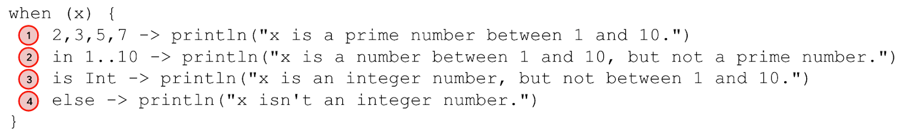
</div>

程序的运作方式如下：

- 为 x 变量赋了 20 值。
- 程序继续评估第一个分支的条件。20 的值不是 2、3、5 或 7 值，因此程序会跳过第一个分支正文的执行，并继续评估第二个分支。
- 20 值不在 1 到 10 的范围内，因此程序会跳过第二个分支正文的执行，并继续评估第三个分支。
- 20 的值是 Int 类型，因此输出 `x is an integer number, but not between 1 and 10` 正文。
- 已执行正文，因此程序会继续退出 when 语句并忽略 else 分支。

### 试试看

现在，请在红绿灯程序中练习所学内容。

假设某些国家/地区会用琥珀色的红绿灯颜色向驾驶人员发出警告，其含义与其他国家/地区的黄灯一样。您能否修改此程序，使其涵盖上述附加条件，并保留原始条件？

### 添加正文相同的附加条件

向红绿灯程序添加一个附加条件：

1. 如果红绿灯程序仍处于打开状态，请通过此程序返回 Kotlin 园地实例。如果您已关闭此程序，请打开 Kotlin 园地的新实例，然后输入以下代码：

```kotlin
fun main() {
    val trafficLightColor = "Yellow"
    when (trafficLightColor) {
        "Red" -> println("Stop")
        "Yellow" -> println("Slow")
        "Green" -> println("Go")
        else -> println("Invalid traffic-light color")
    }
}
```

2. 在 when 语句的第二个分支中，在 "Yellow" 条件后添加一个英文逗号，然后添加一个 "Amber" 条件：

```kotlin
fun main() {
    val trafficLightColor = "Yellow"
    when (trafficLightColor) {
        "Red" -> println("Stop")
        "Yellow", "Amber" -> println("Slow")
        "Green" -> println("Go")
        else -> println("Invalid traffic-light color")
    }
}
```

3. 将 trafficLightColor 变量更改为 "Amber" 值：

```kotlin
fun main() {
    val trafficLightColor = "Amber"
    when (trafficLightColor) {
        "Red" -> println("Stop")
        "Yellow", "Amber" -> println("Slow")
        "Green" -> println("Go")
        else -> println("Invalid traffic-light color")
    }
}
```

4. 运行此程序，然后验证输出：

```
Slow
```

## 4. 使用 if/else 和 when 作为表达式

您学习了如何使用 if/else 和 when 作为语句。使用条件作为语句时，您可以让每个分支根据条件在正文中执行不同的操作。

您还可以使用条件作为表达式，以便为每个条件分支返回不同的值。与条件语句相比，当各分支的正文看起来类似时，您可以使用条件表达式来提高代码的可读性。

<div align="center">
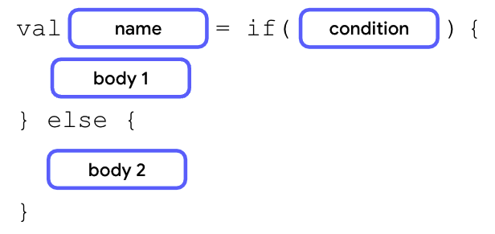
</div>

条件表达式的语法与条件语句类似，但每个分支的最后一个代码行需要返回一个值或表达式，并且要将条件分配给一个变量。

如果正文仅包含一个返回值或表达式，您可以移除大括号，使代码更简洁。

<div align="center">
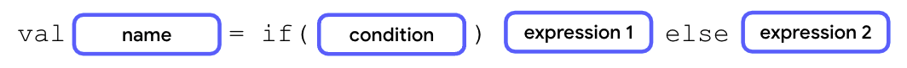
</div>

在下一部分中，您将通过红灯程序来学习 if/else 表达式。

### 将 if 语句转换为表达式

该 if/else 语句中有很多重复的 println() 语句：

```kotlin
fun main() {
    val trafficLightColor = "Black"
    if (trafficLightColor == "Red") {
        println("Stop")
    } else if (trafficLightColor == "Yellow") {
        println("Slow")
    } else if (trafficLightColor == "Green") {
        println("Go")
    } else {
        println("Invalid traffic-light color")
    }
}
```

将该 if/else 语句转换为 if/else 表达式，并移除以下重复内容：

1. 在 Kotlin 园地中，进入之前的红绿灯程序。

2. 定义一个 message 变量，然后为其分配一个 if/else 语句：

```kotlin
fun main() {
    val trafficLightColor = "Black"
    val message = if (trafficLightColor == "Red") {
        println("Stop")
    } else if (trafficLightColor == "Yellow") {
        println("Slow")
    } else if (trafficLightColor == "Green") {
        println("Go")
    } else {
        println("Invalid traffic-light color")
    }
}
```

3. 移除所有 println() 语句及其大括号，但保留其中的值：

```kotlin
fun main() {
    val trafficLightColor = "Black"
    val message = 
      if (trafficLightColor == "Red") "Stop"
      else if (trafficLightColor == "Yellow") "Slow"
      else if (trafficLightColor == "Green") "Go"
      else "Invalid traffic-light color"
}
```

4. 在程序末尾添加一个 println() 语句，然后向其传递 message 变量作为实参：

```kotlin
fun main() {
    val trafficLightColor = "Black"
    val message = 
      if (trafficLightColor == "Red") "Stop"
      else if (trafficLightColor == "Yellow") "Slow"
      else if (trafficLightColor == "Green") "Go"
      else "Invalid traffic-light color"
    println(message)
}
```

5. 运行此程序，然后查看输出：

```
Invalid traffic-light color
```

### 试试看

将红绿灯程序转换为使用 when 表达式，而不是 when 语句：

1. 在 Kotlin 园地中，输入以下代码：

```kotlin
fun main() {
    val trafficLightColor = "Amber"
    when (trafficLightColor) {
        "Red" -> println("Stop")
        "Yellow", "Amber" -> println("Slow")
        "Green" -> println("Go")
        else -> println("Invalid traffic-light color")
    }
}
```

您能否将 when 语句转换为表达式，以避免重复使用 println() 语句？

2. 创建一个 message 变量，并将其分配到 when 表达式：

```kotlin
fun main() {
    val trafficLightColor = "Amber"
    val message = when(trafficLightColor) {
        "Red" -> "Stop"
        "Yellow", "Amber" -> "Slow"
        "Green" -> "Go"
        else -> "Invalid traffic-light color"
    }
}
```

3. 添加一个 println() 语句作为程序的最后一个代码行，然后向其传递 message 变量作为实参：

```kotlin
fun main() {
    val trafficLightColor = "Amber"
    val message = when(trafficLightColor) {
        "Red" -> "Stop"
        "Yellow", "Amber" -> "Slow"
        "Green" -> "Go"
        else -> "Invalid traffic-light color"
    }
    println(message)
}
```

> **注意**：when 语句不需要定义 else 分支。不过，在大多数情况下，when 表达式需要 else 分支，因为 when 表达式需要返回值。因此，Kotlin 编译器会检查所有分支是否详尽。else 分支可确保不会出现未给变量赋值的情况。

## 5. 总结

恭喜！您学习了条件以及如何在 Kotlin 中编写条件。

### 摘要

- 在 Kotlin 中，可以使用 if/else 或 when 条件来实现分支。
- 仅当 if 分支条件中的布尔表达式返回 true 值时，系统才会执行 if/else 条件中的 if 分支的正文。
- 仅当前面的 if 或 else if 分支返回 false 值时，系统才会执行 if/else 条件中的后续 else if 分支。
- 仅当前面的所有 if 或 else if 分支均返回 false 值时，系统才会执行 if/else 条件中的最后一个 else 分支。
- 当分支数量超过两个时，建议使用 when 条件来替换 if/else 条件。
- 您可以在 when 条件中使用英文逗号 (,)、in 范围和 is 关键字来编写更复杂的条件。
- if/else 和 when 条件可以用作语句或表达式。

### 了解更多内容

- [条件和循环](https://kotlinlang.org/docs/control-flow.html)
